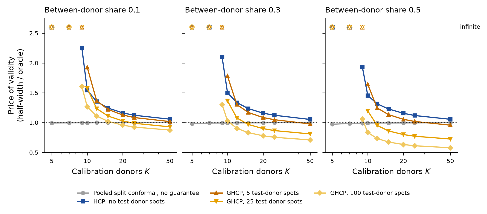
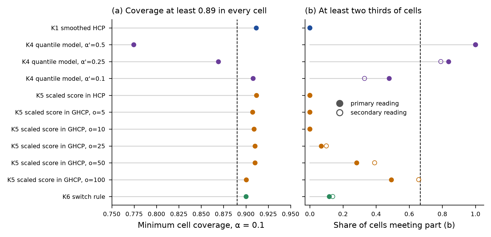

# Round 4, conformal track: report at gate C2 (C1 and C2 together)

Branch `round4-conformal`, tag `round4-conf-C2`. Written 1 to 2 October 2026. Plan
`docs/round04/tracks/conformal/round4_conf_plan.md`, sections 1 to 11; the instruction is
`docs/round04/i01/conformal/round4_conformal_track.md` on `main`; addendum 1 is plan section 10.

## 1. Stage and status

C0 passed and was reported in plan section 3. C1 (the simulation testbed and the known methods)
and C2 (the remaining candidates, the lower-bound scoping and the go or no-go) are complete. This
is a report-and-wait gate. Nothing from C3 has started, and ACS has not been read.

The verdict under the fixed criterion is that **no candidate goes forward**. No variant meets all
three parts. K4 at $\alpha' = 0.5$ and $0.25$ meets (b) and fails (a); K4 at $\alpha' = 0.1$, K1,
K5 and K6 meet (a) and fail (b); K6 also fails (c)
(`results/round4/conformal/C2_candidates/c2_criterion.csv`). C3 runs the known methods as
planned.

## 2. What was run

**Code**, all in `code/scripts/` on the branch, with md5 at the commit tagged for this gate:
`round4_conf_sim.py` (76fda34ee622e299bbaa806e5c8da98a, the C1 generator, methods and oracle),
`round4_conf_c1_merge.py` (C1 merge and acceptance), `round4_conf_c1_ghcp_repro.py` (runs the
released GHCP launchers unmodified, with the chunk-subset and merge modes of section 7.4),
`round4_conf_c1_ghcp_compare.py` (reproduction against the paper and the shipped files),
`round4_conf_c1_codepath.py`, `round4_conf_c2_lower_bound.py`, `round4_conf_c2_merge.py` (C2
merge and criterion), and the four candidate modules `round4_conf_c2_k1_smoothed.py`
(bce6f54fa808bff951a05555967f6287), `round4_conf_c2_k4_qmodel.py`
(f2505a09e1adced5063e9f7994a6ffc1), `round4_conf_c2_k5_scaled.py`
(732425307f375ca5eaeb06df7639787a) and `round4_conf_c2_k6_switch.py`
(f84e7f74b2b13af0c1be0a857fc853da), each byte-identical to the copy in its fragment's `code/`
directory. The released GHCP code is github.com/soham-penn/hierarchical_CP at commit
d1a69f4a35b260b592d3ea39d7c7ad7133459cba, used unmodified.

**C1 grid.** 522 cells, 5,000 replicates each, nine fragments by $K$, run on the local machine
on Nicolas's instruction while the Longleaf queue held about 34,000 jobs (plan section 11 item
1). There is no `sacct` record for them; each fragment's `PROVENANCE.txt` records
`slurm_job_id : none`, the local host, Python 3.11.15 and numpy 2.4.6
(`results/round4/conformal/C1_testbed/frag_K10/local/PROVENANCE.txt`, wall 2695 seconds for
$K = 10$). Merged into `results/round4/conformal/C1_testbed/c1_grid.csv`, 31,320 rows.

**GHCP reproduction.** On Longleaf, account `rc_tengfei_pi`, all jobs routed to `spill`. One
setup job (Slurm 3231770, 28:40, MaxRSS 2.37 GB) built the released code's pinned environment and
ran the code-path check and launcher smokes. Then 33 jobs ran the six launchers at the paper's
the paper's replicate count in chunk subsets, and one final job merged them through each launcher's own
aggregation, ran the released plot and table scripts, and compared. The final job's run had all
merges, plots and the comparison complete and failed only on a misordered `tar` option at the
very end; the outputs it was archiving are complete on Longleaf and were read from there.
Accounting for every job is in
`results/round4/conformal/C1_testbed/ghcp_repro_longleaf/repro_jobs_sacct.csv` (39 jobs: 34
completed, the 4 superseded merge jobs cancelled by me, the final job failed at `tar`).

**C2 candidates.** Four units, each started locally and moved to Longleaf on Nicolas's later
instruction (plan section 11 item 3); 38 Slurm jobs, all on `spill` with 2 cores, accounting in
`results/round4/conformal/C2_candidates/c2_jobs_sacct.csv`. Longest single job 8198 seconds
(K5), largest MaxRSS 0.91 GB (K4).

**Local compute after the move back to Longleaf**, each by explicit permission (plan section 11
item 4). A 9-second Python 3.13 run of one released launcher, a few-second recomputation of two
code-path draws, and the light gate table work of this report (C1 merge, C2 merge and criterion,
two figures, the numeric-claim sweep).

## 3. Acceptance checks

All from `results/round4/conformal/C1_testbed/c1_acceptance.csv` unless another file is named.

| Check | Statistic | Value | Tolerance | Passed |
|---|---|---|---|---|
| Merge | duplicated / clashing keys | 0/0 | 0 | yes |
| HCP at $K = 50$, share 0.1, $\alpha = 0.1$, literal | max $\lvert$coverage $- (1-\alpha)\rvert$ | 0.0188 | 0.01 | no |
| same, against HCP's own level $(1-\alpha)(K+1)/K$ | max deviation | 0.00226 | 0.01 | yes |
| same at $\alpha = 0.2$, literal | max deviation | 0.0185 | 0.01 | no |
| same at $\alpha = 0.2$, own level | max deviation | 0.0035 | 0.01 | yes |
| No donor effect, own expected coverage, HCP | max deviation | 0.0020 | 0.01 | yes |
| same, one per donor | max deviation | 0.0037 | 0.01 | yes |
| same, pooled | max deviation | 0.0008 | 0.01 | yes |
| same, within-test-donor split | max deviation | 0.0044 | 0.01 | yes |
| same, GHCP (equal-$N$ cells, formula of section 7.2) | max deviation | 0.0054 | 0.01 | yes |
| same, GHCP without adaptation | max deviation | 0.00358 | 0.01 | yes |
| Pooled price with no donor effect | max $\lvert$price $- 1\rvert$ | 0.0070 | 0.02 | yes |
| HCP infinite exactly when $K + 1 < 1/\alpha$ | rows violating, of 1044 | 0.0 | 0 | yes |
| Semi-real $K = 10$, CCRCC spot counts, HCP coverage vs A4b | absolute difference | 0.0041 | 0.02 | yes |
| same, HCP/pooled half-width vs A4b | absolute difference | 0.0346 | 0.15 | yes |
| Semi-real $K = 10$, $N = 500$ (secondary), coverage | absolute difference | 0.00543 | 0.02 | yes |
| same, half-width ratio | absolute difference | 0.2399 | 0.15 | no |
| GHCP reproduction | rows outside MC error, of 254 | 0.0 | 0 | yes |

The literal HCP check at $K = 50$ fails by construction. HCP's calibration level is
$(1-\alpha)(K+1)/K$, which is 0.9180 at $K = 50$, and its coverage sits at that level, not at 0.9.
Addendum 1 accepted the own-level reading for the no-donor-effect check; I apply the same reading
here and report the literal one beside it. The semi-real secondary setting ($N = 500$ spots per
donor in place of CCRCC's counts) misses the width-ratio tolerance; the primary setting, which is
the one the instruction's A4b comparison is about, passes both parts. The semi-real fit has
25200 units, 3236 at the folded-normal floor, and a median relative error of the fitted 90%
quantile of 0.0209
(`results/round4/conformal/C1_testbed/frag_K10/local/c1_semireal_fit__K10__local.csv`).

**The GHCP reproduction** (`results/round4/conformal/C1_testbed/ghcp_repro_longleaf/compare/c1_ghcp_reproduction.csv`,
summary in `c1_ghcp_reproduction_summary.csv` beside it). All 254 values transcribed from the
paper's Tables 1 to 4 and 6 to 11 are found and agree within Monte Carlo error. Agreement means
$\lvert$ours $-$ paper$\rvert \le r + 2\sqrt{\text{se}_\text{paper}^2 + \text{se}_\text{ours}^2}$
with $r$ half a unit in the paper's last printed digit. The standardised differences have mean
0.131, standard deviation 0.518 and maximum absolute value 1.814 over 247 finite values. The
reproduction is not bit-identical to the shipped files (16 of 239 comparable values exactly
equal), and section 7.3 traces that to the Python version.

**The code-path check** of this track's HCP and GHCP against the released functions, run at 400
random draws on Longleaf (`results/round4/conformal/C1_testbed/ghcp_repro_longleaf/setup/c1_codepath.csv`),
agrees on the GHCP centre (179 draws, maximum difference 4.440892098500626e-16) and on the pool
under the code rule (400 draws, 0 differences). It disagrees on 8 GHCP half-widths and 1 HCP
quantile. Section 7.1 explains them as exact ties at the quantile level resolved in opposite
directions.

## 4. Methods, assumptions and guarantees as written before they ran

The C1 methods are as in plan section 6 and `round4_conf_sim.py`'s docstrings. The four
candidates' definitions, written before their runs, are reproduced unchanged in
`docs/round04/i01/conformal/round4_conf_candidate_definitions.md`. In brief:

- **K1, smoothed HCP.** HCP at a randomised level, between the two donor-block quantile levels
  adjacent to $(1-\alpha)(K+1)$, with $U \sim \text{Unif}(0, 1)$. Guarantee finite-sample under
  hierarchical exchangeability, coverage at least $1 - \alpha$ over data, test spot and $U$.
- **K4, group-level quantile model.** $\hat q = \bar q + t_{K-1,1-\alpha'} s_q\sqrt{1 + 1/K}$ over
  the calibration donors' own quantiles, $\alpha' \in \{0.5, 0.25, 0.1\}$. Model-based, the model
  being normal and exchangeable donor quantiles.
- **K5, scaled score.** $\lvert r - c\rvert/\hat\sigma$ with $\hat\sigma$ from each group's own
  training block, inside GHCP at $o \ge 5$. Inside HCP at $o = 0$ it coincides with HCP, because
  no test-donor scale exists without test-donor observations. The guarantee is the host's.
- **K6, switch rule.** The rule of `docs/round04/i01/conformal/round4_conf_lower_bound.md` section 5 with the DKW
  widening of addendum 1. No finite-sample guarantee and no named model.

**Variables that differ between arms.** Every comparison in sections 5 and 6 is within a C1 cell,
so generator, $K$, $N$, share, $\tau$, $\alpha$ and the replicate draws (seed tag `C1`) are
common. Between a candidate and its reference only the method differs. K5 inside GHCP also shares
the selected test-size donor $J_0$ with C1's `ghcp`, because K5 registers under that name for
seeding. The reference is HCP at $o = 0$ and GHCP (paper pool rule, $\eta = 0$, adaptation on,
$\lambda = m/(13 + m)$) at $o > 0$.

## 5. Predictions against outcomes

C1 numbers are from `results/round4/conformal/C1_testbed/c1_report_numbers.csv`, C2 numbers from
`results/round4/conformal/C2_candidates/c2_report_numbers.csv` and `c2_criterion.csv`.

| Prediction | Outcome | Scored |
|---|---|---|
| C1.1 HCP covers at least $1-\alpha$ everywhere; price 1.8 to 2.2 at $K=10$, 1.3 to 1.5 at 25, 1.1 to 1.2 at 50, higher under $t_3$ | Coverage held (no finite cell below nominal by more than 3 MCSE, 0.0 of 896). Price at $K=10$ is 1.4419 to 1.6753 under normal tails and up to 2.1773 under $t_3$; at $K=25$ 1.1167 to 1.1759; at $K=50$ 1.0533 to 1.0776609441465017. Higher under $t_3$ held | coverage held, magnitudes lower than predicted |
| C1.2 pooled under-covers with the share, 0.87 at 0.3 and 0.83 at 0.5, no $K$ dependence | Mean 0.8882 at share 0.3 and 0.8821 at 0.5; minima 0.8581 and 0.838576. Coverage rises with $K$ (Spearman 1.0 at every share) | not held |
| C1.3 one per donor at nominal with spread 3 to 5 times HCP's; repeated subsampling narrows it | One per donor mean 0.9143; spread ratio median 1.5227157087111725. Repeated subsampling mean 0.9486, spread ratio to one per donor median 0.7051 | spread ratio not held; narrowing held |
| C1.4 GHCP at $o=25$ covers in every cell with price below 1.4 at $K=10$, below 1.15 at $o=100$; within-test-donor split matches at $o \ge 100$, worse at $o \le 25$ | Coverage held (minimum 0.9136 at $o=25$, 0.9004 at $o=100$). $K=10$ price median 1.6980 at $o=25$ and 1.4667 at $o=100$. Within-donor split is infinite at $o \le 10$ and narrower than GHCP at $o = 25$ (half-width ratio median 0.7585) | coverage held, price not held, comparator not held |
| C1.5 HCP at $o=0$ to GHCP at $o=5$ is the largest step | Never the largest, 0.0 of 312 cells; the largest step is $10 \to 25$ in 248.0 cells. At $K=10$ GHCP at $o=5$ is wider than HCP in every cell | not held |
| C2.1 K1 recovers less than a tenth of the gap at $K=10$ | K1 is wider than HCP at $K=10$; median share of the HCP-pooled gap recovered $-1.6049$ over 58 cells | held, in the strong form that K1 recovers none |
| C2.2 K4 at $\alpha'=0.5$ covers 0.88 to 0.92 at price 1.1 to 1.3 (normal), under-covers by 3 to 6 points under $t_3$ at share 0.5; at $\alpha'=0.25$ covers at least 0.90 at price 1.2 to 1.4 and meets (a) and (b) | $\alpha'=0.5$ covers 0.8097 to 0.9000 at price 0.8206 to 1.0010 under normal tails, 0.7923 on average under $t_3$ at share 0.5. $\alpha'=0.25$ minimum 0.8693 under $t_3$, fails (a) in 54 cells | not held |
| C2.3 K5 keeps coverage and narrows by 5 to 15% at $\tau=0.3$, inside HCP and GHCP | Inside HCP it is HCP. Inside GHCP at $\tau=0.3$ the half-width ratio median is 1.1596 (wider), 3.6362 at $o=5$ falling to 1.0 at $o=100$; coverage within $-0.0211$ to $0.0056$ of GHCP | not held |
| C2.4 no $o=0$ candidate meets all three parts; GHCP at $o \ge 5$ goes to real data with K5 as its score | No candidate meets all three. K5 fails (b) against GHCP at every $o$ | first half held; K5 as the score not supported |
| C2.5 the lower-bound scoping produces a conjecture with a partial argument | Two derived propositions with proofs (section 6.4); the improvability question at $K+1 \ge 1/\alpha$ remains a conjecture | exceeded on the impossibility side, held on the improvability side |
| C2.6 K6 covers at least 0.89 everywhere, meets (b) only at share 0.1, price equal to HCP's at shares 0.3 and 0.5 | Minimum coverage 0.9001720000000001. Meets (b) in 0.8472 of share-0 cells and in 0.0 of cells at shares 0.1, 0.3, 0.5. Price within 0.0325 of HCP's at share 0.3 and 0.0018 at 0.5 | coverage and price held; (b) holds at share 0, not 0.1 |

## 6. Results

### 6.1 The price of validity, C1

`results/round4/conformal/C1_testbed/fig_c1_price_of_validity.png` shows normal tails, $N = 500$,
$\tau = 0$, $\alpha = 0.1$. HCP is infinite at $K \le 8$ and steepest just above that. GHCP at five
test-donor spots is no better than HCP near $K = 10$, because it gives one calibration donor up
as the size donor and five observations barely move the centre; at $K = 10$ the step from HCP to
GHCP at $o = 5$ raises the price in every cell of
`results/round4/conformal/C1_testbed/c1_price_steps.csv`. At larger $K$ and with 25 or more
test-donor spots GHCP falls below the new-donor oracle, which it can, because it adapts to the
test donor and the oracle is the mixture over donors. Per-cell values, dispersion and Monte
Carlo errors are in `c1_grid.csv` (columns `coverage_sd`, `coverage_mcse`, `frac_infinite`).

### 6.2 The criterion, C2

From `results/round4/conformal/C2_candidates/c2_criterion.csv`, 522 cells for every row.

| Candidate | $o$ | min coverage | cells below 0.89 | (b) primary | (b) secondary | (c) | verdict |
|---|---|---|---|---|---|---|---|
| K1 smoothed | 0 | 0.91155 | 0 | 0.0 | 0.0 | met | does not go forward |
| K4, $\alpha'=0.5$ | 0 | 0.7747 | 450 | 1.0 | 1.0 | model-based | does not go forward |
| K4, $\alpha'=0.25$ | 0 | 0.8693 | 54 | 0.8372 | 0.7906 | model-based | does not go forward |
| K4, $\alpha'=0.1$ | 0 | 0.9081 | 0 | 0.4789 | 0.3300 | model-based | does not go forward |
| K5 in HCP | 0 | 0.9117 | 0 | 0.0 | 0.0 | met | does not go forward |
| K5 in GHCP | 5 | 0.9074 | 0 | 0.0 | 0.0 | met | does not go forward |
| K5 in GHCP | 25 | 0.9102 | 0 | 0.0690 | 0.0994 | met | does not go forward |
| K5 in GHCP | 100 | 0.9004 | 0 | 0.4923 | 0.6573 | met | does not go forward |
| K6 switch | 0 | 0.9002 | 0 | 0.1169 | 0.1379 | unmet | does not go forward |

Rows for K5 at $o = 10$ and $50$ are in the file. K4's model is not supported on the semi-real
setting. Across replicates at $K = 10$ the Shapiro-Wilk test of normality of the donor quantiles
has median $p$ 0.070 and rejects at 0.05 in 0.460 of replicates (CCRCC spot counts: 0.071 and
0.458), with mean skew 1.160 (`results/round4/conformal/C2_candidates/frag_K4/k4_qk_normality.csv`).

### 6.3 What the candidates show

K1 cannot help. At $K = 10$ and $\alpha = 0.1$, $(1-\alpha)(K+1)$ lies just below $K$, so K1 uses the top
donor-block level with probability 0.9, and that level is wider than HCP's own quantile. Across
all finite cells its median half-width ratio to HCP is 1.0130
(`c2_report_numbers.csv`). K4 trades coverage for width exactly as a location-scale model of a
skewed quantity would. K5's scale is estimated from $\lfloor o/2 \rfloor$ observations, so at
$o = 5$ the scale rests on two, and the noise in $\hat\sigma$ widens the interval more than the
adaptation narrows it. At $o = 100$ and $N = 100$ the pool is empty and both K5 and GHCP reduce
to the within-donor split, so their ratio is exactly 1. K6 takes its pooled branch in nearly every
replicate without a donor effect and rarely with one
(`results/round4/conformal/C2_candidates/frag_K6/k6_branch_stats.csv`), so it is HCP wherever a
donor effect exists.

### 6.4 The lower-bound scoping

`docs/round04/i01/conformal/round4_conf_lower_bound.md`, numbers in
`results/round4/conformal/C2_candidates/lower_bound/`. Proposition 1 (derived) says that at
$K + 1 < 1/\alpha$ any valid method that is finite almost surely under some law must over-cover
there. At $\alpha = 0.1$ the floor on its coverage is 0.9514 at $K = 4$,
0.9230 at $K = 5$ and 0.9007 at $K = 8$ (`c2_lb_beta_star.csv`).
Proposition 2 (derived, with step 3 written in full in section 8.1) says that every valid method
returns an infinite interval with probability at least $1 - \alpha(K+1)$ on some law, and
randomised HCP attains this. At $K + 1 \ge 1/\alpha$ the switch rule of section 5 is invalid as
stated. A point-mass counterexample at $K = 10$ gives coverage 0.8990, and a
repaired rule is valid in the revealed-law limit (`c2_lb_case3.csv`). The finite-$N_k$ version
loses up to $K\gamma$ in coverage, more than the DKW level of the addendum covers. The question
whether anything valid improves on HCP by a non-vanishing amount at $K + 1 \ge 1/\alpha$ is open.

### 6.5 The GHCP pool rule (addendum 1 item 2)

(a) A worked example in the paper's own setting has $K = 20$ reference groups all of size 21, $\eta = 0.5$.
The paper's rule (8) keeps $m_\eta = \lceil (1-\eta) K \rceil = 10$ groups. The released code's
`_select_s_tilde_with_tie_randomization` computes
$n_\text{sel} = \lceil pK \rceil - \#\{N_j \le o\} + 1$ with $p = \text{mean}(N \le o) + 1 - \eta$,
which is 11. After the size donor is drawn, the calibration set has 9 groups under the paper's
rule and 10 under the code's.

(b) Corollary 2.6 is stated for "the restricted donor pool in (8)", that is the paper's rule. The
paper's own discussion of Table 1 also uses $\lvert S_\eta \rvert = 10$. The shipped results come
from the code, which uses 11, and the reproduction matches them. So the paper's tables were
produced under the rule its theorem does not name.

(c) In C1, with $\eta = 0.5$ at $\alpha = 0.1$ over 2610 (cell, $o$) pairs, the two rules' coverages
differ by at most 0.01754 and by 0.00195 on average, the paper's rule being the more conservative.
Treating the two arms' Monte Carlo errors as independent, 710 pairs differ by more than three
standard errors. Because both arms use the same replicate draws, the true standard error of the
difference is smaller and this count is if anything an understatement
(`results/round4/conformal/C1_testbed/c1_pool_rule_summary.csv`, per cell in
`c1_pool_rule_by_cell.csv`). The code rule is never below nominal by more than Monte Carlo error
in C1, but it is not covered by the corollary as stated.

(d) The commit read is d1a69f4a35b260b592d3ea39d7c7ad7133459cba.

## 7. Discrepancies, open questions and escalations

### 7.1 Exact ties at the quantile level, this track against the released code

Eight of the nine code-path mismatches are at $o \le 2$ with the infinite mass equal to $\alpha$
exactly (seven at $o = 0$, where it is $1/(\lvert S_\text{cal}\rvert + 1)$), and the ninth is an HCP
draw whose cumulative weight equals the level to a relative $-5.6 \times 10^{-16}$
(`results/round4/conformal/C1_testbed/ghcp_repro_longleaf/setup/c1_codepath_mismatches.csv`,
the tie in `c1_codepath_tie_check.csv` beside it).
This track takes $Q_\beta = \inf\{q : F(q) \ge \beta\}$ with a relative tolerance of $10^{-12}$
(`QTOL` in `round4_conf_sim.py`); the released code compares in floating point and resolves the
tie upward. Both are valid. The difference is not small where it bites. At $o = 0$ with $K = 10$
and $\alpha = 0.1$, $K = 5$ and $\alpha = 0.2$, or $K = 20$ and $\alpha = 0.05$, this track's GHCP
is finite and the released code's is infinite. The GHCP draw at $o = 2$ (difference 0.053) was not
traced; I have not established that it is the same effect. The C1 grid at $\alpha = 0.1$ contains
the $K = 10$ case.

### 7.2 The reproduction is not bit-identical, and the cause is the interpreter

The released requirements pin numpy 2.4.6, pandas 3.0.3 and scikit-learn 1.8.0 under Python
3.13.1. The Longleaf environment has those pins, but on the older Python of the
project's base environment, named in section 2, (`results/round4/conformal/C1_testbed/ghcp_repro_longleaf/setup/ghcp_venv_freeze.txt`).
The Bayes launcher run locally under Python 3.13.15 reproduces the shipped Table 6 widths to
$1.8 \times 10^{-15}$; the Longleaf run differs by as much as $-0.0294$
(`results/round4/conformal/C1_testbed/ghcp_repro_longleaf/compare/c1_ghcp_python_version_check.csv`).
The reproduction criterion is met either way. A bit-identical reproduction needs a Python 3.13
environment on Longleaf and a rerun of the 33 jobs.

### 7.3 Shipped summaries outside the paper's tables disagree by more than Monte Carlo error

In 13 rows of the fixed-$N$ summary the shipped Std-CP intervals are all infinite and ours are not.
In 8 rows of the Poisson summary, at $o = 30$ and $35$, the infinite counts differ widely, 756 shipped against 126 ours at $\alpha = 0.1$ and $o = 35$, (`results/round4/conformal/C1_testbed/ghcp_repro_longleaf/compare/c1_ghcp_infinite_count_mismatches.csv`).
None of these rows is in a paper table. The Python version may explain them, and so may a later
recompute script in the released repository that writes Std-CP; I have not checked either.

### 7.4 Escalations

1. **Local execution and its reversal.** The C1 grid ran locally (plan section 11 item 1). The GHCP
   reproduction and the C2 units moved to Longleaf on the later instruction; their partial local
   outputs are quarantined (`frag_K1/local_aborted_*`, `frag_K6/local_partial_aborted/`) or were
   overwritten by the Longleaf results with identical seeds (K4). K5's local process could not be
   stopped from the sandbox and kept rewriting its local CSV; the CSV in the fragment is the merged
   Longleaf output (sha256 beginning 9f1ee7ad), restored after the process ended.
2. **The chunk-subset driver.** To fit Longleaf's backfill, each launcher's RNG chunks were split
   across jobs and merged by the launcher's own code (`round4_conf_c1_ghcp_repro.py`, docstring
   item 3). On a small-$B$ test the subset-and-merge output was byte-identical to a direct run for
   the size-shift and Section 3.1 Poisson launchers (6 CSV files, 0 differing). The sandbox
   semaphore patch of the driver's item 1 is unnecessary on Longleaf but harmless.
3. **The literal $K = 50$ HCP check and the semi-real $N = 500$ width ratio fail**, section 3.
4. **GHCP row leaks.** Two C1 units (K5 and K25) printed one GHCP row each before the
   reproduction passed. Nothing was read from them.
5. **The released "repeated subsampling" baseline averages quantiles**, which is not Dunn,
   Wasserman and Ramdas's set $\{s : \text{mean}_b\, \pi_b(s) \ge \alpha\}$. C1's `dwr_rep` uses
   the paper's definition.
6. **The pool rules differ** (section 6.5), and the paper's tables come from the rule its corollary
   does not name.
7. **K6's $\delta$** is interpolated in $d$ between exact grid points for unequal-$N$ and semi-real
   cells. Its tables for $K = 5, 7, 9, 10$ came from the stopped local run (deterministic, same
   code) and were not recomputed on Longleaf.
8. **Accounts.** C0 moved from `rc_htzhu_pi` to `rc_tengfei_pi` while pending; everything since
   ran under `rc_tengfei_pi`.

## 8. What was not checked

The K5 width comparison uses cell means, not the replicate pairing the per-replicate files allow,
and K5's per-replicate files are on Longleaf only. Top-decile coverage is not defined in C1. The
GHCP $o = 2$ code-path difference is untraced. The paper's ACS tables (5, 12, 13) wait for C3. The
GHCP reproduction was not rerun under Python 3.13 on Longleaf. C1's local fragments were not rerun
on Longleaf. Whether the propositions of section 6.4 are known in the literature was left to the
oversight chat, as the addendum asks.

**Numeric-claim sweep** (`code/scripts/verify_numeric_claims.py` over `README.md` and
`docs/round04/**/round4_conf_*.md`). Every claim in this report and in the candidate definitions resolves
against its cited file. In the lower-bound document three values are in-line arithmetic of a
counterexample, not file values, and one value was wrongly rounded and is corrected in this
commit (the DKW widening at $N_k = 100$ now reads 0.3255, as in `c2_lb_case3.csv`). In the plan
the unresolved values are the instruction's predictions and counts transcribed verbatim, and in
`README.md` three values are as on `main`, which this branch does not edit.

## 9. Proposed next step

C3 as planned, with HCP at $o = 0$ and GHCP at $o > 0$ as the methods, the paper's pool rule
primary and the code rule secondary, and no candidate added. Two decisions are the oversight
chat's: whether to rebuild the Longleaf GHCP environment on Python 3.13 and rerun the reproduction
for a bit-identical record, and whether the quantile tie convention of section 7.1 should follow
the released code in C3, since it changes finiteness at $K = 10$, $\alpha = 0.1$, $o = 0$.
