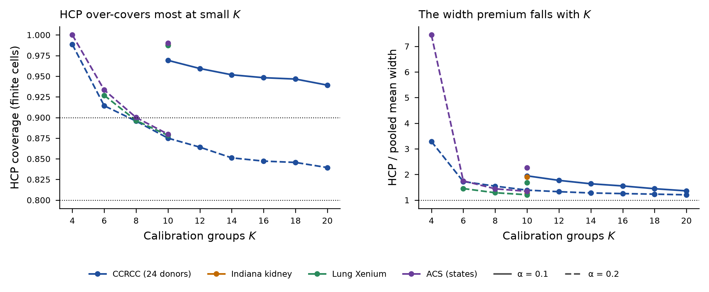
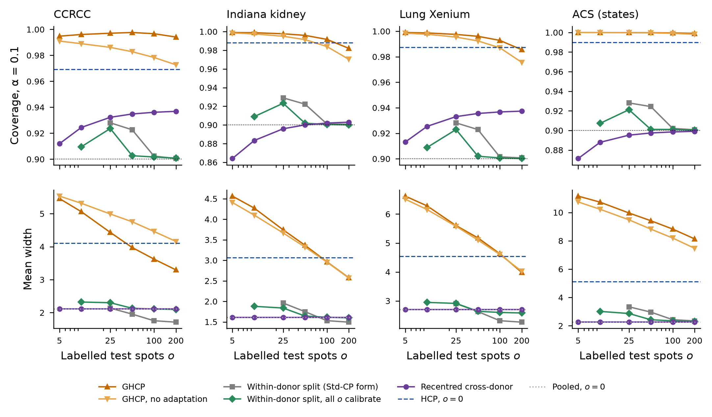

# Round 4, conformal track: final report at gate C4 (C1 to C3)

Branch `round4-conformal`, tag `round4-conf-final`. Written 2 October 2026. Plan
`docs/round04/tracks/conformal/round4_conf_plan.md` sections 1 to 12; the C2 report is `docs/round04/i01/conformal/round4_conf_C2_report.md`
and the C2 decision memo is plan section 12. This is the end-of-track report-and-wait gate.

## 1. Stage and status

C1 and C2 were reported at gate C2 and accepted (plan section 12.1). C3, the real-data
$(K, o)$ map, is complete on every unit, namely CCRCC $K$ and $o$, Indiana $K$ and $o$, lung
Xenium $K$ and $o$, and ACS $K$ and $o$. The fixed-format table the PPI track's Q5 reads,
`results/round4/conformal/C3_real/c3_o_sweep.csv`, carries `within_plain` as a method value. In
the repository it is committed as `c3_o_sweep.csv.gz` because the plain file exceeds GitHub's
size limit; the plain file is in the Longleaf project tree at the same path (md5 in section 2).

## 2. What was run

**Code**, in `code/scripts/` at the tagged commit. `round4_conf_c3.py` is the shared C3 module,
md5 2d8418677cf8290eec89a14c315b92cd, built and anchored by an ad hoc core unit before the
eight units ran. `round4_conf_c3_merge.py` merges the fragments and computes the report numbers.
Each unit's runner is in its fragment's `code/` directory under
`results/round4/conformal/C3_real/frag_<unit>/`. The released GHCP code is commit
d1a69f4a35b260b592d3ea39d7c7ad7133459cba throughout.

**Jobs.** Every C3 HEST unit ran on Longleaf under `rc_tengfei_pi`, all 106 jobs routed to
`spill`. Of those, 70 completed, 17 failed, 9 timed out and 10 were cancelled by the units
(`results/round4/conformal/C3_real/c3_jobs_sacct.csv`). Every failed or timed-out piece was
rerun with the same code and seeds or superseded. The row counts in section 3 show that nothing
was dropped. The longest job ran 5509 seconds and the largest MaxRSS was 8.25 GB. Both ACS
units read the PPI track's ACS files. ACS o ran locally under plan section 11 item 7, and ACS K
ran on Longleaf (Slurm 3378830). Merges, figures and the numeric-claim sweep ran locally under
section 11 item 4.

**Queue.** At the start of interval 2 the Longleaf general and spill partitions were fully
allocated, with a deep pending queue. The first jobs waited several hours, and the
4-hour note of plan section 12.6 was sent to Nicolas for jobs 3357158, 3357176 and 3378830.

**The merged o-axis table** has md5 2c3ceaa42528a1e3ad2979dc1161e542 in both places.

## 3. Acceptance checks

**HEST anchor**, `results/round4/conformal/C3_real/frag_core/c3_anchor.csv`. The CCRCC
$K = 10$, $o = 0$ pooled, HCP and one-per-donor rows from the C3 module reproduce
`a4b_hcp_K10__<enc>.csv` on all three encoders and both donor sets. Coverage agrees to 0.0
(tolerance 1e-12), with no finite-flag mismatches and identical design columns. Widths agree to
about 1e-13 on the Intel node (uni_v2) and to 2.8610447344590284e-10 or less on AMD nodes
(resnet50, hoptimus0). This is the same base-head floating-point offset that C0 recorded. The
`a4b_summary.csv` check passes in all six scopes.

**Merge**, `results/round4/conformal/C3_real/c3_merge_checks.csv`. There are 0 duplicated keys
in the o-axis table, merged from four fragments, and 0 in the K-axis table. The
$K = 10$, $o = 0$ rows of the K units equal those of the o units on 4698 matched rows, with a coverage
difference of 0.0 and a width difference of at most 2.861031411782733e-10.

**ACS**, `results/round4/conformal/C3_real/frag_ACS_o/acs_ghcp_reproduction.csv`. The GHCP
paper's ACS Tables 5, 12 and 13 reproduce within Monte Carlo error at 53 of 53 transcribed
values, using the released `real_data/acs/` processing at d1a69f4 on the verified source. The
local `raw/` files matched `raw_manifest.json`; the Longleaf directory has no manifest, but its
parquet md5 equals the local one. The counts per table are in `c3_report_numbers.csv` (section
6).

**Tie convention** (plan 12.2 item 1). The released code's finiteness is recorded beside every
row in each unit's full table (`finite_code`). Indiana and lung report it identical to the
primary convention in every row. In ACS it differs only for HCP at $\alpha = 0.2$, $K = 4$
(`frag_ACS_K`). C3 runs no GHCP at $o = 0$ on the HEST tasks, the one cell where C1 found the
two conventions to differ, because $o = 0$ is HCP by plan 12.2.

## 4. Methods, assumptions and guarantees

As in plan sections 6 and 12.3 and the docstrings of `round4_conf_c3.py`.
- **o = 0:** the pooled spot quantile, HCP, and one-per-donor (round 3's `dwr`, the mean over
  200 single draws).
- **o > 0:**
  - GHCP: the primary form `ghcp` has $\eta = 0$ with adaptation on. At $\eta = 0$ the paper's
    and the code's pool rules select the same groups. The forms with $\eta = 0.5$ (paper rule
    with and without adaptation, code rule at $\alpha = 0.1$) are the secondary variants.
  - `within`, the Std-CP form, which recentres on $\lfloor o/2 \rfloor$ observations and
    calibrates on the rest.
  - `within_plain`, which calibrates the absolute score on all $o$ observations with no
    recentring. It is exchangeable within the test donor, so its coverage is at least
    $1 - \alpha$, and it is finite from $o = 9$ at $\alpha = 0.1$.
  - The recentred cross-donor interval, which shifts the pooled donor-design quantile by the
    labelled spots' mean residual. It has no finite-sample guarantee.

Every comparison is within one (task, encoder, fold, calibration draw, label draw), so the base
head, the calibration spots and the labelled spots are common and only the method differs. The
$K$ sweep changes the training-donor count as $K$ rises, and the count is recorded beside each
$K$.

## 5. Predictions against outcomes

C1 and C2 predictions were scored in the C2 report, section 5, and that scoring was accepted
(plan 12.1); they are not repeated here. C3 numbers are from
`results/round4/conformal/C3_real/c3_report_numbers.csv` unless noted. "Mean" is over encoders
of the mean over folds of the per-fold mean over draws.

| Prediction | Outcome | Scored |
|---|---|---|
| C3.1 HCP on CCRCC falls from about 0.99 at $K=4$ (finite only at $\alpha=0.2$) to about 0.95 at $K=20$; width ratio to pooled from above 3 to about 1.4; pooled 0.86 to 0.87 at every $K$ | At $\alpha=0.2$, $K=4$: coverage 0.9885, width ratio 3.2861. At $\alpha=0.1$, $K=20$: coverage 0.9392, width ratio 1.3604. Pooled at $\alpha=0.1$ 0.8588 to 0.8727 over $K$ | held |
| C3.2 original | not tested, premise refuted in C1 (plan 12.3 change 3) | not tested |
| C3.2 revised. At $K=10$ GHCP covers at least 0.97 at every $o$ on every HEST task and is wider than `within_plain` at every $o \ge 25$; at $o \le 10$ its width is within 10% of HCP's at $o=0$ or above it; on the CCRCC $K$ sweep its coverage at $o=25$ falls from above 0.97 at $K=10$ to 0.93 to 0.95 at $K=20$ | Minimum GHCP coverage over $o$ 0.9941 (CCRCC), 0.9820 (Indiana), 0.9852 (lung). GHCP/`within_plain` width at $o \ge 25$ between 1.5435 and 2.0495. GHCP/HCP width at $o \le 10$ between 1.2312 and 1.4888. CCRCC GHCP coverage at $o=25$ 0.9970 at $K=10$, 0.9440 at $K=20$ | held |
| C3.3 recentring recovers more than half of the shortfall on unit-calibrated tasks and less than a third on block-calibrated ones | The block-calibrated tasks (HCC, LUNG, SKCM) are not in C3 | not tested |
| C3.4 the top-decile shortfall (0.72 under the cross-donor absolute score) closes to 0.85 or above under GHCP with the CQR score at $o \ge 25$ | Pooled absolute score top-decile coverage 0.7281; GHCP (no adaptation) with CQR 0.9905 at $o=25$ and 0.9785 at $o=200$. On round 3 A4's 6 CQR genes only, donor set 24, one calibration draw | held, provisional (6 genes) |
| C3.5 Indiana shows the CCRCC pattern with a smaller gap (fold scatter a third of CCRCC's); lung a larger gap; ACS between; the paper's ACS numbers reproduced | Pooled shortfall from 0.9 at $K=10$: CCRCC 0.0356, Indiana 0.0129, lung 0.0008, ACS 0.0016. Fold sd of pooled coverage 0.1424 (CCRCC) and 0.0424 (Indiana). ACS tables reproduced at 53 of 53 values | Indiana and ACS reproduction held; lung and ACS ordering not held |
| C3.6 recentred within 0.03 of the pooled cross-donor coverage at $o=5$ and within 0.02 of nominal at $o \ge 50$ on CCRCC and Indiana; under-covers by at least 0.03 at every $o$ on lung | Recentred minus pooled at $o=5$: CCRCC 0.0475, Indiana $-0.0230$. Recentred minus nominal at $o \ge 50$: CCRCC 0.0348 to 0.0369, Indiana 0.0001 to 0.0030. Lung recentred minus nominal 0.0131 to 0.0374, over-covering | held on Indiana only; not held on CCRCC and lung |

## 6. Results

**The K axis**, `results/round4/conformal/C3_real/fig_c3_K_sweep.png`, numbers in
`c3_report_numbers.csv` (prediction C3.1).
- **CCRCC:** HCP's width premium over the pooled quantile falls steadily with $K$, from 1.9465
  at $K = 10$ to 1.3604 at $K = 20$ at $\alpha = 0.1$. Its coverage stays above nominal, while
  the training-donor count falls from 13 to 3. Pooled coverage is 0.8644 at $K = 10$.
- **Lung:** at $\alpha = 0.1$, HCP and one-per-donor are infinite at $K = 6$ and $8$ and finite
  at $K = 10$ (`frag_Lung_K`).
- **ACS:** the within-fold design allows only $K \le 10$ (`frag_ACS_K`).
- **Dispersion:** the fold standard deviation is in `c3_K_sweep_by_task.csv`
  (`coverage_sd_folds`).

**The o axis**, `results/round4/conformal/C3_real/fig_c3_o_sweep.png`, numbers in
`c3_report_numbers.csv` (prediction C3.2r) and `c3_o_sweep_by_task.csv`. At $K = 10$ and
$\alpha = 0.1$ the real data repeat the three regions that C1 showed.
- **$o = 0$:** HCP is the valid choice.
- **$0 < o < 25$:** GHCP is finite where the within-donor split is not, but it is wider than
  HCP. On CCRCC the GHCP/HCP width ratio is 1.3283 at $o = 5$.
- **$o \ge 25$:** `within_plain` is near nominal and about half GHCP's width. The
  GHCP/`within_plain` width ratio is 1.9269 on CCRCC at $o = 25$.

GHCP over-covers everywhere. Its coverage is 0.9970 on CCRCC at $o = 25$. The secondary GHCP
forms with $\eta = 0.5$ are infinite at every $o$ at $K = 10$ and $\alpha = 0.1$, because the
restricted pool keeps about five donors (`frag_CCRCC_o`, `frag_Indiana_o`). The recentred
interval keeps the pooled width at every $o$ and moves coverage toward or past nominal.

## 7. Escalations

1. **ACS grouping.** The released GHCP ACS task is California PUMAs as groups; the instruction's
   is states. The reproduction (section 3) used the released PUMA task. The C3 ACS rows use
   states, the PPI task definition and the PPI package predictions, so they are not the paper's
   ACS task (`frag_ACS_o/PROVENANCE.txt`).
2. **ACS manifest on Longleaf.** The Longleaf ACS directory has no `raw_manifest.json`. The md5
   check ran on Nicolas's local copy, and the Longleaf parquet's md5 was matched to it (section
   11 item 8).
3. **ACS K range.** Calibration states drawn from the test state's own cross-fitting fold limit
   $K$ to 10. A separate cross-fold extension reaches $K = 20$ with only a heuristic guarantee
   and is reported separately (`frag_ACS_K/c3_K_sweep_crossfold__ACS.csv`).
4. **Stamps.** My shared brief named the lead's frame id, and several units stamped with it.
   Four fragments carry only their own frame id. Four carry the lead's in the local mirror,
   although CCRCC o and Indiana K report correcting this on Longleaf. ACS K has no local stamp
   (`results/round4/conformal/C3_real/c3_stamp_check.csv`).
5. **Lung size-matching target.** The size-matching target (`n_T_matched` 10114 in
   `results/round4/conformal/C3_real/frag_Lung_K/c3_K_sweep__LUNG.csv`) is the core unit's
   assumption, built as round 3 does for Indiana; no earlier file fixed it.
6. **Width agreement across CPU vendors.** Widths agree across Intel and AMD nodes only to about
   1e-10; coverage is unaffected (section 3).
7. **One misread instruction.** The ACS K unit read my no-permission notice as an order to stop
   local compute, and ran on Longleaf after a long queue.
8. **A follow-up run.** The CCRCC GHCP $K$ sweep at $o = 25$ was added after the eight units,
   because revised C3.2 needs it (`frag_CCRCC_K/ghcp_o25/`).
9. **The memo's local-compute rule.** Plan 12.6 allows local work only for named tasks, while
   section 11 item 7 is Nicolas's later general permission. I followed item 7 and flagged the
   difference on transcription.

## 8. What was not checked

C3.3 needs the block-calibrated tasks, which C3 does not include. C3.4 covers only round 3
A4's 6 CQR genes, one calibration draw and donor set 24. The Intel-constrained anchor reruns
for resnet50 and hoptimus0 were not read. The ACS rows use states, not the paper's PUMA task.
GHCP at $o = 0$ was not run on the HEST tasks.

## 9. Proposed next step

None within this track. The prediction-set section of the paper is the PPI track's and
Nicolas's to write from this record. Whether to tell the GHCP authors about the pool rule and
the tie convention is Nicolas's decision with David and Dr. Zhu.

---

## What the conformal track established

For spots of a new donor, HCP is the valid method when no spot of that donor is labelled. Its
price of validity is infinite for $K + 1 < 1/\alpha$, and on CCRCC it falls from 1.9465 times
the pooled width at $K = 10$ to 1.3604 at $K = 20$ (`results/round4/conformal/C3_real/c3_report_numbers.csv`).
The C1 testbed shows the same shape against the oracle, and no $o = 0$ candidate of C2 beat it
under the fixed criterion (`results/round4/conformal/C2_candidates/c2_criterion.csv`). The
released GHCP code reproduces the paper's simulation tables at 254 of 254 values
(`results/round4/conformal/C1_testbed/ghcp_repro_longleaf/compare/c1_ghcp_reproduction.csv`)
and its ACS tables at 53 of 53 (`results/round4/conformal/C3_real/frag_ACS_o/acs_ghcp_reproduction.csv`).
On HEST at $K = 10$, a few labelled spots do not help. GHCP at $o \le 10$ is wider than HCP at
$o = 0$, and from $o = 25$ the plain within-donor split is about half GHCP's width at near
nominal coverage (`c3_report_numbers.csv`, revised C3.2). The pooled quantile's shortfall is
real on CCRCC (0.0356 at $K = 10$) and small on Indiana, lung and ACS (`c3_report_numbers.csv`,
C3.5).

The paper's prediction-set section should say five things.
- HCP is the method at $o = 0$, with its price of validity as a function of $K$.
- For $K + 1 < 1/\alpha$ the price is characterised. Every valid method has infinite expected
  width, the forced infinite probability $1 - \alpha(K+1)$ is attained by randomised HCP, and
  methods that are finite almost surely have the floor $1 - \beta^\star$. This goes in as one
  remark with proofs in an appendix (`docs/round04/i01/conformal/round4_conf_lower_bound.md`). For $K + 1 \ge 1/\alpha$
  the question is open.
- On these data, fewer than about 25 labelled spots per test slide buy nothing for the
  prediction set, and from 25 on the within-donor split is the cheapest valid choice.
- The released GHCP code's pool is one group larger than the paper's equation (8), and the
  published tables were produced under the code's rule.
- This track uses the standard tie convention, under which the threshold is the
  $\lceil (n+1)(1-\alpha) \rceil$-th smallest score.

The lower-bound scoping produced the remark above and nothing further worth pursuing in this
track.
