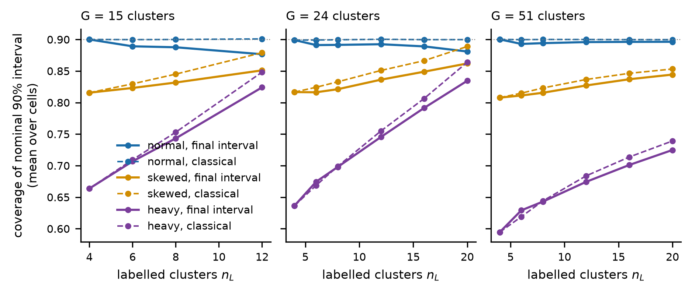
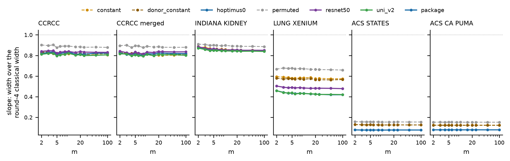

# Round 5 PPI track, the E2 gate report (stages E0, E1 and E2)

8 October 2026. Written by the execution session for the oversight chat, under `docs/round05/i01/ppi/round5_ppi_track.md` as transcribed in `docs/round05/tracks/ppi/round5_ppi_plan.md`. Every number below is read from the file named beside it. Paths are relative to the repository root unless they start with `/work`.

## 1. Stage and status

E0, E1 and E2 are complete. Every acceptance check of E0 and E2 passes. E1's acceptance checks 1, 2 and 4 pass, and check 3 passes in 480, 479 and 478 of 480 cells under the normal, skewed and heavy laws, with the three exceptions all under the log-normal laws (section 3, `results/round5/ppi/E1_interval/e1_acceptance.csv`). The reading of section 2.4 of the brief holds for the slope $\theta_3$, and the derivation of `docs/round05/tracks/ppi/round5_ppi_theory.md` section 1 recovers it as a special case. The group difference $\theta_2$ shows a separate problem in regime B that the brief did not anticipate (section 6.3 and escalation 4). Work has stopped at the gate. Nothing in E3 or E4 has been set up. The gate's pull request is NicWYZ/HEST-1k-replication#15, from `round5-ppi` into `main`, and the tag `round5-ppi-E2` marks the commit that adds this sentence.

## 2. What was run

**Branch and commits.** Branch `round5-ppi` was created from `origin/main` at `d82c3f33ce37fe2d7dbf5b527bfee9a9fb9ee935` and pushed empty on 7 October. All later commits are local until the gate push (plan extension 1). The Longleaf code clone `/work/users/w/e/weiyang/hest_code/round5-ppi` was cloned at that commit by Slurm job 4168737 and was not moved afterwards, so every job's clone HEAD is `d82c3f33ce37fe2d7dbf5b527bfee9a9fb9ee935`. New round-5 scripts reached Longleaf by upload into each job's directory, and every `PROVENANCE.txt` records their md5s and the local commit that holds them.

**Scripts.** All under `code/scripts/`. The round-4 modules were imported unmodified, with md5s confirmed in the clone (`results/round5/ppi/E0_anchors/e0_setup_checks.csv`).

| script | role |
|---|---|
| `round5_ppi_common.py` | paths, md5, ownership stamps, `PROVENANCE.txt` writer |
| `round5_ppi_e0_checks.py`, `round5_ppi_e0_compare.py` | E0 setup checks and anchor comparison |
| `round5_ppi_estimator.py` | the whole-cluster linearised design variance, the oracle coefficient, Johnson's interval |
| `round5_ppi_e1_sim.py`, `round5_ppi_e1_diag.py`, `round5_ppi_e1_merge.py` | E1 simulation, real-task diagnostic, merge and scoring |
| `round5_ppi_e2_regimeB.py`, `round5_ppi_e2_sim.py`, `round5_ppi_e2_merge.py` | E2 parts 1 and 2, merge, decomposition and scoring |
| `round5_ppi_e2_diag.py`, `round5_ppi_e2_levelcheck.py`, `round5_ppi_e2_report_extra.py` | E2 diagnostics and the subset counts quoted here |

**Jobs.** The lead's jobs are in `results/round5/ppi/r5ppi_slurm_jobs.csv` and each unit's jobs are in `results/round5/ppi/unit_job_ledgers/`. Every job ran on partition `spill`. The E0 job waited 1 h 47 min on `rc_htzhu_pi` at priority 197 and was moved while pending to `rc_tengfei_pi`, where its priority was 246. Every later job was submitted on `rc_tengfei_pi` and waited a few minutes at most. Each unit's wall times and peak memory are in its ledger. The largest peak memory of a lead job was 2.11 GB (`r5ppi_slurm_jobs.csv`, job 4168737).

**Fan-out.** E1 ran as four sub-agents (the three values of $G$ and the diagnostic) and E2 as seven (six tasks and the simulation). Each was sent its own frame id after it started and before it wrote anything. Every stamp matches the id assigned to its unit, 27 of 27 in E1 and 56 of 56 in E2 (`results/round5/ppi/E1_interval/e1_stamp_check.csv`, `results/round5/ppi/E2_regimeB/e2_stamp_check.csv`). The lead merged, recomputed every pooled number on Longleaf and committed. No sub-agent ran git.

## 3. Acceptance checks

**E0** (`results/round5/ppi/E0_anchors/`).

1. The project tree is on `main` at `9d7277dc8c4bfade08d5895051666ee134b8396a` and all four md5s of brief section 3 match in the clone (`e0_setup_checks.csv`). All 12 tissue prediction parquets exist and match `q5_input_md5.json`. The two ACS parquets have md5 `e18604e1e915ff51f2668719e397ab7a` (states) and `c581e8d0a04c989cfebfe6ee888feb90` (PUMAs) (`e0_parquet_md5.csv`), the same values the round-4 ACS runs recorded (`code/scripts/round4_ppi_q2_acs_run_one.sh`).
2. `round4_ppi_q4a_tests.py` passes 13 of 13 (`tests/q4a_tests_stdout.txt`). `round4_ppi_q1b_tests.py` passes 135 of 135 (`tests/q1b_tests.csv`) on its second run. The first run omitted the required `--ref-module` argument and did not start. The second ran it, as round 4 did, against the estimator at `de3d1f2`.
3. The masking anchor (CCRCC, `hoptimus0`, $n_L = 8$, every unit labelled, three rules) matches all 40 rows of `q4a_table61.csv`. The largest difference is 0.0 in every column (`e0_anchor_masking.csv`). The regime B anchor (budget 2,400, rules `none` and `c_crossfit`) matches all 16 rows. The largest difference is 0.0 except `est_var_over_emp_var_median`, at 2.4e-16 relative (`e0_anchor_regimeB.csv`).

**E1** (`results/round5/ppi/E1_interval/e1_acceptance.csv`).

1. The new variance function equals `textbook_two_stage(..., lin=True)` on the synthetic array and on one CCRCC draw, in both populations and under both rules. The largest relative difference is 6.5e-15 against a tolerance of 1e-12 (12 of 12 rows, `e1_acceptance1.csv`).
2. Under rule `none` the intervals with and without the linearised term are identical in every column, in 1,440 of 1,440 cells.
3. In the oracle arm the empirical variance over the exact fixed-coefficient design variance is within three Monte Carlo standard errors of 1 in all 480 normal-law cells. It is within three standard errors in 479 of 480 skewed-law cells and in 478 of 480 heavy-law cells, with largest $|z|$ of 3.87 and 4.08. Escalation 2 discusses this.
4. Under the normal law at $G = 24$ the classical interval's median coverage over cells is 0.8988 to 0.9001 across $n_L$ from 4 to 20, within 0.0012 of 0.90 (`e1_report_numbers.csv`, rows `acc4`).

**E2** (`results/round5/ppi/E2_regimeB/e2_acceptance.csv`).

1. With $m_g = M_g$ regime B returns the full-data value to at most 2.5e-13 in absolute terms on every task (ACS states $\theta_2$, a mean of log income), and the design variance is 0 in every row.
2. With the round-4 proportional allocation and seed strings, the new script reproduces the 16 E0 regime B anchor rows. The largest difference is 2.2e-16.
3. At outcome level $\mu = 0$ the simulation reproduces all 96 matching round-4 coverages exactly (largest difference 0.0). The constant predictor's variance ratio is within 0.011 of 1 in all 16 rows.

A pairing check was added. The classical estimate uses only $z$ and the labelled units, so its per-gene width should agree across a task's arms. It does, to 1.4e-8 relative at most, on lung $\theta_2$ (`results/round5/ppi/E2_regimeB/diag/e2_pairing_check.csv`). The merge's own row for this check reads `False` because it used an absolute tolerance of 1e-9, which is too tight for lung widths near 6.

## 4. What differs between the arms of each comparison

- **E1, final against classical interval.** The two arms share the same populations, samples and cross-fit halves. The final arm has the coefficient `c_crossfit_design`, with $c_U\bar F$ on the population term and the linearised term in $e_g$. The classical arm has $\lambda = 0$.
- **E1, with and without the linearised term.** The two arms share the same estimate. The only difference is the term $(\lambda_g - c_U)\bar F$ in $e_g$.
- **E1, oracle against the design rule.** The oracle has a fixed coefficient, the population's least-squares slope, which is unclipped and the same on every cluster. The design rule estimates the coefficient on the other half and clips it to $[0, 1]$.
- **E1, laws.** The normal, skewed and heavy laws differ only in the law of $p_g$ and $\xi_g$. The seeds name the law, so the draws are not shared across laws.
- **E2, arms of a task.** All arms share the same labelled units in every draw and the same cross-fit halves. They differ only in the prediction $\hat y$. The permuted predictor is `resnet50` (or the package predictor on ACS) with rows permuted across the task. The constant predictor is the task-wide mean of `resnet50` for each gene. The donor-constant predictor is each cluster's own mean of `resnet50`. The round-4 classical estimator is the same in every arm, which the pairing check confirms.
- **E2, real over constant.** The two arms differ in the predictor alone. The real predictor carries its own cluster levels and its own within-cluster ranking of units. The constant predictor carries one level per gene and no ranking.
- **E2 simulation across $\mu$.** The arms share every random draw and differ only in the added level of $y$, which every predictor inherits. The constant predictor takes each replicate's own mean, so its level varies with the replicate.

## 5. Predictions against outcomes

Scores are read from `results/round5/ppi/E1_interval/e1_prediction_scores.csv`, `results/round5/ppi/E2_regimeB/e2_prediction_scores.csv` and `results/round5/ppi/E2_regimeB/diag/e2_report_numbers_extra.csv`. Each cell of each prediction is listed in `e1_prediction_cells.csv` and `e2_prediction_cells.csv`, and the E1 cells are tabulated by every grid axis in `e1_tabulations.csv`. E1's predictions are scored on the normal law as written, with the other laws reported beside them.

| prediction | outcome | score |
|---|---|---|
| E1.1 final covers 0.88 to 0.91 for $n_L \ge 6$, within 0.02 of classical (normal) | 341 of 390 cells in the band, minimum 0.840. 337 of 390 within 0.02 of classical, largest gap 0.059 | partly held |
| E1.2 without the term, estimated variance more than twice the empirical in half the $\kappa = 10$, $R^2 \ge 0.4$ cells. With it, 0.85 to 1.10. At $\kappa = 0$ coverages within 0.01 | 70 of 78 cells above 2, median 6.98. 69 of 78 in 0.85 to 1.10, minimum 0.687. At $\kappa = 0$, 160 of 160 within 0.01 | partly held |
| E1.3 tuned est/emp below classical by 0.03 to 0.15 at $n_L/G \ge 1/3$, $R^2 \ge 0.4$, and by less than 0.05 at $G = 51$, $n_L \le 12$ | 75 of 144 cells in 0.03 to 0.15, with differences 0.0004 to 0.316. 88 of 90 below 0.05 | partly held |
| E1.4 at $G = 24$, $n_L = 8$, per-population coverage 5 to 95 range at least 0.03 and above 0.87. Skewed law classical 0.85 to 0.89 | range at least 0.03 in 28 of 30 cells, minimum 0.027. 5th percentile above 0.87 in 30 of 30. Skewed-law classical averages per $n_L$ 0.817 to 0.889, 3 of 6 in the band | partly held |
| E1.5 tuned/classical variance below 1 above $n_L = 4 + 2/R^2$, above 1 in at least half the cells below | below 1 in 183 of 186 cells above the count. Above 1 in 5 of 126 cells below it | refuted in its second half |
| E2.1 design coverage 0.87 to 0.92 for $m \ge 5$, 0.78 to 0.90 at $m = 2, 3$ | $\theta_3$, tissue: 426 of 432 cells in band at $m \ge 5$ (0.870 to 0.925), 86 of 96 at $m \le 3$. $\theta_2$, tissue: 1 of 432 in band at $m \ge 5$, coverage 0.400 to 0.883 | held for $\theta_3$, refuted for $\theta_2$ |
| E2.2 constant at or below permuted, gap at most 0.06 on tissue. ACS mean permuted 1.00 within 0.01 | constant below permuted in 93 of 96 tissue cells and 24 of 24 ACS $\theta_3$ cells. Gap at most 0.06 in 43 of 96, largest 0.156. ACS mean 23 of 24 within 0.01, largest 0.0108 | partly held |
| E2.3 real over constant 0.93 to 1.00 ($\theta_3$, kidney), at least 0.97 ($\theta_2$, kidney), 0.60 to 0.85 (lung), 0.4 to 0.8 (ACS) | kidney $\theta_3$ 0.981 to 1.042 (53 of 108 in band, the rest above 1.00). Kidney $\theta_2$ 104 of 108 at least 0.97. Lung 0.740 to 0.865, 35 of 36. ACS 0.602 to 0.639, 24 of 24 | held in substance |
| E2.4 simulated constant variance ratio equals $1 - L$ within 0.03 at $m \ge 20$ | 15 of 16 rows within 0.03, largest difference 0.035 | partly held |
| E2.5 real over constant flat in $m$ within 0.03 for $m \ge 5$ | $\theta_3$, 14 of 14 task and predictor pairs, largest range 0.026. $\theta_2$, 2 of 12 tissue pairs, largest range 0.348 | held for $\theta_3$, refuted for $\theta_2$ |

E1.1 to E1.5 under the skewed and heavy laws are in `e1_prediction_scores.csv`. Under those laws the final interval's coverage is far below the band, for the reason given in section 6.1.

## 6. Results

### 6.1 E1, the final design-target interval in simulation

**Under the normal law the final interval covers close to nominal.** At $G = 24$ and $n_L \ge 6$ it covers 0.858 to 0.900 over cells, median 0.892, against 0.896 to 0.904 for the classical interval (`results/round5/ppi/E1_interval/e1_report_numbers.csv`). The shortfall is concentrated where the clip does not bind. At $\lambda^\star = 0.6$ the final interval's median coverage over all $G$ and $n_L \ge 6$ is 0.888, minimum 0.840. At $\lambda^\star = 1.2$ it is 0.897, minimum 0.881 (`results/round5/ppi/E2_regimeB/diag/e2_report_numbers_extra.csv`). At $\lambda^\star = 1.2$ the unclipped half-sample coefficient has median 1.187 and the clipped one 0.865, so both halves usually sit at 1 and the estimator behaves as one with a fixed coefficient. At $\lambda^\star = 0.6$ the two halves differ, which is the tuning cost. By $G$, 65 of 90 cells at $G = 15$ are in the band against 127 and 149 of 150 at $G = 24$ and 51 (`e1_tabulations.csv`). The tuned interval's estimated variance is low, with median ratio to the empirical variance 0.963 and minimum 0.770 at $G = 24$, against 0.999 for the classical (`e1_report_numbers.csv`).

**The linearised term is necessary when the prediction has a level.** At $\kappa = 10$ and $R^2 \ge 0.4$ the interval without it overstates the variance by a median factor of 6.98, with maximum 31.7 under the normal law. With it, the median ratio is 0.965 (`e1_prediction_scores.csv`). At $\kappa = 0$ the two intervals' coverages agree within 0.0026 in every normal-law cell.

**Skewness of the cluster contributions reproduces the real-task shortfall, and the tuning adds little to it.** Under the skewed law, which was calibrated to the CCRCC slope contributions, the classical interval covers 0.784 to 0.900 at $G = 24$, median 0.852, and the final interval 0.800 to 0.890, median 0.833 (`e1_report_numbers.csv`). On the real tasks the classical interval covers 0.8475 to 0.88 on CCRCC (`results/round5/ppi/E0_anchors/e0_brief_claims.csv`, from `q4a_table61.csv`). Across genes, a gene's classical coverage falls with the skewness of its donor contributions. The Spearman correlation is $-0.81$ for $\theta_3$ on CCRCC, $-0.79$ on CCRCC merged and $-0.81$ on lung, and $-0.21$ on Indiana (p = 0.14) (`results/round5/ppi/E1_interval/e1_real_coverage_vs_skewness.csv`). The median absolute skewness of the slope contributions is 1.76 on CCRCC, 0.87 on lung and 0.60 on Indiana (`e1_report_numbers.csv`), so the weakest correlation goes with the least skewed task. A contradiction would have been a skewed-law classical coverage near 0.90 or a final interval much worse than the classical. Neither appears.

**Johnson's interval does not restore coverage, and is dropped.** Under the skewed law at $G = 24$ the final interval covers 0.834 on average with the $t$ reference and 0.833 with Johnson's correction. The classical interval covers 0.847 and 0.856 (`results/round5/ppi/E1_interval/e1_johnson.csv`).

**The break-even count is conservative under the design rule.** Above $n_L = 4 + 2/R^2$ the tuned estimator has lower variance than the classical in 183 of 186 normal-law cells. Below it, the tuned estimator is still the lower in 121 of 126 cells (`e1_prediction_scores.csv`). The count was derived for an unclipped slope, and clipping to $[0, 1]$ lowers the coefficient's variance, as `docs/round04/tracks/ppi/round4_ppi_theory.md` section 5.2 says. So this is the direction the theory allowed, larger than the oversight chat predicted.

**The heavy law is a stress test, not a model of the data.** Its population skewness is about 292 (plan section 4), and at $G = 24$ the classical interval covers 0.628 to 0.878 under it (`e1_report_numbers.csv`). In one heavy-law cell ($G = 24$, $n_L = 6$, $R^2 = 0$, $\lambda^\star = 0.6$, $\kappa = 2$) the tuned estimator's variance is 40.2 times the classical one (`e2_report_numbers_extra.csv`). A likely cause is that a coefficient estimated on one half is applied to an extreme $p_g$ in the other. This was not checked.

`results/round5/ppi/E1_interval/fig_e1_coverage.png`. Coverage of the nominal 90% interval, the mean over the cells of each $n_L$ ($R^2$, $\lambda^\star$, $\kappa$), 60 populations by 1,000 samples per cell.

### 6.2 E2, the slope $\theta_3$ in regime B

**The interval covers at every $m$.** Design target, donor-weighted, every arm and both rules. On the tissue tasks coverage is 0.870 to 0.925 at $m \ge 5$ and 0.855 to 0.905 at $m = 2$ and 3. On ACS it is 0.850 to 0.940 and 0.865 to 0.945 (`e2_report_numbers_extra.csv`). Each value is a median over genes of 200 draws, so a single draw moves it by 0.005.

**Nearly all of the encoders' regime B gain on the Visium tasks is the level term.** The constant predictor's width ratio against the round-4 classical estimator is 0.81 on CCRCC, 0.80 to 0.82 on CCRCC merged and 0.85 to 0.86 on Indiana at $m = 5$ to 100. The encoders give 0.80 to 0.84 on CCRCC (`results/round5/ppi/E2_regimeB/diag/e2_level_share_vs_constant.csv`). An encoder's width over the constant's is 0.981 to 1.042 on the three kidney tasks. So on the kidney tasks the encoders' within-cluster ranking of spots adds less than 2% in width, and `resnet50` is up to 4% wider than the constant on CCRCC (`e2_report_numbers_extra.csv`). On lung the encoders are 0.740 to 0.865 of the constant's width. On ACS the package predictor is 0.602 to 0.639 of it.

**The level share predicts the constant predictor's gain.** $\sqrt{1 - L}$, from the full data with the clipped pooled coefficient of theory section 1.2, is 0.794 on CCRCC, 0.844 on Indiana, 0.558 on lung and 0.124 to 0.126 on ACS. For $\theta_3$ at $m = 5$, 20 and 100 the constant predictor's width ratio minus $\sqrt{1 - L}$ is between $-0.0005$ and 0.035 on every task (`e2_level_share_vs_constant.csv`). In the simulation the constant's variance ratio is within 0.03 of $1 - L$ in 15 of 16 rows at $m \ge 20$. At $\mu = 3$, donor-weighted, it is 0.110 against 0.105 at $m = 20$ (`results/round5/ppi/E2_regimeB/e2_sim.csv`).

**The permuted predictor is not equivalent to the constant.** It is wider than the constant by 0.061 to 0.086 for $\theta_3$ on CCRCC and by 0.074 to 0.098 on lung (`e2_report_numbers_extra.csv`). Its predictions carry the right level but also a unit-level spread that is unrelated to $y$. That spread adds to $\text{Var}_g(f)$ and lowers the pooled share. Theory section 1.5 item 1 called the two "close". The data say the constant is the cleaner control.

**The gain over the constant does not depend on $m$.** For $\theta_3$ the range over $m \ge 5$ of an encoder's width over the constant's is at most 0.026, in all 14 task and predictor pairs (`e2_report_numbers_extra.csv`).

`results/round5/ppi/E2_regimeB/fig_e2_decomposition.png`. Regime B width over the round-4 classical width for the slope, design target, donor-weighted, rule `c_crossfit`, median over genes of 200 draws. Real predictors solid, controls dashed.

### 6.3 E2, the group difference $\theta_2$ in regime B

**On the tissue tasks the regime B interval for $\theta_2$ under-covers badly, under every arm and both rules.** At $m \ge 5$ it covers 0.503 to 0.865 on CCRCC, 0.470 to 0.740 on Indiana and 0.400 to 0.805 on lung. At $m = 2$ and 3 the range is 0.225 to 0.890 (`e2_report_numbers_extra.csv`). The estimated variance is right on average. For the classical estimator with `hoptimus0` on the four tissue tasks, the ratio of mean estimated to empirical variance is 0.87 to 1.13 across tasks and $m$ (`results/round5/ppi/E2_regimeB/e2_regimeB_grid.csv`, `est_var_over_emp_var_median`). So the failure is in the joint behaviour of the estimate and its variance, not in a biased variance.

**The mechanism looks like rare groups.** The $\theta_2$ weight is $1/\pi$ on the rarer group's units. A sample of $m$ units that misses that group gives a small variance estimate in the draws where the estimate is furthest from the cluster value. The median over donors of $\min(\pi_N, \pi_S)$ is 0.099 on CCRCC, 0.010 on Indiana and 0.008 on lung, and all 9 valid lung donors have it below 0.05 (`results/round5/ppi/E2_regimeB/diag/e2_theta2_rare_group.csv`). The mean probability that $m$ labelled units miss one of the groups falls from 0.97 at $m = 2$ to 0.38 at $m = 100$ on lung. The classical coverage rises from 0.225 to 0.785 over the same range. Across the 48 task and $m$ cells, the Spearman correlation between this probability and coverage is $-0.62$. Two things in the files do not fit a simple version of this reading. On CCRCC coverage is not monotone in $m$: it is 0.750 at $m = 2$, 0.503 at $m = 15$ and 0.730 at $m = 100$. And on CCRCC at $m = 100$, where the miss probability is 0.24, coverage is still 0.73. So rare groups are part of the explanation and not all of it.

**Round 4 saw the start of this.** Its regime B rows for CCRCC $\theta_2$, `hoptimus0`, rule `c_crossfit`, design target, covered 0.7525 to 0.835 (`results/round5/ppi/E0_anchors/e0_brief_claims.csv`, rows `regB_coverage_range` for `CCRCC|hoptimus0|theta2|donor|design|c_crossfit|*`, read from `q4_main_table.csv`). It did not run below 6 spots per donor. Regime A with every unit labelled does not have the problem, because there the cluster contribution is exact.

**The $\theta_2$ decomposition is noisy for the same reason.** An encoder's width over the constant's ranges by up to 0.348 across $m$ on CCRCC merged (`e2_report_numbers_extra.csv`). The constant's width ratio exceeds $\sqrt{1 - L}$ by 0.04 to 0.16 for $\theta_2$ at $m = 5$, 20 and 100 (`e2_level_share_vs_constant.csv`). The $\theta_2$ rows of the decomposition should not be read cell by cell.

### 6.4 The reading of section 2.4

The four facts of section 2.4 were read back from their files and hold as stated (`results/round5/ppi/E0_anchors/e0_brief_claims.csv`). Theory section 1 derives the exact within-cluster variance and the removable share, and recovers section 2.4's expression when the covariate is symmetric and the residual independent of it. The derivation did not contradict section 2.4. E2 confirms the reading for $\theta_3$: the round-4 regime B comparator leaves the level term in, and on the Visium tasks that term is almost all of the encoders' apparent regime B gain. For $\theta_2$ the reading holds for the constant's gain, but section 6.3 is the larger problem.

## 7. Discrepancies, open questions and escalations

### Escalations

1. **`results/round4/` in the project tree is unstamped.** `whose()` returns `unstamped` (`results/round5/ppi/E0_anchors/e0_setup_checks.csv`). Some of its subdirectories carry round-4 stamps (`e0_round4_stamps.csv`). The prediction parquets were used as inputs because the brief names them, their md5s match the record, and nothing was rebuilt or written there.
2. **E1 acceptance check 3 fails in 3 of 1,440 cells.** All three are under log-normal laws: skewed $G = 24$, $n_L = 4$, $z = -3.87$; heavy $G = 24$, $n_L = 4$, $z = -3.06$; heavy $G = 51$, $n_L = 12$, $z = -4.08$ (`results/round5/ppi/E1_interval/e1_prediction_cells.csv`, rows `acceptance3_exceedance`). Every normal-law cell passes. The fixed-coefficient formula is exact, so a simulator defect would show under every law. The Monte Carlo standard error is estimated from the fourth moment of 1,000 estimates, which is unreliable for a law with population skewness 292, so I read these as standard-error underestimates. Nothing was rerun.
3. **Plan extensions.** Nicolas decided on 7 October that scripts reach Longleaf by upload with no pushes between gates (extension 1), and that there is one pull request per gate (extension 2).
4. **New property of the data, $\theta_2$ in regime B.** Section 6.3. This bears on E3, which plans regime B at small $m$ for both estimands, and on the round-4 regime B $\theta_2$ rows.
5. **Provenance on the lung E2 unit.** Its sub-agent ran `write_provenance` with git off the PATH, so its `PROVENANCE.txt` files record the clone HEAD as unreadable. The clone did not move during the round, and every other job records `d82c3f33ce37fe2d7dbf5b527bfee9a9fb9ee935`. The diagnostic E1 unit recorded the HEAD by reading `.git/HEAD` directly.
6. **Process.** One lead submission (job 4203301) carried a script with a syntax error and was cancelled before it started (`r5ppi_slurm_jobs.csv`). Some units ran small extra jobs to read cluster sizes, which are recorded in their ledgers. The E1 diagnostic sub-agent sent its interim law shapes to Nicolas in chat, not to the lead. This changed nothing.

### Discrepancies and records

- Points of the brief listed in plan section 5: the ACS $\theta_2$ weights, the $\mu = 0$ constant, the frame-id timing, the clone state and the duplicated $R^2 = 0$ cells. At $R^2 = 0$ the two $\lambda^\star$ cells are not identical in the files, because the population seed includes $\lambda^\star$. That is a cosmetic difference in the seed and not in the model.
- The E1 skewed and heavy law shapes are in plan section 4, recorded before any log-normal run.
- The E2 acceptance check 1 values are absolute differences. The largest, 2.5e-13 on ACS states, is about $10^{-14}$ relative to a mean log income near 10.

## 8. What was not checked

- Whether the heavy-law outliers in the tuned estimator's variance come from extreme $p_g$ values (section 6.1).
- A direct per-draw check of the rare-group mechanism for $\theta_2$, for example coverage conditional on whether the rarer group was sampled. The scripts kept no per-draw output.
- The spot-weighted and superpopulation rows of E2 are in `e2_regimeB_grid.csv` and `e2_decomposition.csv` but are not scored or discussed here.
- The numeric-claim sweep (`code/scripts/verify_numeric_claims.py`, run locally as plan section 6 extension 3 records) leaves no unresolved claim in `README.md` or any `docs/round05/**/round5_ppi_*.md` file. No independent second reading of the report was done.

## 9. Proposed next step

For the oversight chat to decide. E3 as written depends on the $\theta_3$ reading, which holds. For $\theta_2$, form C (the group difference with each cluster's own levels) has the same weights $1/\pi$, so it may inherit the rare-group under-coverage at small $m$. One option is to restrict E3's small-$m$ regime B runs to $\theta_3$ and report $\theta_2$ only where both groups are sampled with high probability. Another is to add a stratified within-cluster draw, which labels units within each group. This is a scope decision and not mine.
