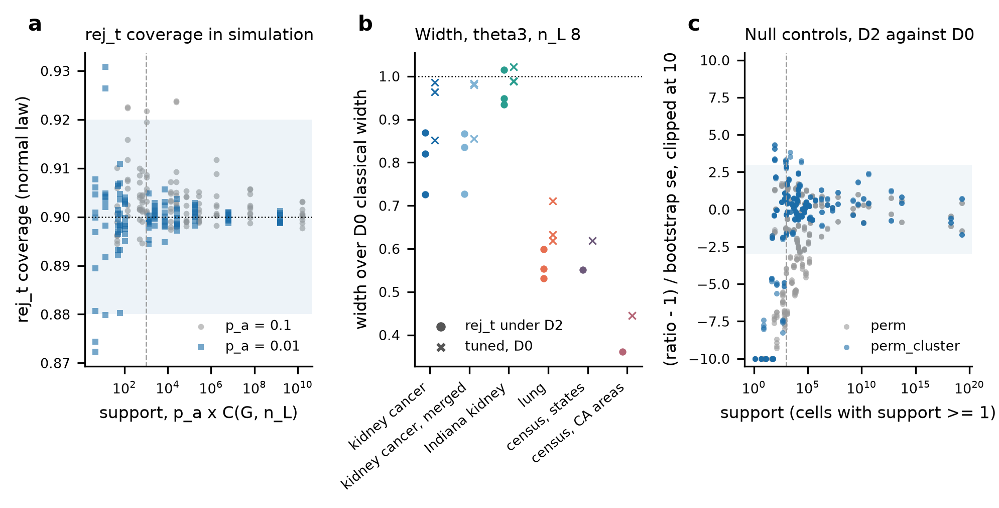

# Round 5 PPI track, the final report (E1 to E5, with E4b)

9 October 2026. Written by the execution session for the oversight chat at the E5 gate, the track's last, under `docs/round05/i01/ppi/round5_ppi_track.md` and the decision memos `docs/round05/i02/ppi/round5_ppi_E2_decisions.md` and `docs/round05/i03/ppi/round5_ppi_E4_decisions.md`, as transcribed in `docs/round05/tracks/ppi/round5_ppi_plan.md` sections 7 and 8. The two gate reports `docs/round05/i01/ppi/round5_ppi_E2_report.md` and `docs/round05/i02/ppi/round5_ppi_E4_report.md` stay as written, and this report gives each stage's result in brief with the file it comes from. Every number below is read from the file named beside it. Paths are relative to the repository root unless they start with `/work`. Shorthand is `E1/` for `results/round5/ppi/E1_interval/`, `E2/` for `results/round5/ppi/E2_regimeB/`, `E3a/` for `results/round5/ppi/E3a_crossfit/`, `E3/` for `results/round5/ppi/E3_twolevel/`, `E4/` for `results/round5/ppi/E4_selection/`, `E4b/` for `results/round5/ppi/E4b_rejective/` and `E5/` for `results/round5/ppi/E5_joint/`.

## 1. Stage and status

Interval 3 is complete and the track has reached its last gate. E4b's derivation closed (`docs/round05/tracks/ppi/round5_ppi_theory.md` section 3), so no stop was needed. E4b's acceptance checks 1 and 2 pass, and check 3 passes in 204 of 208 cells and fails in 4, all on census by state for $\theta_3$ at $n_L = 4$ (`E4b/e4b_acceptance.csv`, section 3). All four E4b predictions held (`E4b/e4b_prediction_scores.csv`). Because check 3 failed, the estimator definition `docs/round05/tracks/ppi/round5_ppi_estimator_definition.md` does not enter D2 with `rej_t` as the paper's design option, as the memo's rule says, and the decision goes to the oversight chat as escalation 1. E5's allocation table, joint design table, dropped-draw table and superpopulation table are in `E5/`. The tag `round5-ppi-final` marks the commit that adds this report's last wording.

## 2. What was run

**Branch and commits.** All interval-3 work is on local branch `round5-ppi` above `bf9b869`, the head of pull request #17, which is merged into `main`. The first interval-3 commit `3c8bb8e` added the E4 memo unchanged and plan section 8. Then `9cf4ab7` (theory section 3, `rej_t`, `perm_cluster`, the E4b drivers and tests), `9185bc6` (the runner stamps the owning frame id), `0776327` (threshold comparison, stamp check and the E5 scripts), `b410529` (the D2 pool threshold in float64), `c5fbfa4` (E4b results) and `4061f77` (E5 outputs and the definition document). Nothing was pushed between the E4 gate and this report.

**Code delivery.** Four bundles in interval 3, each a short Slurm job that verified the bundle, fast-forwarded `/work/users/w/e/weiyang/hest_code/round5-ppi` and wrote a read-only snapshot under `/work/users/w/e/weiyang/hest_code/round5-ppi_snapshots/<full hash>/` (`results/round5/ppi/code_deliveries.csv`, logs in `results/round5/ppi/deliveries/`). The track used 11 deliveries in all.

| delivery | Slurm job | head after | carried |
|---|---|---|---|
| 8 | 4381624 | `9cf4ab7` | memo, plan section 8, theory section 3, E4b code |
| 9 | 4381768 | `9185bc6` | runner frame id |
| 10 | 4383333 | `0776327` | threshold and E5 scripts |
| 11 | 4384187 | `b410529` | float64 threshold |

**Scripts.** All under `code/scripts/`, with md5s at the reporting commit in `E5/e5_report_numbers.csv` (names `md5|...`). Each job's `PROVENANCE.txt` lists the md5 of every script it ran.

| script | role |
|---|---|
| `round5_ppi_balance.py` | adds `va_nominal`, `rej_t`, `perm_cluster_variable`, redraw to first acceptance |
| `round5_ppi_e4b_rejective.py`, `round5_ppi_e4b_sim.py`, `round5_ppi_e4b_tests.py` | E4b real-task driver, simulation and tests |
| `round5_ppi_e4b_threshold.py` | E4 and E4b D2 thresholds side by side |
| `round5_ppi_e4b_merge.py`, `round5_ppi_e4b_stamp_check.py` | E4b merge, bootstrap, scoring, figure, stamp check |
| `round5_ppi_e5_allocation.py`, `round5_ppi_e5_joint.py`, `round5_ppi_e5_theta2_drops.py`, `round5_ppi_e5_superpop.py` | E5 tables |
| `round5_ppi_final_numbers.py` | counts for this report (`E5/e5_report_numbers.csv`) |
| `round5_ppi_run.py`, `round5_ppi_common.py` | runner with `--frame-id`, writing `_provenance.json` |

**Jobs.** The six E4b task units ran 183 Slurm jobs, 166 completed and 17 failed (`E5/e5_report_numbers.csv`, from the unit ledgers `E4b/<task>/e4b_job_ledger__<task>.csv`). The 17 are 9 permuted-arm jobs on CCRCC, Indiana and lung given a parquet path that does not exist, each resubmitted with the `resnet50` parquet as E4 did, and 8 lung $\theta_2$ jobs at $n_L = 4$ and 12 that stopped with "no accepted candidate" before the float64 fix and were rerun at `b410529` (escalation 2). Every job ran on partition `spill` under account `rc_tengfei_pi` except one CCRCC_merged pilot on `general` (4382016). The largest peak memory was 1.905 GB (job 4382113) and the longest wall time 18.2 min (job 4382173, lung), per unit in `E5/e5_report_numbers.csv`. The lead's 25 interval-3 jobs (the pilot, 20 threshold jobs and four deliveries) all completed (`results/round5/ppi/r5ppi_slurm_jobs.csv`).

**Local runs.** The E4b simulation ran on this Mac under plan section 7.4 as six runs from a `git archive` snapshot of `9185bc6`, and the E4b tests ran locally at `b410529`. They are rows L044 to L050 of `results/round5/ppi/r5ppi_local_runs.csv`, which holds 50 local runs over the track. The merges and E5 tables ran locally on committed files.

**Fan-out.** E4b ran as seven sub-agents, one per task on Longleaf and one for the local simulation. Each brief carried the sub-agent's own frame id and was checked against its unit before dispatch (`E4b/e4b_assigned_frame_ids.csv`). The stamp check compares the frame id in every `_provenance.json` with the assigned one and matches in 191 of 191 records (`E4b/e4b_stamp_check.csv`). The lead wrote theory section 3, the threshold comparison, the merge, the E5 tables, the definition document and this report.

**Provenance index.** `results/round5/ppi/provenance_index.csv`, rebuilt over E0 to E4b, has 5,098 rows over 585 jobs, 535 on Longleaf and 50 local (`results/round5/ppi/provenance_index_summary.csv`). Check 1 passes in every row. Check 2 fails in the same 5 rows as at the E4 gate, the four uncommitted ad hoc E2 scripts and the E0 reference copy (`results/round5/ppi/provenance_index_failures.csv`, E4 report section 2).

## 3. Acceptance checks

**E4b** (`E4b/e4b_acceptance.csv`).

1. The first 200 draws of every D0 and D1 cell reproduce E4's rows in 1,824 of 1,824 comparable rows, with largest difference 0. The D2 threshold, now the $p_a$ quantile over a larger pool, has E4b over E4 ratio median 1.000 and range 0.929 to 1.094 over genes and cells (`E4b/e4b_threshold.csv`). Beside E4's rows, D2's empirical variance ratio has median 1.000 and range 0.615 to 1.093, and the largest coverage difference is 0.155, on lung.
2. `rej_t`'s point estimate equals the classical estimate in 1,408 of 1,408 D2 cells, with largest difference 0 over draws and genes.
3. With `perm_cluster`, the D2 over D0 ratio of median variances is within three bootstrap standard errors of 1 in 204 of 208 cells with support of at least 1,000 (`E4b/e4b_bootstrap.csv`). By task 52 of 52 on CCRCC, 44 of 44 on CCRCC_merged, 48 of 48 on Indiana, 28 of 32 on census by state and 32 of 32 on census by area (`E4b/e4b_report_numbers.csv`, names `acc3|...`). Lung has no cell with support of 1,000 or more. The four failures are census by state, $\theta_3$, $n_L = 4$, with ratio 1.166 at $p_a = 0.1$ and 1.195 at $p_a = 0.01$, the largest $|z|$ 3.81. Each is repeated for the two arms, because neither `perm_cluster` nor the classical mean depends on the arm, so there are two distinct designs. This is escalation 1.

The checks of E0 to E4 are in the gate reports (`docs/round05/i01/ppi/round5_ppi_E2_report.md` section 3, `docs/round05/i02/ppi/round5_ppi_E4_report.md` section 3).

## 4. What differs between the arms of each comparison

1. **E4b, `rej_t` against the classical interval under D2.** Only the variance estimate and the reference distribution. `rej_t` regresses $\bar z_g$ on the $k$ balance variables over the labelled clusters and uses $t_{n_L - k - 1}$. The draws, the point estimate and the target are shared.
2. **E4b, `rej_t` under D2 against the tuned interval under D0.** The cluster sample (rejective against simple random), the point estimate (the classical mean against the tuned estimator) and the interval (`rej_t` against `textbook_t|fpc|lin|xf`).
3. **E4b, `perm_cluster` against `perm`.** `perm_cluster` permutes the `resnet50` (tissue) or `package` (census) arm's own $\bar f_g$ across the valid clusters with a crc32 seed per gene. `perm` is E4's variable, built from unit-level permuted predictions. The design, draws and estimator are shared.
4. **E4b against E4.** 2,000 accepted draws per cell against 200, the first 200 with E4's seeds, and a D2 threshold computed over a larger pool. D2 redraws until a candidate is accepted rather than falling back to the last candidate.
5. **E5, regime B against regime A in the joint table.** As in E3 item 4 of the E4 report. The joint table's prediction-set block comes from the conformal track's `w3_map_by_task.csv` at `69baff38`, a different analysis on the same tasks.

The comparisons of E1 to E4 are listed in the gate reports' section 4.

## 5. Predictions against outcomes

E1 and E2 are scored in `docs/round05/i01/ppi/round5_ppi_E2_report.md` section 5 from `E1/e1_prediction_scores.csv` and `E2/e2_prediction_scores.csv`, E3a, E3 and E4 in `docs/round05/i02/ppi/round5_ppi_E4_report.md` section 5 from `E3a/e3a_sim_prediction_cells.csv`, `E3/e3_prediction_scores.csv` and `E4/e4_prediction_scores.csv`, and E4b here from `E4b/e4b_prediction_scores.csv`. E3.3 carries the memo's rescoring.

| prediction | outcome | evidence |
|---|---|---|
| E1.1 | partly held | final interval in band in 341 of 390 normal-law cells, minimum 0.840 |
| E1.2 | partly held | without the term, 70 of 78 cells above 2; with it, 69 of 78 in 0.85 to 1.10 |
| E1.3 | partly held | 75 of 144 cells in 0.03 to 0.15 |
| E1.4 | partly held | range at least 0.03 in 28 of 30 cells; skewed-law classical 3 of 6 in band |
| E1.5 | refuted in its second half | above 1 in 5 of 126 cells below the count |
| E2.1 | held for $\theta_3$, refuted for $\theta_2$ | $\theta_3$ 426 of 432 cells in band at $m \ge 5$; $\theta_2$ 1 of 432 |
| E2.2 | partly held | gap at most 0.06 in 43 of 96 tissue cells |
| E2.3 | held in substance | lung 35 of 36, census 24 of 24 |
| E2.4 | partly held | 15 of 16 rows within 0.03 |
| E2.5 | held for $\theta_3$, refuted for $\theta_2$ | $\theta_3$ 14 of 14 pairs; $\theta_2$ 2 of 12 |
| E3a.1 | held | xf est/emp 0.974 to 1.013 in 15 of 15 cells |
| E3a.2 | held | largest coverage difference 0.0060 over 180 cells |
| E3a.3 | held for $\theta_3$ | lung $n_L = 12$, xf 0.885 against classical 0.885 |
| E3.1 | held | permuted width ratio 1.000 to 1.017 in 72 of 72 cells |
| E3.2 | partly held | within 0.05 of E2 in 242 of 274 cells |
| E3.3 | held for $\theta_3$, not applicable to $\theta_2$ | memo section 2; see section 6.3 |
| E3.4 | held | regime B narrower in 210 of 232 ($C_{ppi}$) and 211 of 232 ($P_{ppi}$) |
| E3.5 | refuted | $m^\star_{PP}/m^\star$ within 15% of theory in 10 of 28 |
| E3.6 | held | stratified $\theta_2$ 0.885 to 0.913 at $m \ge 6$ in 192 of 192 cells |
| E3.7 | partly held | kidney within 0.10 in 216 of 216; lung and census 20 of 112 |
| E4.1 | partly held | within 0.05 of $1 - R^2$ in 189 of 240 cells |
| E4.2 | partly held | census by state 0.264, below its band |
| E4.3 | partly held | lung 0.89, 0.81, 0.94; kidney cancer 1.22 to 1.81 |
| E4.4 | D2 over-coverage refuted, the rest partly held | D2 classical at least 0.93 in 95 of 320 real cells |
| E4.5 | partly held | kidney embedding balance at least 0.9 in 466 of 576 cells |
| E4b.1 | held | `rej_t` covers 0.894 to 0.906 in 60 of 60 cells; narrower than tuned D0 in 24 of 24 (0.734 to 0.967) |
| E4b.2 | held | band 5 of 5 (CCRCC `uni_v2` 0.726, census by state 0.551, lung 0.531, 0.599, 0.553); narrower than tuned D0 6 of 6; coverage within 0.03 6 of 6 |
| E4b.3 | held | kidney cancer $\theta_2$, outside 3 SE in 44 of 64 `perm` cells and 8 of 64 `perm_cluster` cells |
| E4b.4 | held | lung `hoptimus0` 0.255 (E4 0.255), `resnet50` 0.336 (0.330), `uni_v2` 0.277 (0.285) |

## 6. Results

### 6.1 E1 and E2 in brief

Under the normal law the final design-target interval covers close to nominal. At $G = 24$ and $n_L \ge 6$ it covers 0.858 to 0.900, median 0.892, against 0.896 to 0.904 for the classical interval (`E1/e1_report_numbers.csv`). The linearised term is needed when the prediction has a level, since without it the variance is overstated by a median factor of 6.98 at $\kappa = 10$ and $R^2 \ge 0.4$ (`E1/e1_prediction_scores.csv`). Skewed cluster contributions reproduce the real-task shortfall of the classical interval, and Johnson's correction does not restore coverage (`E1/e1_johnson.csv`).

In regime B the slope $\theta_3$ covers 0.870 to 0.925 at $m \ge 5$ on the tissue tasks (`E2/diag/e2_report_numbers_extra.csv`). Nearly all of the encoders' regime B gain on the Visium tasks is the level term, since a constant predictor reaches width ratio 0.81 on CCRCC against 0.80 to 0.84 for the encoders (`E2/diag/e2_level_share_vs_constant.csv`). Under the simple random within-cluster draw, $\theta_2$ under-covers in regime B, at 0.400 to 0.883 at $m \ge 5$ (`docs/round05/i01/ppi/round5_ppi_E2_report.md` section 5), which E3's stratified draw fixed.

### 6.2 E3a, E3 and E4 in brief

The cross-fitting term restores the design-target interval. At $G = 15$, $n_L = 12$ the ratio of estimated to empirical variance is 0.974 to 1.013 with it and 0.691 to 0.909 without, and coverage 0.888 to 0.903 against 0.840 to 0.886 (`E3a/e3a_sim_prediction_cells.csv`). Form C makes a predictor constant within each cluster change nothing, exactly, and its classical estimator is narrower than form P's for $\theta_3$ (section 6.3). The stratified draw gives $\theta_2$ coverage 0.885 to 0.913 at $m \ge 6$ in 192 of 192 cells (`E3/e3_prediction_scores.csv`). Under D2 with own balance the classical variance falls to 0.255 to 0.330 of D0 on lung, 0.604 for `uni_v2` on kidney cancer and 0.264 on census by state at $n_L = 8$ (`E4/e4_variance_ratios.csv`), and the simple-random-sampling interval does not see the fall (section 6.3).

### 6.3 The corrections of memo section 2

1. **E3.3 splits by estimand.** For $\theta_3$ the form C classical estimator is 0.818 to 0.854 of form P's width on the two kidney cancer tasks, 0.928 to 0.962 on Indiana and 0.936 to 0.948 on lung. For $\theta_2$ under the stratified draw the two classical forms give the same width, 1.000 to 1.003 (`E3/e3_prediction_cells.csv`, prediction E3.3). The 144 cells in the band are exactly the 144 $\theta_3$ cells. E3.3 is held for $\theta_3$ and not applicable to $\theta_2$, and plan section 7 records the rescoring.
2. **The regime B minimum of 0.500 is on census by state.** In `E3/e3_superseded_round4_numbers.csv` the lowest E3 regime B $\theta_2$ coverage under `C_ppi` is 0.500, on census by state with `package`, at budget `cd_cs_100_vs_A_nL4_B4800`, where $m$ is 1 and round 4 covered 0.545. The E4 report's section 6.3 named census by area, which was wrong. One labelled unit per state is below the smallest number either form needs, so the value says nothing about the method.
3. **What balanced selection delivers as an interval.** At $n_L = 8$ for $\theta_3$ with own balance at $p_a = 0.01$, the classical interval's width under D2 is 0.93 to 1.08 of its width under D0, while its estimated over empirical variance rises to 1.2 to 1.5 on kidney cancer, 3.2 to 4.0 on lung, and 3.3 and 7.4 on the two census tasks (memo section 2, from `E4/e4_selection_grid.csv`). The variance falls and the simple-random-sampling interval does not see it. E4b answers this. `rej_t` is 0.726 of the D0 classical width for `uni_v2` on kidney cancer and 0.551 on census by state at that cell, and covers within 0.03 of the D0 classical interval in 6 of 6 E4b.2 cells (`E4b/e4b_prediction_scores.csv`).
4. **E3.5's second clause.** The fitted between-cluster ratio of PPI to classical is 0.98 to 1.04 while $1 - R^2_c$ is 0.29 to 0.95 (memo section 2, `E3/e3_components_fitted.csv` against `E3/e3_components.csv`). The curve $a/n_L + b/(n_L m) + c$ cannot carry a between gain that is zero below $n_L = 6$, so E3.5's second clause compared the formula with a fit that cannot express it. Section 6.6 gives the allocation with the measured between ratio.

### 6.4 E4b, an interval that uses the balance

Theory section 3 writes $\bar z_L - \bar Z = (\bar e_L - \bar E) + B^\top(\bar x_L - \bar X)$. The two terms are uncorrelated under simple random sampling, and rejective acceptance scales the second term's covariance by $v_a$. The resulting variance of the classical mean under D2 is

$$
\text{Var}_{\text{D2}}(\bar z_L) \approx \Big(1 - \frac{n_L}{G}\Big)\frac{S_e^2 + v_a\,B^\top S_X B}{n_L}
$$

and `rej_t` estimates it from the labelled clusters with $t_{n_L - k - 1}$. Morgan and Rubin (2012), Theorems 3.1 and 3.2, give the scaling for randomised experiments. The sampling form is this session's transfer and is not stated in the paper (theory section 3.6). Fuller (2009) could be read only in abstract (escalation 11). In a synthetic check at supports of at least 7,355 the empirical over theoretical variance is 1.017 to 1.077 and `rej_t`'s estimated over empirical variance 0.916 to 1.039 (theory section 3.7).

In simulation (`E4b/sim/`, scored in `E4b/e4b_prediction_scores.csv`) D0 and D1 are identical to E4, and D2 differs only in the 576 draws that E4 filled with the last candidate. Under the normal law with balance on $\bar f_g$ at $p_a = 0.01$, `rej_t` covers 0.894 to 0.906 in every cell with $n_L \ge 6$ and support of at least 1,000, and its width is 0.734 to 0.967 of the tuned D0 interval in every cell with $n_L \le 8$ and $R^2 \ge 0.4$.

On the real tasks (`E4b/e4b_rej_width_ratios.csv`, `E4b/e4b_report_numbers.csv`, names `rej|...`) `rej_t` covers with median 0.878, range 0.641 to 0.931, over the 960 D2 cells with support of at least 1,000, and is within 0.03 of the D0 classical interval in 861. Over the 448 cells with smaller support the median is 0.863 and the minimum 0.0965. The worst supported cells are Indiana $\theta_2$ at $n_L = 6$ with two balance variables at $p_a = 0.1$, which cover 0.641 to 0.684 against 0.872 for D0, with three residual degrees of freedom and up to 0.70 of genes with standardised bias above 3 (`E4b/e4b_d2_diagnostics.csv`, escalation 7). 128 `rej_t` cells were skipped because $n_L - k - 1 < 2$, all at $n_L = 4$, and 20 `strat_t` cells because $n_L = 12$ exceeds lung's 9 valid $\theta_2$ clusters (`E4b/e4b_skipped.csv`). For $\theta_2$ the reason column records the smallest residual degrees of freedom over draws, which falls to 0 or $-1$ where a draw labels donors without both groups. Beside every D2 cell, `E4b/e4b_d2_diagnostics.csv` gives its support, the standard deviation over clusters of the inclusion frequency, its Spearman correlation with $|\bar f_g - \bar F|$, and the share of genes with standardised bias above 3.

The cluster-level null control does what the unit-level one did not. On the kidney cancer tasks for $\theta_2$, `perm` falls outside three standard errors in 44 of 64 cells and `perm_cluster` in 8 of 64 (E4b.3). Lung's own-balance variance ratios with 2,000 draws stay within 0.05 of E4's (E4b.4), so they belong to the accepted set rather than the number of draws.

`results/round5/ppi/E4b_rejective/fig_e4b_summary.png`. Panel a, `rej_t` coverage under the normal law in simulation against the support $p_a\binom{G}{n_L}$, with the band 0.88 to 0.92 shaded. Panel b, on the real tasks at $n_L = 8$ for $\theta_3$ with own balance at $p_a = 0.01$, the width of `rej_t` under D2 (circles) and of the tuned interval under D0 (crosses), each over the D0 classical width. Panel c, the D2 over D0 ratio of median classical variances under `perm` and `perm_cluster`, as the distance from 1 in bootstrap standard errors against support, with $\pm 3$ shaded.

### 6.5 E5, the estimator definition

`docs/round05/tracks/ppi/round5_ppi_estimator_definition.md` defines the paper's estimator. It uses form C within clusters, the between coefficient under `c_crossfit_design`, the interval `textbook_t|fpc|lin|xf`, regime B's reference with $\sum_g (m_g - 2)$ degrees of freedom for $\theta_3$ and $\sum_{g,h}(m_{h,g} - 1)$ for $\theta_2$, and the stratified draw for $\theta_2$ over the donors where both groups are present. E4's code drew from all donors and dropped draws with fewer than two valid labelled donors. The share dropped is 0.015 on Indiana at $n_L = 4$ and 0.190 and 0.025 on lung at $n_L = 4$ and 6, in E4's D0 cells, and 0 elsewhere (`E5/e5_theta2_dropped_draws.csv`). Those cells were not rerun.

Under E3's simulation the superpopulation-target interval covers below 0.85 in 916 of 8,820 cells, all in regime A with a predictor at $G = 15$ and 24, with minimum 0.7050 for the mean and 0.7665 for $\theta_3$ (`E5/e5_superpop_undercoverage.csv`). The paper's real-data claims use the design target only.

D2 with `rej_t` is not entered as the design option, because acceptance check 3 failed. The document records what balance and `rej_t` do, with the support condition $p_a\binom{G}{n_L} \ge 1{,}000$ and $n_L - k - 1 \ge 2$ (escalation 1).

### 6.6 E5, allocation

For coefficients fixed in advance, theory section 2.4's optimal number of labelled units per cluster scales by $\sqrt{(1 - R^2_w)/(1 - R^2_c)}$. With cross-fitted coefficients the between gain is the measured ratio $\rho_c(n_L)$, and

$$
m^\star_{\text{PP}}(n_L) = m^\star\sqrt{\frac{1 - R^2_w}{\rho_c(n_L)}}
$$

`E5/e5_allocation.csv` has 67 rows, one per task, encoder and $n_L$, for form C and $\theta_3$. The classical $m^\star$ at $c_d/c_s = 100$ from the components is 77.9 on CCRCC, 77.2 on CCRCC_merged, 125.0 on Indiana, 74.5 on lung, 268.7 on census by state and 102.9 on census by area. At $n_L = 8$, $\rho_c$ is 0.82 to 1.04 on the kidney tasks and 0.2 to 0.46 on lung and census (`E5/e5_report_numbers.csv`). On lung with `hoptimus0` the formula gives $m^\star_{\text{PP}}$ of 86.7 and the fitted components 52.9 (escalation 9).

### 6.7 E5, the joint design table

`E5/e5_joint_design.csv` has 196 inference rows, regime B, form C, $m$ from 5 to 100, and 158 prediction-set rows read from `results/round5/conformal/W3_real/merged/w3_map_by_task.csv` at `69baff381a6f7b7abb8a72649d726efdd21b287d` (column `w3_source`), the `origin/main` head after pull request #18. In regime B the $\theta_3$ width ratio of `C_ppi` to `C_classical` is 0.982 to 1.009 on the kidney tasks, 0.706 to 0.847 on lung, and 0.594 to 0.625 on the census tasks. `C_ppi` covers 0.855 to 0.950 over the 196 rows. Every row has at least 3 labelled units per cluster for $\theta_3$ and 4 for $\theta_2$ (column `min_units_ok`, 0 rows false, `E5/e5_report_numbers.csv`), so no regime B coverage statement in the table needs a mark.

## 7. Discrepancies, open questions and escalations

### Escalations

1. **E4b acceptance check 3 fails in 4 of 208 cells, and D2 is not adopted.** Census by state, $\theta_3$, $n_L = 4$, ratios 1.166 and 1.195 at $p_a = 0.1$ and 0.01, out of 208 cells (`E4b/e4b_acceptance.csv`, `E4b/e4b_bootstrap.csv`). With $G = 51$ and $k = 1$ the support is large, so this is not the small-sample-space effect of E4's lung rows. The 208 cells share draws within a task, so they are not independent tests, and how many failures a correct null would give across them was not worked out. The definition document reads the memo's rule strictly and leaves D2 with `rej_t` out. The decision whether a failure confined to one task at $n_L = 4$ should block the design option is the oversight chat's.
2. **The float32 threshold.** The D2 pool threshold was first computed in float32, and on lung $\theta_2$ at $n_L = 4$ and 12, where the support is tiny, it rounded below the smallest distance, so no candidate was accepted. Eight jobs failed. The fix (`b410529`, test 6 of `E4b/tests/`) computes it in float64. Those 8 cells were rerun at `b410529` and the other 24 lung cells and every other task ran at `9185bc6`. The threshold code is the only change between the two commits that the runs touch.
3. **E4's thresholds were recomputed with the float32 code.** `E4b/e4b_threshold.csv` comes from the threshold jobs at `0776327`, before the fix. The fix changes the threshold only where float32 rounding crosses a distance, which needs a tiny support, so the ratio range of 0.929 to 1.094 is not expected to move. It was not recomputed.
4. **Permuted-arm parquet paths.** Nine jobs on CCRCC, Indiana and lung failed because the briefs' command named a permuted parquet that does not exist. The permuted arm uses the `resnet50` parquet, as E4 did. Each job was resubmitted and the failures stay in the ledgers.
5. **Premature submissions.** Several sub-agents first submitted a result with no work done, before the message with their own frame id arrived, and then resubmitted. Only the second results were used.
6. **Lung has no acceptance-3 cell.** Every lung D2 cell has support below 1,000, so check 3 does not test lung at all.
7. **`rej_t` under-covers at three residual degrees of freedom.** Indiana $\theta_2$ at $n_L = 6$ with $k = 2$ and support of at least 1,000 covers 0.641 to 0.684 (`E4b/e4b_rej_width_ratios.csv`). The approximation of theory section 3.5 needs more residual degrees of freedom than this cell has, and a rule of $n_L - k - 1 \ge 2$ is too weak for the paper.
8. **Pilot outputs.** Lung's pilot outputs stayed on Longleaf and were not copied back. They were not used.
9. **The allocation formula and the fitted curve disagree.** Section 6.6. Which value the paper uses for $m^\star_{\text{PP}}$ on lung and census is open.
10. **Delivery 8's size.** Its bundle carried the E4 results commit with the code, so it was far larger than the code-only bundles 9 to 11. Its md5 is in `results/round5/ppi/code_deliveries.csv`.
11. **Fuller (2009) was read only in abstract.** The publisher refused access to the full text. Morgan and Rubin (2012) was read in full from arXiv 1207.5625.
12. **`pcF2` equals `own` on the census tasks.** Census tasks have one outcome, so the leading components of all genes' $\bar f_g$ are the outcome's own $\bar f_g$, and the `pcF2` rows repeat the `own` rows with $k = 2$.
13. **E4's dropped $\theta_2$ draws were not rerun**, as the memo allowed (section 6.5).

### Discrepancies and records

1. The E4 report's section 6.3 named census by area for the regime B minimum of 0.500. It is census by state (section 6.3 item 2).
2. The E4b simulation sub-agent did not append its runs to `results/round5/ppi/r5ppi_local_runs.csv`, and the lead added them as L044 to L049.
3. The prediction-set block covers w3 parts 1 to 3 at $\alpha = 0.1$. Its rows are read, not recomputed.

## 8. What was not checked

1. The E4 thresholds recomputed with the float64 code.
2. Whether check 3's census-by-state failure persists with more D0 draws.
3. `rej_t` with a degrees-of-freedom floor larger than 2.
4. The README, which the oversight chat sweeps.

## 9. Every round-4 statement this round changes

| round-4 statement | round 4 | round 5 | file |
|---|---|---|---|
| classical $m^\star$ at $c_d/c_s = 100$, CCRCC | 121 | form C 77.9 from the components, 78.4 fitted | `E5/e5_allocation.csv`, `E3/e3_superseded_round4_numbers.csv` |
| same, Indiana | 236 | 125.0 from the components, 157.8 fitted | same |
| same, lung | 172 | 74.5 from the components, 77.2 fitted | same |
| same, census by state | 379 | 268.7 from the components, no fitted form C value (form P 435.9) | same |
| regime B narrower than regime A, $c_d/c_s = 10$ | 216 of 232 | 210 of 232 (`C_ppi`), 211 of 232 (`P_ppi`) | `E3/e3_superseded_round4_numbers.csv`, part `q31_count` |
| permuted predictor as a null on unit-weighted rows | variance ratio down to 0.0876 on lung $\theta_3$ | 0.992 to 1.027 in 34 of 34 scored cells | `E3/e3_superseded_round4_numbers.csv`, part `unitw_perm`; `E3/e3_prediction_scores.csv` |
| regime B $\theta_2$ coverage | median 0.875, minimum 0.545 | median 0.9, minimum 0.5 at $m = 1$ on census by state (stratified draw, form C) | `E3/e3_superseded_round4_numbers.csv`, part `theta2_rows` |
| lung $\theta_3$ at $n_L = 12$, cross-fitted interval | 0.870 | 0.885 with the cross-fitting term | `E3a/e3a_masking_E3a3_table_nL8_12_16.csv` |
| encoders' regime B gain on the Visium tasks | attributed to the encoders | mostly the level term, constant 0.81 against encoders 0.80 to 0.84 on CCRCC | `E2/diag/e2_level_share_vs_constant.csv` |

Round 4's $m^\star$ values are from `results/round4/ppi/Q2_theory/q2_report_numbers.csv` as quoted in `E3/e3_superseded_round4_numbers.csv`, which also holds every round-4 regime A and B $\theta_2$ row beside its E3 value. The round-5 $m^\star$ under form P is in the same file (part `mstar`).

## 10. Proposed next step

None inside this track. The oversight chat decides escalation 1 and the allocation value of escalation 9.

## What the round-5 inference track established

The design-target interval `textbook_t|fpc|lin|xf` covers 0.888 to 0.903 where the uncorrected interval covered 0.840 to 0.886 (`E3a/e3a_sim_prediction_cells.csv`). Form C makes a predictor constant within each cluster leave the estimate unchanged in 420 of 420 simulation cells (`E3/e3_sim_summary.csv`). For $\theta_3$ the form C classical estimator is 0.818 to 0.854 of form P's width on kidney cancer (`E3/e3_prediction_cells.csv`). The stratified within-cluster draw gives $\theta_2$ regime B coverage 0.885 to 0.913 at $m \ge 6$ (`E3/e3_prediction_scores.csv`). Most of the encoders' regime B gain on the Visium tasks is the level term (`E2/diag/e2_level_share_vs_constant.csv`). In regime B the predictor narrows $\theta_3$ intervals to 0.706 to 0.847 of the classical width on lung and 0.594 to 0.625 on census, and barely on kidney, at 0.982 to 1.009 (`E5/e5_joint_design.csv`). Balanced cluster selection takes the classical variance to 0.604 of simple random selection for `uni_v2` on kidney cancer and 0.264 on census by state at $n_L = 8$ (`E4/e4_variance_ratios.csv`). `rej_t` turns that fall into a narrower interval, 0.726 and 0.551 of the D0 classical width, covering within 0.03 of it (`E4b/e4b_prediction_scores.csv`). It covers 0.894 to 0.906 in simulation where support is at least 1,000 (`E4b/e4b_prediction_scores.csv`), and median 0.878 on the real tasks with the same support (`E4b/e4b_report_numbers.csv`). Its null control fails in two census designs at $n_L = 4$, so it is not yet the paper's design option (`E4b/e4b_acceptance.csv`). With the classical estimator the cost-optimal number of labelled units per cluster at $c_d/c_s = 100$ is 74.5 to 268.7 across tasks (`E5/e5_allocation.csv`). The superpopulation-target interval covers below 0.85 in 916 of 8,820 simulation cells, so the paper's real-data claims use the design target only (`E5/e5_superpop_undercoverage.csv`).
