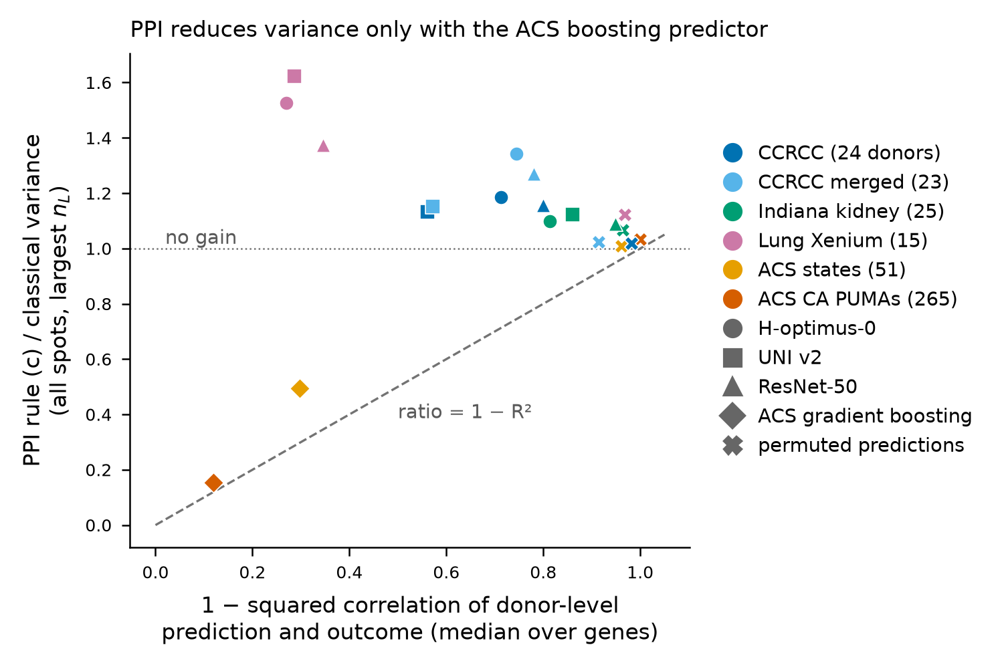
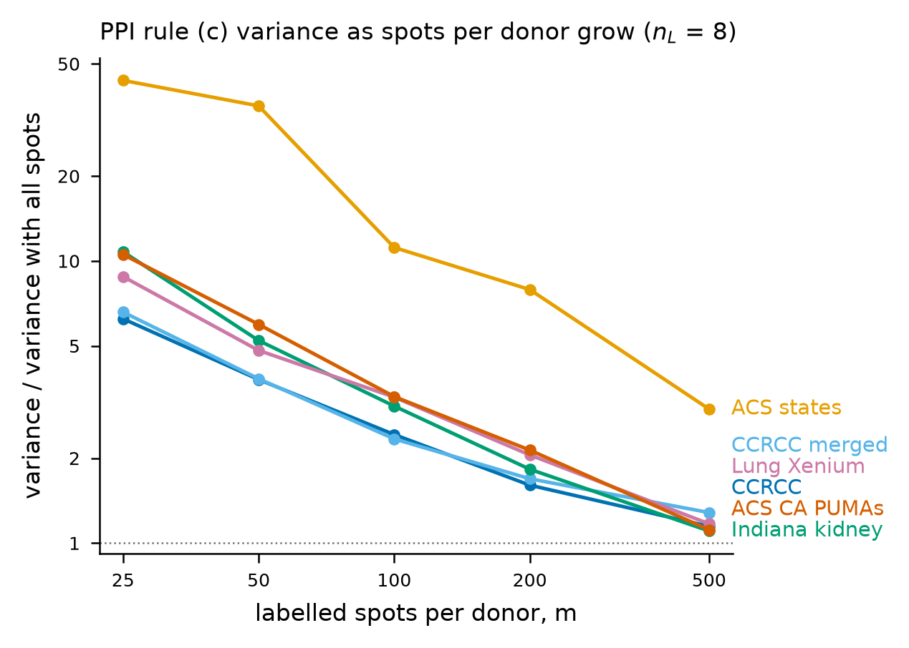
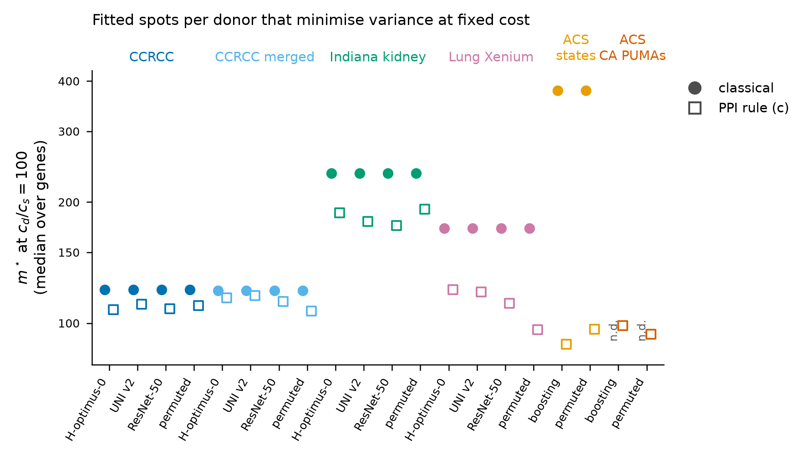
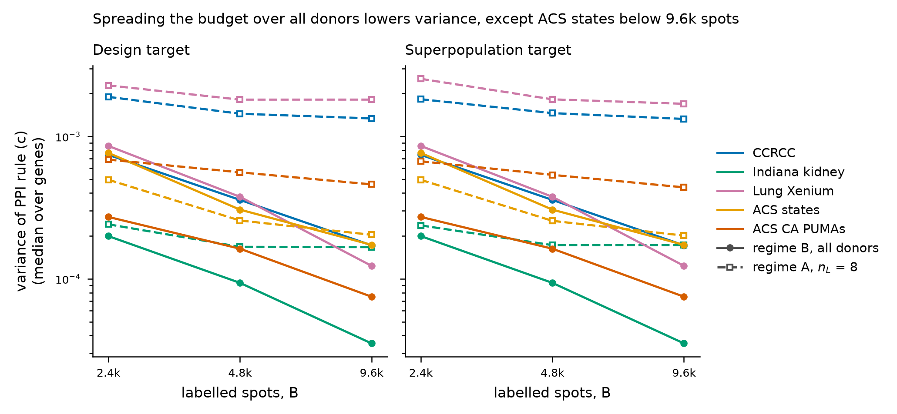

# Round 4, the PPI track, Q3 report (covering Q2, Q3, Q1b and the theorem check)

Instruction: `docs/decisions/round4_ppi_track.md`, with addendum 1 and the Q1 decision memo
(`docs/decisions/round4_ppi_Q1_decisions.md`), all transcribed in `docs/round4_ppi_plan.md`
(sections 1 to 13). Format: the instruction's section 8, as in the Q1 report. Branch `round4-ppi`.
Date: 2 October 2026.

## 1. Stage and status

Interval 2 is complete and this report is the Q3 gate. Nothing after Q3 has been set up, staged or
piloted, and the work stops here until the Q3 decision memo arrives.

- Q2 ran on all six task variants (CCRCC, CCRCC merged, Indiana kidney, lung Xenium, ACS states,
  ACS PUMAs within California), with three encoders and the permuted predictor on HEST and the
  package and permuted predictors on ACS.
- Q3 ran on CCRCC, Indiana kidney, lung Xenium and both ACS variants, plus the regime B arm of the
  simulation.
- The Q1 supplement Q1b ran in full (memo section 3), with the 135 unit tests passing
  (`results/round4/ppi/Q1_estimator/q1b/tests/q1b_tests_stdout.txt`).
- The theorem check ran (memo section 5), first as specified and then with an oracle-$\lambda$ arm
  added to separate the theorem from the cost of estimating $\lambda$.
- The recalibration test ran on CCRCC and Indiana with `hoptimus0`.
- The permuted predictor's $\lambda$ under rules (d1) and (d2) was checked on real data.

Two findings change how the rest of the track should be read, and both are in section 6. First, on
the real HEST tasks the donor-weighted PPI estimator is less efficient than the classical one under
every $\lambda$ rule. Second, the donor-weighted estimators are invariant by construction to any
donor-constant shift in the predictions, so the cluster-level $R^2$ that governs them is the
cluster-level $R^2$ of the within-donor contrasts, not of donor offsets.

## 2. What was run

Commits on `round4-ppi` since the Q1 merge (`75e630a`, head `2385298`), oldest first:

- `c92f960`, the Q1 memo and plan section 13;
- `4bc8da1`, rule (d), the Q1b simulation and its tests;
- `72332fd`, the $n_L < 6$ rule, the wild-$t$ studentisation, the theory document and the ACS
  transfer check;
- `48b042d`, the theorem simulation and the permuted-$\lambda$ arguments;
- `8986600`, the Q2 masking code;
- `99f3ee8`, the Q3 regimes code;
- `f7f3c8b`, index lists and the $\theta_2$ mean for ACS;
- `054b83c`, the ACS inventory and task definition, and the test results;
- `aaec0e8`, fitting from saved grids;
- `de3b71f`, the oracle-$\lambda$ arm;
- `42fe578` and `241316b`, plan sections 12.2 and 12.3, Q1b merged, theorem check version 2;
- `63b0cb9`, the unit drivers as run and the merge script;
- then the commit carrying this report.

The Longleaf project tree stayed on `main` at `9d7277d` as the data root. Code reached the track
clone `/work/users/w/e/weiyang/hest_code/round4-ppi` by git bundles fetched and fast-forwarded inside
Slurm jobs, to `4bc8da1`, `72332fd`, `99f3ee8`, `aaec0e8` and `de3b71f` in turn.

<!-- TABLE:scripts -->
| script | md5 |
|---|---|
| `code/scripts/round4_ppi_acs_pums2018_analyze.py` | `2b0add945d60eb308cd83cbb6939d5a1` |
| `code/scripts/round4_ppi_acs_pums2018_fetch.py` | `cd3bf537387236d989ef3c17063e4ecb` |
| `code/scripts/round4_ppi_data.py` | `2a26eb3ce74815e3e7c63cccd0527398` |
| `code/scripts/round4_ppi_estimator.py` | `931bd81f10200410c512bcf3f81b5b43` |
| `code/scripts/round4_ppi_q1_acceptance.py` | `4f1993e527e88277bd42f3137ea12336` |
| `code/scripts/round4_ppi_q1_merge.py` | `756f8ca93c72fc5db84a003a89d80a16` |
| `code/scripts/round4_ppi_q1_permuted_lambda.py` | `26807b7e89f239f725814f06aff99956` |
| `code/scripts/round4_ppi_q1_permuted_mechanism.py` | `552ca5fcc5ca8425948e067a6811416e` |
| `code/scripts/round4_ppi_q1_sim.py` | `873dad7f383eb99826b2d0b990cd6914` |
| `code/scripts/round4_ppi_q1b_sim.py` | `416318688d6c0c2c6254dc87442b19c0` |
| `code/scripts/round4_ppi_q1b_tests.py` | `90fd589f98cbea127ed06c7b6dd5f4db` |
| `code/scripts/round4_ppi_q2_acs_convert.py` | `b077f08f1a27194111da2d44ca910fa8` |
| `code/scripts/round4_ppi_q2_acs_run_one.sh` | `d38bde00864c6cf88258be0958da910a` |
| `code/scripts/round4_ppi_q2_indiana_predict_driver.py` | `790f9f37b5994265552c415cd55423b2` |
| `code/scripts/round4_ppi_q2_lung_predict_driver.py` | `ccde9bb9760c2e007e1be703d55c69a1` |
| `code/scripts/round4_ppi_q2_masking.py` | `7f0274bb3c2285d0139dbd07ec39fb58` |
| `code/scripts/round4_ppi_q2_recalibration.py` | `0bfb7ac9d04bad2c377ec57215abf5f0` |
| `code/scripts/round4_ppi_q2_theorem_run_v2_local.sh` | `8b8e4e9381a439f879cb364099b5ed8b` |
| `code/scripts/round4_ppi_q2_theorem_sim.py` | `3548eea9b225c53ee8aebc4de0713803` |
| `code/scripts/round4_ppi_q3_acs_run_local.sh` | `0d42d0fdbd1b831206d26527d807a914` |
| `code/scripts/round4_ppi_q3_figures.py` | `d0a0717485b9688a444846942340e196` |
| `code/scripts/round4_ppi_q3_merge.py` | `b7b9fced7455aca3e01a9acf9f7c2b46` |
| `code/scripts/round4_ppi_q3_regimeB_sim.py` | `02da231857f74978de92550b95cf62d2` |
| `code/scripts/round4_ppi_q3_regimes.py` | `fd1d2e53b7178d43aa0d82ee65fea26d` |
| `code/scripts/round4_ppi_q3_report_tables.py` | `cc3149dd8c466b061eb6a3da5a653ac0` |
| `code/scripts/round4_ppi_q3_scoring.py` | `e433e0e09efbe5a7916e3e881d1b74c3` |

Scripts, with the md5 of the committed file (computed from the working tree at commit time).
<!-- /TABLE -->

### Units

| unit | frame | where it ran |
|---|---|---|
| Q1b, $G_L = 4$ | `67a1a9c1` | Longleaf |
| Q1b, $G_L = 6$ | `6ea1d265` | Longleaf |
| Q1b, $G_L = 8$ | `9285b99f` | Longleaf |
| Q1b, $G_L = 12$ | `b5444cee` | Longleaf |
| Q1b, $G_L = 20$ | `74f2eb69` | Longleaf |
| theorem check | `ab674f84` | Longleaf (version 1), local (version 2, oracle arm) |
| permuted $\lambda$, rule (d) | `78102188` | Longleaf |
| Q2 CCRCC and CCRCC merged | `30f92869` | Longleaf (1 cell), local (39 cells) |
| Q2 and Q3 Indiana kidney | `29d26232` | Longleaf (predictions), local (masking, regimes) |
| Q2 and Q3 lung Xenium | `040a77a6` | Longleaf (predictions), local (masking, regimes) |
| Q2 and Q3 ACS | `e2341968` | Longleaf (conversion, 3 cells), local (17 Q2 cells, 12 Q3 runs) |
| recalibration | `6164c86b` | Longleaf (embedding stage), local (masking) |
| Q3 CCRCC | `80c0bf0a` | Longleaf (12 jobs) |
| Q3 simulation, regime B arm | `535f3eb4` | Longleaf |

Every Slurm job this interval, with its compute-job id, intent, account, state, times and MaxRSS, is
in `results/round4/ppi/Q3_regimes/q2q3_slurm_jobs.csv`. It lists 133 jobs, 58 completed, 68 cancelled, 4 failed and 3 out of memory, 131 of them on
`rc_tengfei_pi`. The failures are the Indiana runs described in escalations 7 and 13 and one Indiana
column-check job that stopped on a heredoc error in its own script. All jobs cancelled
were cancelled before they started (elapsed 00:00:00 in that file), when the work moved to the
local Mac under plan sections 12.2 and 12.3.

### Local runs

Plan section 13.7 put every interval-2 job on Longleaf. Nicolas then asked in chat for local runs,
recorded as plan section 12.2 ("if Longleaf is cluttered then run anything you can locally") and
section 12.3 (local compute preferred while it speeds things up, at most four local processes for
this track). Under those two extensions the Mac ran the theorem check's version 2,
39 of the 40 CCRCC Q2 cells, the Q2 masking and Q3 regimes for Indiana and lung, 17 ACS Q2 cells and
the 12 ACS Q3 runs, and the recalibration masking step. Every local run carries a `PROVENANCE`
file with the host, the code md5 and the input md5s.

### ACS source (memo section 6)

Nicolas ran the fetch on his machine into `~/acs_pums2018` (read-only grant). Its
`fetch_info.json` records the call `ACSDataSource(survey_year='2018', horizon='1-Year',
survey='person', ...)` for 51 state files with `folktables` 0.0.12, 3,214,539 rows and 286 columns,
and `raw_manifest.json` lists the 51 raw files with bytes and md5. Both are committed under
`results/round4/ppi/Q0_setup/acs_pums2018/`. The copy on Longleaf matched the manifest on every
file (`acs_pums2018_transfer_check.csv`, 55 of 55 rows with `match` = 1, Slurm 3237420 in
`results/round4/ppi/Q3_regimes/q2q3_slurm_jobs.csv`). The inventory and task definition came from Slurm 3245844. The analysed populations are 51 state
clusters with 1,659,616 persons and 265 California PUMAs with 195,665 persons
(`acs_pums2018_inventory.json`). The outcome is log personal income and the predictor a gradient
boosting model cross-fitted over five state folds.

## 3. Acceptance checks

- Q3, regime B at $m$ = all equals $\theta_{\text{full}}$. The maximum absolute difference over
  every task is $2.5 \times 10^{-13}$ (ACS states; $8.7 \times 10^{-15}$ on Indiana) (`results/round4/ppi/Q3_regimes/q3_report_numbers.csv`, name
  `Q3.acc|m_all_equals_theta_full|max`).
- Q3, at $m = 1$ the regime B design variance is zero and the run reports $n = m = 1$. The maximum
  over tasks is 0 (same file, `Q3.acc|m1_design_var_zero_and_n_m1|max`).
- Q3, regime A reproduces B2's CCRCC coverage in B1's settings. The classical CR1 donor-weighted
  $\theta_3$ coverage at $n_L = 6$ is 0.8825, 0.910 and 0.9275 at $n_L$ = 6, 8 and 12 (`q2_variance_grid.csv`, `hoptimus0`, $m$ = all), against B2's 0.890, 0.8975 and 0.940 (`results/round3/B2_semisynthetic/b2_coverage.csv`, classical, cluster variance, median over genes), differences of at most 0.0125 against a per-gene Monte Carlo standard error of about 0.021 at 200 draws (`q3_regime_comparison.csv`).
- Q1b, the unit tests at `72332fd` pass 135 of 135
  (`results/round4/ppi/Q1_estimator/q1b/tests/`). Two failed on first delivery and were fixed
  before any Q1b run (section 7).
- Q2, the recalibration leaves the within-cluster $R^2$ unchanged to
  $2.0 \times 10^{-9}$ (`q3_prediction_scores.csv`, `Q2.6`, `max_abs_delta_R2_within`).
- Every sub-agent hand-back carried its own frame id in its stamps, which was checked before merge.

## 4. What differs between the arms of each comparison

- Q2. Within a task, the arms differ only in the predictor. The labelled donors, the subsampled
  spots and the replicate seeds are shared across predictors and $\lambda$ rules, so the variance
  ratios are paired.
- Q3. Regime A labels every spot of $n_L$ donors, $m_A = B/n_L$ in the budget-matched comparison;
  regime B labels $m_B = B/G$ spots on each of the $G$ donors, spread over a donor's slides in
  proportion to spot counts. The cost-weighted comparison charges $c_d/c_s = 100$ per donor touched,
  so regime B, which touches all $G$ donors, gets fewer spots, and is undefined where $G c_d$
  exceeds regime A's whole cost.
- Q1b. The unequal-size arm draws cluster sizes from a lognormal with the equal-size arm's mean, all
  else equal.
- The theorem check. The estimated-$\lambda$ and oracle-$\lambda$ arms share every replicate.

## 5. Predictions against outcomes

<!-- TABLE:scores -->
| prediction | criteria met / scored |
|---|---|
| Q2.1 | 4/20 |
| Q2.2 | 1/80 |
| Q2.3 | 1/4 |
| Q2.4 | 3/5 |
| Q2.5 | 0/12 |
| Q2.6 | 4/8 |
| Q2.7 | 12/30 |
| Q3.1 | 10/18 |
| Q3.2 | 130/176 |
| Q3.3 | 0/0 |
| Q3.4 | 5/8 |

Source `results/round4/ppi/Q3_regimes/q3_prediction_scores.csv` (rows with scope SUMMARY).
<!-- /TABLE -->

Each row in that file states the criterion as made operational. Where a prediction's wording left a
threshold open, the file says how it was read.

Unless a sentence names another file, every number in this section is read from
`results/round4/ppi/Q3_regimes/q3_prediction_scores.csv`, and the Q1b numbers from
`results/round4/ppi/Q1_estimator/q1b/q1b_report_numbers.csv`.

**Q1b.1, held in part.** Rules (d1) and (d2) give a median $\lambda$ of 0 in every superpopulation
cell at $r = 0$. The median width ratio at $r = 0$ is within 0.02 of 1 for (d2) from $G_L = 8$
(1.0194, 1.0076, 1.0025 at $G_L$ = 8, 12, 20) but not at $G_L = 6$ (1.0398). For (d1) it is within
0.02 only at $G_L = 20$ (1.0114), with 1.0686, 1.0429 and 1.0238 at $G_L$ = 6, 8 and 12. On the design
target the median $\lambda$ under (d1) reaches 0.3244, so the "every cell" half fails there.

**Q1b.2, refuted.** At $r \ge 0.5$ the superpopulation median width ratios for (c), (d1) and (d2) are
0.8163, 0.8531 and 0.9025 at $G_L = 8$, 0.8179, 0.8400 and 0.8845 at $G_L = 12$, and 0.8507, 0.8594
and 0.8852 at $G_L = 20$. Rule (d1) is within 0.02 of (c) at $G_L = 20$ only, and (d2) gives up 0.0866
and 0.0666 at $G_L$ = 8 and 12, more than the predicted 0.02 to 0.05.

**Q1b.3, held except one margin.** With unequal sizes, classical CR1 at $G_L = 4$ covers 0.8765
against 0.8980 under equal sizes, a loss of 0.0215, and CR2 recovers all of it (0.8998). At
$G_L \ge 8$ CR1 and CR2 differ by 0.0113, 0.0060 and 0.0025 at $G_L$ = 8, 12 and 20, so the
"within 0.01" half misses at $G_L = 8$ by 0.0013.

**Q1b.4, refuted.** On $\theta_3$ spot-weighted at $\rho = 0.1$ the wild bootstrap-$t$ with Mammen
weights covers less than the CR1 $t$ interval at every $G_L$ (classical, 0.7568 against 0.8225 at
$G_L = 6$ and 0.8377 against 0.8675 at $G_L = 20$), never 0.88. Rademacher weights sit within 0.03
of CR1 (0.8313 at $G_L = 6$, 0.8662 at $G_L = 20$), not between the two.

**Q2.1, refuted.** The ratio at $m$ = all is within 0.1 of $1 - R^2_{\text{cluster}}$ in 4 of 20
task and predictor pairs, the two permuted ACS arms, the ACS PUMA package arm and the permuted CCRCC
arm. It misses by 0.14 to 1.34 for every HEST encoder and by 0.196 for the ACS states package arm.
The side claims hold. On the outcome scale the HEST encoders' unit-level $R^2$ is 0.019 to 0.085 on
the Visium tasks and 0.257 to 0.374 on lung, their cluster-level $R^2$ is at most 0.230, and the ACS
predictor's cluster-level $R^2$ (0.569 states, 0.951 PUMAs) and gain are larger (table in 6.1).

**Q2.2, refuted.** The variance is flat beyond $m = 200$ (ratio to $m$ = all below 1.2) in 1 of 80
cells. At $m = 500$ the classical ratio is 1.479 to 1.735 on the HEST tasks with `hoptimus0` and
135.663 on ACS states (table in 6.2).

**Q2.3, refuted.** The ordering $m^\star_{\text{PP}}$(`hoptimus0`) $<$ $m^\star_{\text{PP}}$(`resnet50`)
$<$ $m^\star_{\text{PP}}$(permuted) holds on CCRCC only, by margins under 3 spots (108.1, 108.6,
110.7), and fails on CCRCC merged, Indiana and lung. On lung the permuted predictor has the smallest
value (96.4). Within a task $m^\star_{\text{PP}}$ changes little across predictors.

**Q2.4, held on 3 of 5 scored tasks.** The classical $m^\star$ at $c_d/c_s = 100$ is 121 on CCRCC and
on CCRCC merged, inside 30 to 150, but 236 on Indiana. Lung's 172 is not above Indiana's. ACS
states' 379 is. For ACS PUMAs it is undefined, because the fitted between-PUMA component of the
classical estimator is negative.

**Q2.5, refuted as stated, and the split by target explains it.** On the design target the
estimated variance is within 15% of the empirical one in 0.984 of the cells with $n_L \ge 6$ on
CCRCC, 0.949 on CCRCC merged and 0.953 on Indiana, but 0.672 on lung, 0.570 on ACS states and 0.492
on ACS PUMAs. On the superpopulation target the fraction is 0.203 to 0.516, with median ratios of
1.080 to 1.541. That is expected. The masking draws labelled donors from one fixed population, so
the empirical variance is a design variance, and the cluster-robust estimator also carries the
between-donor term.

**Q2.6, refuted.** The leave-one-donor-out $R^2$ of the predicted offsets has median $-0.111$ on
CCRCC and $-0.089$ on Indiana, and the cluster-level $R^2$ falls by 0.042 and 0.048. The
within-cluster $R^2$ is unchanged to $2.6 \times 10^{-9}$, and on the spot-weighted population the
variance-ratio change is within 0.034 of the change in $1 - R^2_{\text{cluster}}$. The donor-weighted
ratios cannot change (escalation 2).

**Q2.7, refuted.** At $m = 5000$ and $G_U = 100$ the estimated-$\lambda$ ratio exceeds
$1 - R^2_{\text{cluster}}$ by 0.113 to 0.420, against 0.026 to 0.077 with the oracle $\lambda$. At
$G_U = 20$ it exceeds the full ratio by 0.060 to 0.232, so it is above
$1 - R^2_{\text{cluster}}$ by more than the $G_U$ term in all 12 cells but not within 0.05 of the
full ratio in any.

**Q3.1, refuted.** Under rule (c), regime B is at least 20% narrower than regime A at every budget
and $n_L$ only on ACS PUMAs (largest ratio 0.704 design, 0.730 superpopulation). On the superpopulation target the
largest ratio is 0.815 on CCRCC, 0.869 on lung, 1.100 on Indiana and 1.535 on ACS states. At
$n_L = 4$ and 6 regime B is narrower on every task for the predictor shown in the table in 6.3. The advantage shrinks under $c_d/c_s = 100$ on every task
where that comparison is defined. The reversal at $c_d/c_s \ge 1000$ is not assessed.

**Q3.2, held for the design half on HEST.** Regime B design-based coverage with the design variance
is 0.885 to 0.905 in all 72 HEST cells with $m \ge 25$, and 0.86 to 0.94 on ACS with 9 of 16 cells
inside 0.88 to 0.92. The cluster-robust variance against $\theta_{\text{full}}$ covers above 0.97 in
20 of 24 cells on CCRCC and on lung, 8 of 24 on Indiana, 0 of 12 on ACS states and 1 of 4 on ACS
PUMAs.

**Q3.3, not assessed at this depth.** Only $c_d/c_s = 100$ was run.

**Q3.4, held for regime B, refuted for regime A.** Over 16 task and predictor pairs at $B = 9600$,
regime B's variance ratio has Spearman correlation 0.926 with $1 - R^2_{\text{within}}$ and 0.415
with $1 - R^2_{\text{cluster}}$ on both targets, as predicted. Regime A's has $-0.088$
(superpopulation) and 0.591 (design) with $1 - R^2_{\text{cluster}}$, below the predicted 0.8. The
conditional clause holds. The within-cluster $R^2$ exceeds the cluster-level one for every HEST
encoder except `uni_v2` on CCRCC and CCRCC merged, and regime B's ratio is below regime A's for every
HEST predictor (`q3_report_numbers.csv`, names `Q3.4|...|var_ratio_B9600`).

## 6. Results

### 6.1 The gain on real data

<!-- TABLE:q2_gain -->
| task | predictor | $n_L$ | unit $R^2$ (outcome) | cluster $R^2$ (outcome) | $1-R^2_{\text{cl}}$ (donor $z$) | ratio, donor, (c) | ratio, donor, (d1) | ratio, donor, (d2) | ratio, spot, (c) |
|---|---|---|---|---|---|---|---|---|---|
| CCRCC | hoptimus0 | 16 | 0.083 | 0.076 | 0.713 | 1.186 | 1.184 | 1.086 | 0.742 |
| CCRCC | uni_v2 | 16 | 0.085 | 0.128 | 0.561 | 1.133 | 1.181 | 1.130 | 0.770 |
| CCRCC | resnet50 | 16 | 0.058 | 0.049 | 0.800 | 1.156 | 1.162 | 1.068 | 0.823 |
| CCRCC | permuted | 16 | 0.000 | 0.015 | 0.981 | 1.018 | 1.010 | 1.000 | 0.891 |
| CCRCC_merged | hoptimus0 | 16 | 0.083 | 0.082 | 0.744 | 1.342 | 1.358 | 1.182 | 0.919 |
| CCRCC_merged | uni_v2 | 16 | 0.085 | 0.140 | 0.571 | 1.152 | 1.278 | 1.136 | 0.955 |
| CCRCC_merged | resnet50 | 16 | 0.057 | 0.049 | 0.780 | 1.270 | 1.234 | 1.056 | 1.001 |
| CCRCC_merged | permuted | 16 | 0.000 | 0.047 | 0.914 | 1.024 | 1.000 | 1.000 | 1.257 |
| INDIANA_KIDNEY | hoptimus0 | 16 | 0.046 | 0.115 | 0.814 | 1.098 | 1.122 | 1.016 | 0.857 |
| INDIANA_KIDNEY | uni_v2 | 16 | 0.053 | 0.112 | 0.861 | 1.124 | 1.086 | 1.017 | 0.785 |
| INDIANA_KIDNEY | resnet50 | 16 | 0.019 | 0.074 | 0.949 | 1.090 | 1.039 | 1.000 | 0.848 |
| INDIANA_KIDNEY | permuted | 16 | 0.000 | 0.021 | 0.964 | 1.068 | 1.007 | 1.001 | 0.909 |
| LUNG_XENIUM | hoptimus0 | 12 | 0.374 | 0.222 | 0.270 | 1.527 | 1.578 | 1.429 | 1.459 |
| LUNG_XENIUM | uni_v2 | 12 | 0.373 | 0.230 | 0.286 | 1.624 | 1.671 | 1.448 | 1.568 |
| LUNG_XENIUM | resnet50 | 12 | 0.257 | 0.196 | 0.346 | 1.374 | 1.432 | 1.295 | 1.632 |
| LUNG_XENIUM | permuted | 12 | 0.000 | 0.064 | 0.967 | 1.123 | 1.005 | 1.000 | 1.426 |
| ACS_STATES | package | 16 | 0.621 | 0.569 | 0.297 | 0.494 | 0.519 | 0.601 | 0.100 |
| ACS_STATES | permuted | 16 | 0.000 | 0.001 | 0.961 | 1.010 | 1.011 | 0.986 | 0.107 |
| ACS_CA_PUMA | package | 16 | 0.612 | 0.951 | 0.120 | 0.155 | 0.157 | 0.182 | 0.002 |
| ACS_CA_PUMA | permuted | 16 | 0.000 | 0.004 | 1.000 | 1.034 | 0.996 | 0.993 | 0.013 |

Source `results/round4/ppi/Q2_theory/q2_report_numbers.csv` (names `Q2.1|...`) and `q2_cluster_r2.csv` (scale `log1p_y`, median over genes); $\theta_3$, $m$ = all, largest $n_L$, superpopulation target, CR1.
<!-- /TABLE -->

*Figure 1.* $\theta_3$ donor-weighted, rule (c), $m$ = all, largest $n_L$ (16, or 12 on lung),
superpopulation target. Each point is one task and predictor, the median over genes of 200 draws
per gene. The dashed line is the theorem's limit $1 - R^2_{\text{cluster}}$ and the dotted line no
gain. Values in `results/round4/ppi/Q2_theory/fig_q2_source_points.csv`.

Only the ACS package predictor reduces the donor-weighted variance (0.494 on states, 0.155 on
PUMAs). Every HEST encoder raises it, by 9% to 62%, and the permuted predictors sit at 1.010 to
1.123. Lung, which has the highest donor-level squared correlation among the HEST tasks (0.270 to
0.346 for $1 - R^2_{\text{cl}}$), loses most. With 12 of 15 donors labelled, only three donors are
unlabelled, so the unlabelled term $V_U = \lambda^2 \text{Var}(p_g)/G_U$ is large against the
labelled term, which the theorem's full ratio predicts (plan section 13.5). On CCRCC and Indiana, with
eight or nine unlabelled donors, the gain is still negative, so $V_U$ is not the whole story. The
estimated $\lambda$ adds variance as well (section 6.5).

The spot-weighted ratios are below 1 on CCRCC (0.742 to 0.891) and Indiana (0.785 to 0.909), including
the permuted arm. The spot-weighted estimand uses one task-wide set of design constants, so the
predictions' task-wide mean enters every donor's contribution and acts as a control variate for the
design weights, the covariance-estimand effect reported at Q1 (section 6.6). It is not evidence that
the encoders predict expression.

### 6.2 Allocation

<!-- TABLE:q2_m -->
| task | predictor | classical, $m=200$ | classical, $m=500$ | (c), $m=200$ | (c), $m=500$ | $m^\star$ classical | $m^\star_{\text{PP}}$ (c) | $\rho_r$ (c) | $m$ at $f=0.1$ |
|---|---|---|---|---|---|---|---|---|---|
| CCRCC | hoptimus0 | 3.003 | 1.735 | 2.429 | 1.489 | 121 | 108 | 0.008 | 1170 |
| CCRCC_merged | hoptimus0 | 3.088 | 1.591 | 2.420 | 1.423 | 121 | 116 | 0.007 | 1337 |
| INDIANA_KIDNEY | hoptimus0 | 3.233 | 1.479 | 2.629 | 1.307 | 236 | 188 | 0.003 | 3535 |
| LUNG_XENIUM | hoptimus0 | 4.566 | 1.719 | 2.741 | 1.402 | 172 | 121 | 0.007 | 1469 |
| ACS_STATES | package | 327.101 | 135.663 | 5.644 | 2.407 | 379 | 89 | 0.013 | 785 |
| ACS_CA_PUMA | package | 31.042 | 7.120 | 2.311 | 1.189 | n.d. | 99 | 0.010 | 971 |

Source `results/round4/ppi/Q2_theory/q2_report_numbers.csv` (names `Q2.2|...`, `Q2.3|...`); $\theta_3$ donor-weighted, superpopulation target, variance at $m$ over variance at $m$ = all at the largest $n_L$; $m^\star$ at $c_d/c_s = 100$, median over genes.
<!-- /TABLE -->

<!-- TABLE:q2_mstar_enc -->
| task | $m^\star_{\text{PP}}$ hoptimus0 | $m^\star_{\text{PP}}$ uni_v2 | $m^\star_{\text{PP}}$ resnet50 | $m^\star_{\text{PP}}$ permuted |
|---|---|---|---|---|
| CCRCC | 108.1 | 111.5 | 108.6 | 110.7 |
| CCRCC_merged | 115.6 | 117.1 | 113.3 | 107.2 |
| INDIANA_KIDNEY | 188.0 | 179.0 | 175.0 | 192.2 |
| LUNG_XENIUM | 121.2 | 119.5 | 112.1 | 96.4 |

Source `results/round4/ppi/Q2_theory/q2_report_numbers.csv` (names `Q2.3|<task>|<encoder>|theta3|donor|c_crossfit|m_star_cd_cs_100_median`).
<!-- /TABLE -->

*Figure 2.* Rule (c) variance at $m$ over the variance with all spots, $n_L = 8$, `hoptimus0` on HEST
and the package predictor on ACS, median over genes.

*Figure 3.* Fitted $m^\star$ at $c_d/c_s = 100$, median over genes; filled circles classical, open
squares rule (c). Not defined (n.d.) where the fitted between-cluster component is negative.

The fitted rectifier intraclass correlation $\rho_r$ is 0.003 to 0.013, so the unit term stays above
a tenth of the cluster term until $m$ reaches 785 to 3,535 spots per donor. That is why the
variance is still falling at $m = 500$ (Q2.2). The fitted $m^\star_{\text{PP}}$ is at most the
classical $m^\star$ on every task where both are defined, as the condition of escalation 3 allows,
and for the predictors in that table it is 89 to 188 spots per donor.

### 6.3 Two labelling regimes

<!-- TABLE:q3_width -->
| task | $B$ | $m_B$ | $n_L=4$ | $n_L=6$ | $n_L=8$ | $n_L=12$ | classical, $n_L=8$ | cost 100, $n_L=4$ | cost 100, $n_L=8$ |
|---|---|---|---|---|---|---|---|---|---|
| CCRCC | 2400 | 84 | 0.457 | 0.571 | 0.638 | 0.749 | 0.729 | 1.199 | 1.186 |
| CCRCC | 4800 | 168 | 0.345 | 0.415 | 0.496 | 0.635 | 0.610 | 0.459 | 0.618 |
| CCRCC | 9600 | 336 | 0.241 | 0.294 | 0.360 | 0.494 | 0.447 | 0.269 | 0.388 |
| INDIANA_KIDNEY | 2400 | 51 | 0.743 | 0.806 | 0.917 | 1.082 | 1.065 | 2.172 | 1.800 |
| INDIANA_KIDNEY | 4800 | 103 | 0.532 | 0.623 | 0.737 | 0.896 | 0.855 | 0.738 | 0.940 |
| INDIANA_KIDNEY | 9600 | 206 | 0.338 | 0.394 | 0.452 | 0.619 | 0.584 | 0.402 | 0.524 |
| LUNG_XENIUM | 2400 | 142 | 0.399 | 0.515 | 0.581 | 0.492 | 1.051 | 0.567 | 0.721 |
| LUNG_XENIUM | 4800 | 284 | 0.276 | 0.372 | 0.455 | 0.423 | 0.881 | 0.326 | 0.492 |
| LUNG_XENIUM | 9600 | 569 | 0.156 | 0.220 | 0.270 | 0.288 | 0.530 | 0.174 | 0.291 |
| ACS_STATES | 2400 | 32 | 0.589 | 0.715 | 1.243 | 1.535 | 1.550 | n.d. | n.d. |
| ACS_STATES | 4800 | 63 | 0.413 | 0.807 | 1.095 | 1.293 | 1.691 | 2.328 | 3.643 |
| ACS_STATES | 9600 | 127 | 0.437 | 0.644 | 0.928 | 1.159 | 1.787 | 0.641 | 1.275 |
| ACS_CA_PUMA | 2400 | 9 | 0.342 | 0.512 | 0.638 | 0.687 | 1.461 | n.d. | n.d. |
| ACS_CA_PUMA | 4800 | 17 | 0.372 | 0.502 | 0.551 | 0.730 | 1.927 | n.d. | n.d. |
| ACS_CA_PUMA | 9600 | 35 | 0.230 | 0.333 | 0.413 | 0.537 | 2.071 | n.d. | n.d. |

Source `results/round4/ppi/Q3_regimes/q3_report_numbers.csv` (names `Q3.1|...`); width ratio regime B over regime A, $\theta_3$ donor-weighted, rule (c) unless marked, superpopulation target, unit cost unless marked; n.d. where regime B's cost-matched budget is below zero.
<!-- /TABLE -->

<!-- TABLE:q3_cov -->
| task | $B$ | design, classical | cluster-robust, classical | design, (c) | cluster-robust, (c) |
|---|---|---|---|---|---|
| CCRCC | 2400 | 0.905 | 0.970 | 0.890 | 0.980 |
| CCRCC | 4800 | 0.905 | 0.980 | 0.905 | 0.995 |
| CCRCC | 9600 | 0.900 | 1.000 | 0.885 | 1.000 |
| INDIANA_KIDNEY | 2400 | 0.905 | 0.930 | 0.900 | 0.945 |
| INDIANA_KIDNEY | 4800 | 0.900 | 0.955 | 0.897 | 0.970 |
| INDIANA_KIDNEY | 9600 | 0.905 | 0.988 | 0.905 | 0.995 |
| LUNG_XENIUM | 2400 | 0.895 | 0.955 | 0.900 | 1.000 |
| LUNG_XENIUM | 4800 | 0.900 | 0.980 | 0.900 | 1.000 |
| LUNG_XENIUM | 9600 | 0.900 | 1.000 | 0.900 | 1.000 |
| ACS_STATES | 2400 | 0.915 | 0.905 | 0.870 | 0.900 |
| ACS_STATES | 4800 | 0.875 | 0.870 | 0.895 | 0.940 |
| ACS_STATES | 9600 | 0.895 | 0.895 | 0.890 | 0.930 |
| ACS_CA_PUMA | 2400 | 0.870 | 0.880 | 0.920 | 0.950 |
| ACS_CA_PUMA | 4800 | 0.900 | 0.905 | 0.895 | 0.955 |
| ACS_CA_PUMA | 9600 | 0.940 | 0.940 | 0.890 | 0.975 |

Source `results/round4/ppi/Q3_regimes/q3_report_numbers.csv` (names `Q3.2|...|regB|...`); regime B coverage of $\theta_{\text{full}}$, median over genes, $\theta_3$ donor-weighted.
<!-- /TABLE -->

*Figure 4.* Rule (c) variance against the labelled-spot budget, regime B over all donors (solid)
and regime A with $n_L = 8$ (dashed), $\theta_3$ donor-weighted, median over genes. Values in
`results/round4/ppi/Q3_regimes/fig_q3_source_points.csv`.

Spreading a fixed budget over every donor gives narrower intervals than concentrating it on a few
donors on every HEST task at $n_L \le 8$, and the advantage grows with the budget. Against
$n_L = 12$ the picture is mixed on Indiana (1.082 at $B = 2400$). On ACS states regime B loses against
$n_L = 8$ at the two smaller budgets and against $n_L = 12$ at all three. Charging 100 spot-equivalents per donor
touched reverses the comparison at the smallest budget on CCRCC (1.199 at $n_L = 4$) and Indiana
(2.172), raises the ratio above 2 on ACS states at $B = 4800$, and makes regime B infeasible on
ACS PUMAs at every budget.

Regime B's design-based interval covers close to nominal on every HEST task. Its cluster-robust
interval over-covers $\theta_{\text{full}}$, up to 1.000 on CCRCC and lung, because it includes the
between-donor term that the fixed population does not have.

The simulation's regime B arm (Slurm 3322205, 3322206, 3322208 in `results/round4/ppi/Q3_regimes/q2q3_slurm_jobs.csv`) covers the
superpopulation target at 0.867 to 0.916, with no cell below 0.85
(`results/round4/ppi/Q3_regimes/sim_regimeB/regimeB_sim__G12.csv`, `regimeB_sim__G24.csv`,
`regimeB_sim__G48.csv`).

### 6.4 Q1b

Section 5 scores Q1b. In short, rule (d2) protects the null case from $G_L = 8$, CR2 removes the
unequal-size loss, and the wild bootstrap does not help the spot-weighted slope. The equal-size arm
reproduces Q1 (classical CR1 at $G_L = 4$ covers 0.8980 here,
`results/round4/ppi/Q1_estimator/q1b/q1b_report_numbers.csv`).

### 6.5 The theorem check

Version 2 adds an arm with $\lambda$ fixed at its population optimum, on the same replicates
(`results/round4/ppi/Q2_theory/theorem_v2/q2_sim_theorem.csv`, with the differences in
`results/round4/ppi/Q3_regimes/q3_prediction_scores.csv`). With the oracle $\lambda$ the
empirical ratio matches the finite-$m$ formula `finite_m_ratio_lambda_A` within 0.029, at
most 1.76 Monte Carlo standard errors,
and at $G_U = 100$, $m = 5000$ it is 0.026 to 0.077 above $1 - R^2_{\text{cluster}}$. With $\lambda$
estimated by rule (c) it is 0.113 to 0.420 above. The theorem holds for a fixed $\lambda$, and the
gap between theorem and practice at these $G_L$ is the variance of $\hat\lambda$, which grows with
$\sigma_a^2/\sigma_u^2$. Version 1 (Slurm 3322103, 3322104 in `results/round4/ppi/Q3_regimes/q2q3_slurm_jobs.csv`) ran the specified arm only, and its
estimated-$\lambda$ ratios equal version 2's in all 24 cells (maximum difference 0.0).

### 6.6 The permuted predictor under rule (d)

On the 50-gene list, the permuted predictor's median $\lambda$ under (d1) and (d2) is 0 in all 12
donor-weighted cells, as memo section 3 predicted, with 0.534 to 0.944 of the draws at or below
0.05. In the spot-weighted cells it is 0.443 to 0.753, not below 0.1, so that half of the
prediction fails (`results/round4/ppi/Q1_estimator/permuted_lambda_d/q1_permuted_lambda_d.csv`,
Slurm 3324888 in
`results/round4/ppi/Q3_regimes/q2q3_slurm_jobs.csv`). The spot-weighted estimand's covariance structure, not the predictions' content,
drives $\lambda$ there.

### 6.7 Recalibration

`results/round4/ppi/Q2_theory/recalibration/q2_recalibration.csv` holds 50 genes for each of CCRCC
and Indiana. The ridge model of donor offsets on mean embeddings does not predict held-out offsets
(no positive leave-one-donor-out $R^2$ on Indiana), and adding the predicted offsets lowers the
cluster-level $R^2$. On the spot-weighted population the variance ratio rises slightly after
recalibration on both tasks.

## 7. Discrepancies, open questions and escalations

### Escalations

1. **On real HEST data the donor-weighted PPI estimator loses to the classical one.** At $m$ = all
   and the largest $n_L$, the $\theta_3$ donor-weighted variance ratio under rule (c) is above 1 for
   every encoder on every HEST task (section 6.1). The paper's premise, that predictions buy labelling
   budget at the donor level, does not hold for these encoders and this estimand. The spot-weighted
   ratios are below 1 on CCRCC, which section 6.1 explains. The memo should decide whether Q4's tables
   lead with the donor-weighted loss or reframe the estimand.
2. **The donor-weighted estimators cannot see donor offsets.** The recalibration unit established
   that the donor-weighted $\theta_3$ and $\theta_2$ centre each donor on its own design constants
   (`round4_ppi_q2_masking.py` lines 132 and 133; `round3_b1_ppi.py` lines 275 to 277, 298, 305 and
   306), so a donor-constant shift $c$ in the predictions adds $c \sum_i w_{gi} = 0$ to every donor
   sum. At $m$ = all the donor-weighted variance ratios before and after recalibration differ by at
   most $3.6 \times 10^{-8}$ (`q3_prediction_scores.csv`, `Q2.6`,
   `max_abs_delta_var_ratio_theta3_donor_nL12`), which is float rounding. Two consequences follow.
   The Q2.6 recalibration cannot move the donor-weighted estimator at $m$ = all whatever the offsets
   are, so it was scored on the spot-weighted population. And the "cluster-level $R^2$" relevant to
   the donor-weighted estimands is the squared correlation of donor-level contrasts
   $\sum_i w_{gi} \hat y_{gi}$ with $\sum_i w_{gi} y_{gi}$, which is what `q2_cluster_r2.csv`
   reports on the `z` scale, not the cluster $R^2$ of mean expression. The theory document's
   $u_g$ and $p_g$ should be read on that scale.
3. **The allocation step of the Q2 derivation does not close as stated.** $m^\star_{\text{PP}} \le
   m^\star$ holds if and only if $\sigma_{e,r}^2/\sigma_e^2 \le \sigma_{u,r}^2/\sigma_u^2$
   (`docs/round4_ppi_theory.md`, section 3, step 3), which can fail. In the data it holds in every
   row where both are defined (table in section 6.2).
4. **Q2.7 is refuted, and the reason is the cost of estimating $\lambda$, not the theorem.** With
   $\lambda$ fixed at its population optimum the empirical ratio sits within 0.08 of
   $1 - R^2_{\text{cluster}}$ in all six $G_U = 100$, $m = 5000$ cells; with $\lambda$ estimated
   it sits 0.11 to 0.42 above (section 6.5).
5. **The ANOVA-corrected cluster $R^2$ is undefined for $\theta_3$ donor-weighted on every gene of
   the permuted arms and of both ACS arms**, because a variance component estimate is negative
   (`q3_prediction_scores.csv`, `frac_genes_R2_cluster_corrected_undefined`). The merge reports the
   uncorrected squared correlation of donor values beside it, and Q2.1 and Q3.4 are scored on that.
6. **Indiana kidney had no `morphology_v2` file.** The lead used the round-4 data product
   `instrumentation/morphology_ext/indiana_kidney/morphology.parquet` (md5
   `9b15092aad6d9cb594b250ace521d091`) through a stamped symlink in
   `results/round4/ppi/Q2_theory/morph_links/`, and the same route for lung. This is a data product
   of this round, not a substitute source, and it is recorded as a decision.
7. **B1's prediction code could not run Indiana or lung as is.** It asserts the task's donor partition
   against `donor_audit_r3.csv`, which has no rows for either task. Each unit wrote a small driver
   that replaces only the donor-label lookup in memory with the task definition's labels:
   `round4_ppi_q2_lung_predict_driver.py` (md5 `ccde9bb9760c2e007e1be703d55c69a1`, which also changes
   `label_set` from `audited` to `lung_donor_set` in its copy of the task definition) and
   `round4_ppi_q2_indiana_predict_driver.py` (md5 `790f9f37b5994265552c415cd55423b2`, 25 units with NCBI701 and NCBI702
   as one). Indiana's predictions went to `Q2_theory/predictions_INDIANA_KIDNEY/` because the lung
   run had written unsuffixed join files into `Q2_theory/predictions/`.
8. **Local runs.** Section 2 lists them. They ran under plan sections 12.2 and 12.3, which Nicolas
   asked for in chat after the memo's section 7 put everything on Longleaf.
9. **Queue handling against memo section 7.** Pending jobs were moved from `rc_htzhu_pi` to
   `rc_tengfei_pi` with `scontrol` on 1 October at 12:31 EDT. On 2 October at about 02:37 EDT the
   three Indiana prediction jobs (Slurm 3328382, 3328383, 3328385 in
   `results/round4/ppi/Q3_regimes/q2q3_slurm_jobs.csv`), pending since 21:29 EDT the
   evening before on a fully allocated cluster, had their time limit cut from 1 h to 25 min and
   memory from 16 GB to 12 GB with `scontrol`, sized from the lung predictions (under 2 min, 1.7 GB).
   Memo section 7 says a pending job is not moved. Changing a job's request is arguably not moving
   it, but it is reported here so the memo can say. Nicolas was told about jobs pending past four
   hours at about 15:59 EDT on 1 October and about 01:25 EDT on 2 October.
10. **Stray files in the track clone.** Several Q1b job scripts changed directory into
    `code/scripts/` of the clone before running and left 51 untracked output files there. Job
    `cf3d4936` (Slurm 3328339 in `results/round4/ppi/Q3_regimes/q2q3_slurm_jobs.csv`) moved them, without deleting anything, to
    `/work/users/w/e/weiyang/hest_code/round4-ppi_strays_20261002`, and `git status` afterwards is
    clean (`results/round4/ppi/Q3_regimes/clone_quarantine/`). The outputs themselves were already
    harvested; the strays were duplicates. Every later brief forbids changing into the clone.
11. **The Q1 pull request was not opened by the session.** At the Q1 gate the stored GitHub token
    returned 403 and, after an update, 401 (the stored value was malformed). Nicolas merged Q1 into
    `main` himself as `75e630a`.
12. **The real-data permuted check used 50 genes**, not every gene, and the all-genes rerun was not
    done (section 8).
13. **Indiana's 50 genes were chosen by the Indiana unit.** The shipped task definition carries the
    31,915-gene panel and picks 50 targets per fold. B1 needs one list per task, so the unit used
    the 50 genes selected most often across the 25 donor folds of
    `d4_fold_genes__INDIANA_KIDNEY.json`, ties broken alphabetically, and the recalibration unit
    used the same rule. A first attempt on the full panel ran out of memory at 12 GB (Slurm 3424910
    to 3424912 in `results/round4/ppi/Q3_regimes/q2q3_slurm_jobs.csv`). If the memo wants a different list, the Indiana predictions and everything
    downstream rerun.
14. **Local concurrency.** The Indiana Q3 runs used four local processes at once, the cap in plan
    section 12.3, on a machine the conformal track also uses, so local wall times are not
    comparable across units. The Indiana unit also discarded one Q2 pass that it had started twice
    by mistake, after checking that the clean rerun matched it byte for byte on all 30 files
    compared.

### Discrepancies and records

- Two unit tests failed at the first delivery (`4bc8da1`). T3 failed at $n_L = 5$, fixed by setting
  $\lambda = 0$ when $n_L < 6$ (rule (d) needs at least three donors per half). T6 found the
  cross-fitted wild-$t$ interval 0.80 wide against nominal, fixed by studentising on the labelled
  term only. Both fixes are in `72332fd`, before any Q1b result.
- The theorem check's `PROVENANCE` records `exit: 1` for the local version-2 run. That is the exit
  status of `/usr/bin/time -l` on macOS, not of the script, whose output is complete (24 rows).
- The memo's nominal cluster $R^2$ in the theorem check differs from the exact one because the
  outcome includes $\beta c_g$. Both are in `results/round4/ppi/Q2_theory/theorem_v2/q2_sim_theorem.csv`
  (`one_minus_R2_memo`, `one_minus_R2_exact`), and Q2.7 is scored on the exact one.
- Regime A subsampling uses Horvitz and Thompson expansion within donor, and the design target uses
  the two-stage textbook variance. Neither was specified, and both are recorded here.
- Lung has 15 donors, so its $n_L$ grid stops at 12 (plan section 8, item 8). Lung's
  $\theta_2$ donor-weighted estimand is defined for 13 of 15 donors, because two donors lack one of
  the two cell classes.
- One spot is dropped on lung (NCBI865, barcode `051x019`), as in round 3.
- `code/scripts/round4_ppi_q2_recalibration.py` is replaced by the recalibration unit's second version,
  which adds an `--indiana50` option that rebuilds Indiana's 50-gene task definition by the Indiana
  unit's rule. The CCRCC path is unchanged, and the CCRCC rows of `q2_recalibration.csv` equal the
  first version's.
- The numeric sweep over `README.md` and every `docs/*.md` except the deck outline resolves every
  claim in the `round4_ppi_*` documents. It leaves 11 unresolved claims and 60 unreadable citations
  in four pre-round-4 documents (`results/round4/ppi/Q3_regimes/numeric_sweep_q3.tsv`); the
  unreadable ones point at macOS `._` metadata files, which `.gitignore` already excludes. These
  are the round-5 item of memo section 8.
- The figures were redrawn from the merged tables by `round4_ppi_q3_figures.py`, which also writes
  the exact plotted values to `fig_q2_source_points.csv` and `fig_q3_source_points.csv`.

## 8. What was not checked

- Q3.3, the crossover cost ratio. Only $c_d/c_s = 100$ was run, so the crossover and the reversal
  at $c_d/c_s \ge 1000$ in Q3.1 are not assessed at this depth.
- The recalibration at $m <$ all, where donor-constant offsets do not cancel in the subsampled sums
  of the donor-weighted estimators.
- The permuted-$\lambda$ check on every gene; it ran on the 50-gene list.
- CR2 on the spot-weighted $\theta_3$ in the simulation. Q1b.4 compared CR1 with the two wild
  bootstraps only.
- Q3 at $c_d/c_s \ne 100$, and the Q3 grid on CCRCC merged (Q3 used CCRCC with 24 donors).

## 9. Proposed next step

Three proposals the memo asked for (plan section 13.9), then the next stage.

1. **The $\lambda$ rule. Rule (d2), with rule (c) reported beside it.** In the simulation (d2) keeps
   the width ratio at $r = 0$ within 0.04 of 1 from $G_L = 6$ and within 0.02 from $G_L = 8$, where
   (c) is 0.02 to 0.32 wider across $G_L = 4$ to 20 (section 6.4). It gives up 0.03 to 0.09 of
   width at $r \ge 0.5$ against (c). On the real HEST tasks, where the donor-weighted gain is negative, (d2) is the rule
   closest to the classical estimator (table in section 6.1), so it does the least harm when the
   predictor is uninformative. Rule (d1) passes neither half of Q1b.1 at $G_L = 6$ and is not
   proposed.
2. **CR1 or CR2. CR2 with the Bell and McCaffrey degrees of freedom on the superpopulation target.**
   It equals CR1 under equal cluster sizes and recovers the loss under unequal sizes at
   $G_L \le 8$ (Q1b.3). The design target keeps the textbook variance with the finite-population
   correction.
3. **The spot-weighted interval. No bootstrap.** The wild cluster bootstrap-$t$ does not repair the
   spot-weighted $\theta_3$. Mammen weights cover less than CR1 at every $G_L$ and Rademacher
   weights stay within 0.03 of CR1 (Q1b.4). The proposal is to keep the donor-weighted estimand primary, to
   report the spot-weighted slope with CR2 and its simulated coverage beside it, and to check CR2
   on the spot-weighted $\theta_3$ in the Q4 simulation before the table is built.

Then Q4 as the instruction writes it, with three decisions for the memo first. Whether the paper's
real-data tables lead with the donor-weighted loss (escalation 1). Whether the estimand definition
changes given that donor-weighted estimators ignore donor offsets (escalation 2). Whether Q3.3 is
run at $c_d/c_s \in \{10, 1000\}$ before Q4, which the existing Q3 code supports without change.
