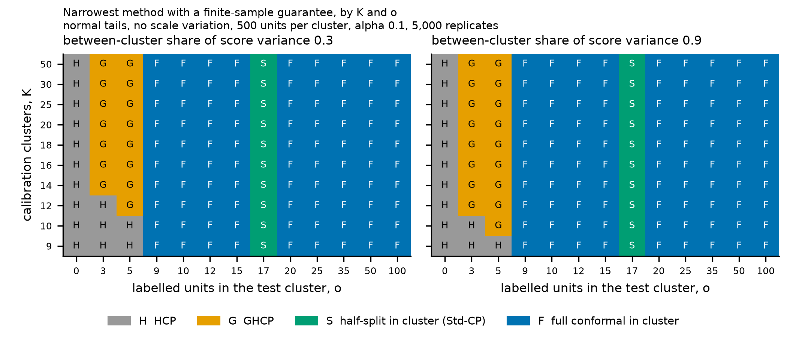
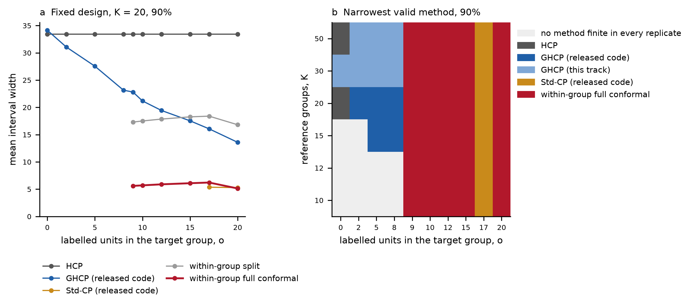
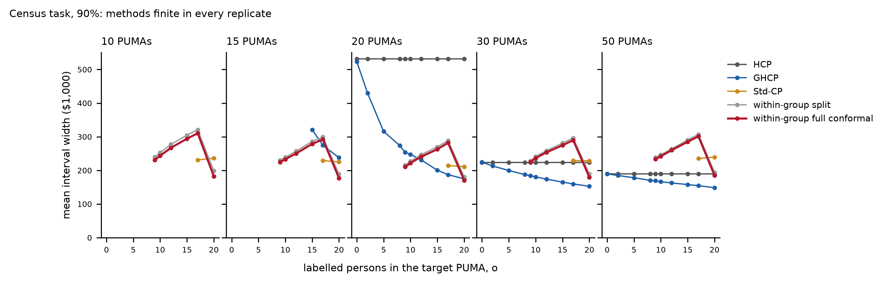

# Round 5, prediction-set track: gate report at W2 (W0, W1, W2, and the state of W4)

Branch `round5-conformal`, from `main` at `d82c3f3`. Plan `docs/round5_conf_plan.md`, which transcribes sections 6 and 7 of `docs/decisions/round5_conformal_track.md`. The plan's section 4 lists eleven points in the instruction or the run that look wrong or unclear, and its section 5 records Nicolas's instructions and the two local-compute extensions. This is the report-and-wait gate. Nothing after W2 has been set up, staged or piloted.

## 1. Stage and status

W0 is complete. Nicolas accepted the c3 anchor as passing on same-vendor agreement (plan section 5 item 4). W1 is complete on all ten values of $K$. W2 is complete: both parts, the sweep over the number of reference groups in the fixed design, the Poisson design at the extended grid, and the census sweep over the number of PUMAs. Acceptance checks 2 and 3 pass. Check 1 passes under the agreement rule for the fixed design and exactly for the Poisson design (section 3). Check 4 passes with one coverage cell of 336 beyond 3 MC standard errors, against 0.91 expected by chance. W4 part A is closed at about half a working day of its day and a half, and part B steps 1 to 4 are written (`docs/round5_conf_theory.md`).

## 2. What was run

**Code.** Scripts are in `code/scripts/` on the branch, and their md5s are recorded in each output's `PROVENANCE.txt`.

- `round5_conf_io.py`: provenance and stamps.
- `round5_conf_w0_anchors.py` and `round5_conf_w0_c3_diag.py`: the W0 anchors and the c3 difference breakdown.
- `round5_conf_w1_sim.py` (md5 60777cae1216e945020e6411488d48a1): W1, which imports `round4_conf_sim.py` (md5 76fda34ee622e299bbaa806e5c8da98a) unmodified.
- `round5_conf_w1_merge.py`: the W1 merge.
- `round5_conf_w1_seedcheck.py`: the one-cell seed check.
- `round5_conf_w2_wrapper.py`, `round5_conf_w2_check.py` and helpers, written by the part-1 sub-agent.
- `round5_conf_w2_census.py` and helpers, written by the part-2 sub-agent.
- `round5_conf_w2_wrapper.py` as changed by the lead for the extended $o$ grid (md5 9c64eb0f6b56912e06654442f4a1ae6a, plan section 4 item 11), with its same-node regression `round5_conf_w2_regress_compare.py`.
- `round5_conf_w2_merge.py` (the W2 merge and acceptance check 4) and `round5_conf_w2_report.py` (scoring numbers and the two W2 figures).

**Longleaf.** The code clone `/work/users/w/e/weiyang/hest_code/round5-conformal` was cloned from GitHub `main` at `d82c3f3` and fast-forwarded from git bundles, per plan section 5 item 2. The project tree was read at `9d7277d` on `main` and not changed (`results/round5/conformal/W0_setup/w0_setup_checks.csv`). Every job landed on `spill`. Jobs ran under `rc_tengfei_pi`, except W2 part 2 and the census units for 10, 15 and 30 PUMAs and two of the four 50-PUMA chunks, which ran under `rc_htzhu_pi`. Both accounts were allowed in those briefs (`W2_ghcp_settings/merged/w2_round_sacct_accounts.txt` and each chunk's `PROVENANCE.txt`).

**Jobs.**

- W0: setup 4168847, anchors 4198240 (sim), 4198244 (c3), 4198252 and 4198457 (codepath), and the c3 diagnostic 4201092 and 4201202.
- W1: smoke 4201564, the ten per-$K$ jobs 4202818 to 4202827, the merge 4215431 and the seed check 4215597 (each id read from its directory's `PROVENANCE.txt`). Wall times run from 35 min ($K = 10$) to 2 h 06 min ($K = 50$), with peak memory under 2 GB in every job (`results/round5/conformal/W1_sim/w1_jobs.csv`).
- W2 part 1 (sub-agent `ed0709a2`): the released launchers and the wrapper validation, jobs listed in `W2_ghcp_settings/part1/w2_part1_sacct.csv`. Part 2 (`630c1298`): the census input, the released census run and the census wrapper validation (`part2/w2_part2_sacct.txt`).
- W2 production: seven simulation-design units, six fixed-design values of $K$ and the Poisson design at $K = 20$. Each ran 1000 replicates at $\alpha \in \{0.1, 0.2\}$ and $o \in \{0, 2, 5, 8, 9, 10, 12, 15, 17, 20\}$ with wrapper md5 9c64eb0f6b56912e06654442f4a1ae6a. Five census units ran, one per PUMA count, with census wrapper md5 d6fb1322983815461700cc75681d9e70. Slurm ids, nodes and wall times are in each unit's directory under `W2_ghcp_settings/sim_designs/` and `census_sweep/`, and the node of every row file merged is in `w2_merge_inputs.json`. Fixed-design units took 36 min to 1 h 11 min per job on 4 cores. Census chunks of 500 replicates took 0.9 to 3.5 h below 50 PUMAs and 4.3 to 4.6 h at 50 PUMAs.
- Failed and superseded runs, kept on Longleaf and not merged: the first attempt of every simulation-design unit (`job1`, `job2`), which stopped at the wrapper's $o$-grid assertion (section 7); chunks rerun for node class (section 7): `fixed_K30/job2b`, `puma15/alpha10_r0-500`, `puma15/alpha10_r500-1000`, `puma20/alpha10_r0-500`, `puma50/alpha10_r0-500`, `puma50/alpha10_r500-1000` and `puma50/alpha20_r0-500`.

**Local work.** Under plan section 5 items 5 and 6: tabulation of returned tables for this report, the second W1 merge into the instruction's paths, the W1 figure, and the W2 scoring numbers and figures (`round5_conf_w2_report.py`, from the merged tables). The W2 merge itself (`round5_conf_w2_merge.py`) ran on Longleaf. The local merge agrees with the Longleaf merge in `W1_sim/merged/`. The acceptance tables are identical, coverage differs by 0.0, and widths differ by at most 7.1e-15.

**Sub-agents.** Each unit ran in its own sub-agent with its own frame id written into its brief. Every returned stamp carries the id assigned to it.

- W0: three, one per anchor.
- W1: ten, one per $K$.
- W2: two development sub-agents, `ed0709a2` for part 1 and `630c1298` for part 2, then five census units, one per PUMA count, and seven simulation-design units.

## 3. Acceptance checks

### W0 (`results/round5/conformal/W0_anchors/`)

1. **Sim anchor** (`sim/w0_sim_anchor.csv`). On the cells `normal|K10|N500|share0.3|tau0.0` and `normal|K20|N500|share0.3|tau0.0`, 120 rows match `c1_grid.csv`. The largest coverage difference is 1.1102230246251565e-16 against a tolerance of 1e-4. The largest relative price difference is 2.3482656241008676e-16 against 1e-6. Infinite fractions are identical. Passed.
2. **c3 anchor** (`c3_uni_v2/w0_c3_anchor.csv`). The selftest passes. All 22,032 rows are matched with none missing either way. At the instruction's tolerances the anchor did not pass: width_mean differs by up to 1.91047000441813e-08 against 3e-10. The breakdown (`c3_uni_v2_diag/w0_c3_diag_by_vendor.csv`) shows the six folds whose round-4 reference ran on Intel, the vendor of the rerun, agreeing to 8.881784197001252e-16. All 223 rows above 3e-10 are in the 18 folds whose reference ran on AMD, and they are at $o = 25$. Coverage is identical on every row once both sides are read from CSV. Nicolas decided that the anchor passes and that the cross-vendor drift is an escalation (plan section 5 item 4).
3. **Codepath anchor** (`codepath/w0_codepath_anchor.csv`). The mismatch counts equal round 4's for all five checks. Passed.

### W1 (`results/round5/conformal/W1_sim/w1_acceptance.csv`)

1. **Reproduction of round 4.** All 15,312 rows of `c1_grid.csv` whose cell, method and $o$ are in the W1 grid are reproduced. The coverage difference is 0.0, the largest relative price difference is 8.561087141255486e-16, and infinite fractions are identical. Passed.
2. **Finiteness.** `within_plain` is infinite in every replicate below $o = 9$ at $\alpha = 0.1$ and below $o = 4$ at $\alpha = 0.2$, and finite in every replicate otherwise. `within` is infinite below $o = 17$ at $\alpha = 0.1$ and, as plan section 4 item 2 adds, below $o = 7$ at $\alpha = 0.2$. Zero exceptions in each of the 8,880 rows checked. Passed.
3. **Coverage of `within_plain` and `within` against $\lceil (n+1)(1-\alpha) \rceil/(n+1)$.** Read literally, every finite cell within three MC standard errors, this fails. 52 of 15,540 `within_plain` cells and 26 of 11,840 `within` cells lie beyond. When the methods are exact, 42 and 32 are expected by chance. The largest $|z|$ is 4.80 for `within_plain`. It is in one cell, `t3|K16|N100|share0.9|tau0.0`, where every within-cluster method over-covers at every $o$. Those exceedances share replicates and test units, so they are not independent.
4. **`within_full`.** Finite in every replicate from $o = 9$ at $\alpha = 0.1$ and from $o = 4$ at $\alpha = 0.2$, and infinite below, with zero exceptions. The kept set was one interval in every replicate of every cell (largest share of non-interval sets 0.0), so hull and exact coverage agree to 4.440892098500626e-16. For coverage within three MC standard errors, 34 of 15,540 cells fail against 42 expected by chance. The largest $|z|$ is 5.27, in the same cell.

**The outlier cell** (`results/round5/conformal/W1_sim/seedcheck/w1_seedcheck.csv`). Rerun with round 4's seed tag, the cell reproduces its W1 rows exactly, 37 rows with difference 0.0. Rerun with an independent seed tag, its largest $|z|$ is 1.42 for `within`, 2.14 for `within_full` and 1.06 for `within_plain`. The mechanism is Monte Carlo fluctuation of one cell's shared draws. An independent seed reproducing the excess would have contradicted it, and it did not. I read checks 3 and 4 as passing against chance and report the literal reading beside it. The decision is the oversight chat's.

### W2 (`results/round5/conformal/W2_ghcp_settings/`)

1. **Launchers against round 4 (`part1/w2_accept1_T2_T3.csv`).** Poisson design (T3): 12 of 12 values equal round 4's `ours` column exactly, and every raw column agrees to 7.1e-15. Fixed design (T2): 4 of 12 within $10^{-9}$. The other eight differ by up to 0.0202 in width and 0.001 in coverage. Under the paper rule of `round4_conf_c1_ghcp_compare.py`, all 24 of 24 agree with the `paper` column. Part 1 traced the T2 difference to the CPU model. The forest-based widths change between the EPYC 7702 nodes of this rerun and the Intel and EPYC 9654 nodes that round 4's fixed-design chunks ran on, while the released Std-CP, which does not use the global forest, agrees to 0.135 (`part1/w2_accept1_raw_columns_fixed.csv`). A rerun pinned to an EPYC 9654 node reproduced round 4's chunk 5 (`part1/w2_node_test_chunk5_vs_round4.csv`). The environment was not rebuilt, so the instruction's fallback rule applies, and the difference is an escalation (section 7). Passed under the agreement rule.
2. **Wrapper against launcher, per replicate (`part1/w2_wrapper_check_summary.csv`).** Run on the same node, the wrapper's HCP and GHCP coverage indicators equal the launcher's in every replicate of both designs (0 mismatches), and widths agree to 7.1e-15. Passed. After the lead's change for the extended $o$ grid, a same-node regression on 8 replicates per design found all 464 rows per design at the shared $o$ values identical to the validated wrapper's, with width difference 0 (`sim_designs/regress_wrapper_ogrid/`).
3. **Census against the paper (`part2/w2_census_acceptance_released.csv`).** The input has 378,817 rows (md5 52c89ae44af23ce972a02c13e4ee5648). The released census run agrees with `acs_paper_reference.csv` at 53 of 53 values. The census wrapper equals the released run on 1000 of 1000 replicates. Passed.
4. **`within_plain` and `within_full` meet W1's checks 2 to 4 in these designs (`w2_acceptance.csv`, `w2_coverage_z.csv`).** Finiteness in every replicate from $o = 9$ at $\alpha = 0.1$ and from $o = 4$ at $\alpha = 0.2$ (from $o = 5$ on this grid), and infinite below, with zero exceptions in all 48 checks over the seven simulation designs and the five census settings. `within_full`'s kept set was one interval in every replicate. Coverage within 3 MC standard errors: simulation designs, `within_plain` fails in 1 of 98 cells against 0.26 expected by chance ($K = 15$, $\alpha = 0.2$, $o = 20$, coverage 0.847 against 0.810, $z = 3.29$, over-coverage), and `within_full` fails in 0 of 98. Census: 0 of 70 for each. In total 1 of 336 cells, against 0.91 expected by chance. In the census task the responses are incomes, which can tie, and ties make both methods conservative. The `within_full` coverage of the exact set ranged from 0.881 to 0.950 at $\alpha = 0.1$ over the census cells that were finite in every replicate. I read check 4 as passing. Literally it fails in one cell, which is over-coverage.

## 4. Methods, assumptions and guarantees, as written before they ran

These are as in the docstrings of `round5_conf_w1_sim.py`, `round5_conf_w2_wrapper.py` and `round5_conf_w2_census.py`, which were committed before their production runs, and in section 2.3 of the instruction.

- `within_plain`. Split conformal on the $o$ labelled absolute residuals of the test cluster, uncentred. It assumes the labelled units and the test unit are exchangeable within the cluster, which holds by construction in simulation. Coverage is at least $1 - \alpha$, exactly $\lceil (o+1)(1-\alpha) \rceil/(o+1)$ with distinct scores.
- `within`, the instruction's Std-CP form. It centres on the mean of the first $\lfloor o/2 \rfloor$ residuals and calibrates on the rest. Same assumption, with $n = o - \lfloor o/2 \rfloor$ in place of $o$.
- `within_full`. Full conformal inside the cluster, with the mean as the fitted model. Same assumption. Coverage is exactly $(o + 1 - \lfloor \alpha(o+1) \rfloor)/(o + 1)$, the same as `within_plain`'s. The interval end points were checked analytically (plan section 4 item 5) and by brute force: 0 mismatches over 1,600,400 grid points (`results/round5/conformal/W1_sim/smoke/`). The reported width is the convex hull, and here the hull is the set.
- `hcp`, `ghcp`, `ghcp_noad`, `ghcp_r05` and `ghcp_r05code` are round 4's, unchanged.
- In W2, `released_stdcp` is the released code's Std-CP: a random-forest half-split with a randomised quantile (plan section 4 item 10). It is not `within`.

**Variables that differ between arms.** In W1, every comparison between methods is within one (cell, replicate, $o$). The replicate draw, the labelled stream and the 500 evaluation units are common, so only the method differs. Comparisons across $o$ share the replicate and use nested labelled sets. Comparisons across $K$ differ in the replicate draws, because seeds are keyed by the cell. In W2, every comparison between methods is within one replicate and one $o$: the released generator's draw, the target group's labelled units and the target unit are common to all methods. The released methods (HCP, GHCP, Std-CP) use the launcher's own forests. This track's `ghcp`, `within_plain` and `within_full` share one residual stream from a global forest fitted on the groups outside this track's paper pool (wrapper docstring, choice 1). So `within_plain`/`within_full` against the released GHCP differ in the forest as well as in the method. Comparisons across $K$ use different replicate draws, because the launcher's seeds depend on the configuration. In the census task every method sees the same sampled PUMAs, target person and labelled persons in a replicate.

## 5. Predictions against outcomes

Read at normal tails, $\tau = 0$, $N = 500$ and $\alpha = 0.1$ unless the prediction names a cell. Values are from `results/round5/conformal/W1_sim/w1_report_numbers.csv` and `w1_predictions.csv`.

| Prediction | Outcome | Scored |
|---|---|---|
| W1.1. At $K \le 10$ GHCP is the narrowest valid method in no cell at any $o$ | GHCP is narrowest in 1 cell: $K = 10$, share 0.9, $o = 5$, where it is narrower than HCP by a relative margin of 0.027096, which is more than 2 MC SE | partly held |
| W1.2. At $K \ge 20$ and share at least 0.3, GHCP is narrowest at $o = 3$ and 5, with a price 3 to 10% below HCP's | Narrowest in 24 of 24 cells. GHCP/HCP width ratio 0.8738190639438328 to 0.9697391764553428, that is 3% to 13% below | partly held (the margin reaches 13% at share 0.9) |
| W1.3. At $o \in \{9, 10, 12\}$ and share 0.3, `within_plain` is narrower than GHCP for $K \le 15$ and wider for $K \ge 25$; `within_full` is narrower than GHCP at every $K$ | `within_plain` narrower in 12 of 12 cells at $K \le 15$, wider in 8 of 9 at $K \ge 25$ (the exception is $K = 25$, $o = 9$, ratio 0.985); `within_full` narrower in 30 of 30 | held, apart from one cell |
| W1.4, first sentence. `within_full` is 5 to 18% narrower than `within` at $o$ from 20 to 50, and wider at $o = 17$ | Ratio 0.8256613065185266 to 0.9281086088469062 at $o$ 20 to 50, and 1.1161583462790825 to 1.1290196641790418 at $o = 17$ | held |
| W1.4, second sentence. From $o = 9$ the narrowest valid method is `within_full` at every $K$ and every share of 0.3 or more | `within_full` in 270 of 300 cells. The other 30 are all at $o = 17$, where `within` is narrowest, as the first sentence says | refuted as written (the sentence contradicts the first; plan section 4 item 9) |
| W1.5. At share 0.9 and $K = 20$, GHCP at $o = 5$ is at least 15% narrower than HCP, and `within_full` from $o = 9$ is at least 40% narrower than GHCP | GHCP/HCP 0.8870856579219655, so 11% narrower. `within_full`/GHCP at most 0.6252594451783394 from $o = 9$, so at least 37% narrower; the largest ratio is at $o = 100$ | refuted on both magnitudes, narrowly on the second |
| W2.1. `within_full` finite in every replicate from $o = 9$; at $o \in \{10, 15, 20\}$ at least 40% narrower than GHCP, whose widths there are 21.2, 17.5 and 13.6 | Finite in every replicate from $o = 9$ in all seven designs. Released GHCP widths 21.18, 17.54, 13.59. `within_full`/released GHCP 0.269, 0.348, 0.378, so 73%, 65%, 62% narrower (this track's `ghcp`: 0.263, 0.342, 0.360) | held |
| W2.2. `within_plain` within 25% of GHCP at $o = 10$ and wider than GHCP at $o = 20$, because it does not centre and the cluster effects are large | Ratio to released GHCP 0.827 at $o = 10$ and 1.237 at $o = 20$. The stated reason was not tested separately | held |
| W2.3. At $o = 5$ and 8 GHCP is the narrowest valid method, and at $o = 5$ it is 10 to 25% narrower than HCP | Released GHCP narrowest at both, with this track's `ghcp` the runner-up and the narrowest non-GHCP method HCP (33.40). Released GHCP/HCP at $o = 5$: 0.825, so 17.5% narrower (`ghcp` 0.837) | held |
| W2.4. At $o = 5$, GHCP is wider than HCP with 10 groups, and 0.75 to 0.92 of HCP with 20 or more | First clause not testable at $\alpha = 0.1$: with 10, 12 or 15 groups the released HCP calibrates on half of them (5, 6 or 8) and is infinite in every replicate, and GHCP is infinite at $K = 10$. At $\alpha = 0.2$, where both are finite, GHCP is narrower than HCP at $K = 10$ (0.697). Second clause: 0.825, 0.871, 0.920 at $K = 20$, 30, 50 (`ghcp` 0.837, 0.868, 0.916) | partly held (second clause held, the $K = 50$ value 0.9199 at the bound; first clause not testable as stated and refuted at $\alpha = 0.2$) |
| W2.5. Census, 20 PUMAs: GHCP narrowest valid at every $o \le 20$. With 10 PUMAs, GHCP wider than HCP at $o \le 10$ | 20 PUMAs, $\alpha = 0.1$: GHCP narrowest at $o \le 8$ and $o \in \{12, 15, 17\}$. `within_full` is narrower at $o = 9$ (GHCP minus `within_full` 43,319 ± 6,549, paired MC SE) and $o = 10$ (25,756 ± 7,000), and at $o = 20$ by 4,164 ± 3,904, inside MC error. At $\alpha = 0.2$ GHCP is narrowest from $o = 2$, except a tie at $o = 9$. 10 PUMAs: not testable at $\alpha = 0.1$ (HCP calibrates on 5 PUMAs and GHCP is never finite in every replicate at $o \le 10$). At $\alpha = 0.2$ GHCP is narrower than HCP at $o = 2$ to 10 (0.896 to 0.681) and equal within MC error at $o = 0$ | refuted (first sentence at $o = 9$, 10; second clause not testable at $\alpha = 0.1$ and refuted at $\alpha = 0.2$) |
| W4.1 to W4.3 | see section 6, W4 | not scored until W5 |

## 6. Results

### W1, the simulation map

`results/round5/conformal/W1_sim/fig_w1_map.png`. Normal tails, $\tau = 0$, $N = 500$, $\alpha = 0.1$, 5,000 replicates. The full table is `w1_narrowest_valid.csv` (one row per cell, $\alpha$ and $o$, with runner-up, margin, paired MC SE and whether the margin exceeds two of them).

In the default slice the map has four regions.

- At $o = 0$, HCP.
- At $o = 3$ and 5, GHCP from $K = 14$ at share 0.3, and from $K = 12$ (and at $K = 10$, $o = 5$) at share 0.9.
- At $o = 17$, `within`. Its calibration set of 9 scores is the smallest that is finite at $\alpha = 0.1$, so its rank $\lceil 10 \cdot 0.9 \rceil = 9$ is the largest of the 9, while `within_full` at $o = 17$ uses rank 17 of 18.
- From $o = 9$ (except 17), `within_full`.

One cell for scale, `normal|K20|N500|share0.3|tau0.0` in `w1_grid.csv`.

- HCP has half-width 2.91 at coverage 0.9414 (MC SE 0.0015).
- GHCP at $o = 5$ has 2.7254 at 0.9441.
- At $o = 10$, `within_plain` has 2.5025 at 0.9071, and `within_full` has 1.9855 at 0.9075.
- At $o = 20$, `within` has 1.9564 at 0.9081, and `within_full` has 1.7986 at 0.9027.

**The whole grid, from $o = 9$ excluding 17, at $\alpha = 0.1$** (`w1_narrowest_valid.csv`, tabulated over every cell into `results/round5/conformal/W1_sim/w1_whole_grid_counts.csv`).

- `within_full` is narrowest in every cell at share 0.9 (720 of 720 at each $\tau$).
- At share 0.5 it is narrowest in all but 11 of 1,440 cells, and at share 0.3 in all but 90 of 1,440.
- At share 0.1, GHCP is narrowest in 295 of 1,440 cells.
- With no cluster effect (share 0), `within_full` is never narrowest. The plain split (443 cells), GHCP without adaptation (205) and HCP (72) share those cells, because centring on a cluster mean then only adds noise.
- At share 0.3 or more, the 101 cells where GHCP rather than `within_full` is narrowest are almost all under $t_3$ tails. There the mean of a few heavy-tailed residuals is a noisy centre.

So the statement "from 9 labelled units the full conformal set inside the test cluster is the narrowest valid method" holds in this generator whenever the between-cluster share is 0.3 or more and the tails are normal. It fails without a cluster effect, and it fails in a minority of cells under $t_3$ tails.

**The share of 0.9.** It was reached by round 4's solver. Realised shares are 0.8830766496860628 to 0.9058044915356912 under normal tails and 0.876331523635129 to 0.9060013049889016 under $t_3$ (`w1_report_numbers.csv`).

### W2, GHCP's own settings with the comparators added

`results/round5/conformal/W2_ghcp_settings/fig_w2_fixed_design.png`. The released fixed design ($N = 21$ per group), $\alpha = 0.1$, 1000 replicates per setting. Panel a shows mean widths of the methods that are finite in every replicate at $K = 20$. Panel b shows the narrowest valid method, from `w2_narrowest_valid.csv`, which also gives the runner-up and the paired margin. Where the released GHCP and this track's `ghcp` are first and second, the released code is narrower by more than 3 paired MC SE in three cells (Poisson design $o = 2$ and 8; $K = 15$, $o = 8$), and the two are within 2.3 SE elsewhere. HCP leads GHCP at $o = 0$ at $K = 20$ and 50 by margins within 3 MC SE.

**The fixed design** (`w2_sim_designs.csv`, `w2_narrowest_valid.csv`).

- Below $o = 9$ the within-group methods are infinite. GHCP is the narrowest valid method from $o = 5$ at $K = 15$ and from $o = 2$ at $K = 20$ to 50. At $o = 0$, HCP leads at $K = 20$ and 50 and this track's `ghcp` at $K = 30$. At $K \le 12$ below $o = 9$, and at $K = 15$ below $o = 5$, no method is finite in every replicate at $\alpha = 0.1$, because the released HCP calibrates on half of the groups.
- From $o = 9$, `within_full` is narrowest at every $K$ and in the Poisson design, except at $o = 17$. At $K = 20$ its width is 5.14 to 6.22 at coverage 0.873 to 0.934, against released GHCP 22.82 to 13.59 and HCP 33.40.
- At $o = 17$, the released Std-CP is narrowest in all seven designs (for example 5.37 against `within_full` 6.22 at $K = 20$, margin 0.86 ± 0.05). Its half split leaves 9 calibration units, and its randomised quantile is exact at $1 - \alpha$ and finite with probability one at that size. `within_full` at $o = 17$ must use its largest residual. This is the analogue of W1's $o = 17$ region, where `within` led.
- `within_plain` is 15 to 19 wide at every $o$ in the fixed design, against `within_full`'s 5 to 6. It does not centre, and the between-group variation in this design is large.

**The census task** (`w2_census.csv`, `fig_w2_census.png`). Mean widths in dollars, $\alpha = 0.1$.

- With 10 or 15 PUMAs, HCP is infinite in every replicate (it calibrates on 5 or 8 PUMAs; plan section 4 item 8). GHCP is never finite in every replicate with 10 PUMAs, and only from $o = 15$ with 15. So from $o = 9$ the within-group methods are the only methods finite in every replicate with 10 PUMAs, and the only ones below $o = 15$ with 15. `within_full` is narrowest at $o \ge 9$ in both, except at $o = 17$, where Std-CP is.
- With 20 PUMAs, HCP is 531,277 wide at coverage 0.983. GHCP falls from 523,195 at $o = 0$ to 174,906 at $o = 20$. `within_full` is narrower than GHCP at $o = 9$ and 10, GHCP is narrower at $o = 12$ to 17, and the two are within MC error at $o = 20$.
- With 30 and 50 PUMAs, GHCP is narrowest at every $o \ge 2$, and HCP at $o = 0$.
- The within-group widths rise from $o = 9$ to 17 and drop at $o = 20$. The rank they use is the largest score up to $o = 18$, and the second largest from $o = 19$. The expected coverage falls from 0.944 to 0.905 with it.

So in GHCP's own simulation designs, from 9 labelled units the full conformal set inside the target group is narrower than GHCP by a factor of about 3 to 4 at every number of reference groups tried. On the census task the ordering depends on the number of PUMAs. GHCP is narrowest with 30 or more, while with 20 the within-group full conformal set is narrower at $o = 9$ and 10. Neither of these statements says anything about GHCP's own guarantee, which held in every setting: coverage of the released GHCP at $\alpha = 0.1$ was 0.900 to 0.977 in the simulation designs, over the settings where it was finite in every replicate, and 0.904 to 0.983 on the census.

### W4, state of the theory document

`docs/round5_conf_theory.md`. Part A is closed, within its cap (about half a working day by the session record, an estimate, against one and a half days). Part B steps 1 to 4 are written. Step 5, dominance, has not been attempted.

- **Proposition 2 (part A, section A.2).** Not found in print in the ten papers of the reading log. Two direct corollaries of Tibshirani, Barber and Ramdas (arXiv:2608.27310) are written out. Theorem 3 (universality) gives an infinite set with probability one for deterministic order-invariant methods when $K + 1 < 1/\alpha$. Theorem 7 (optimality; its optimum is randomised, so I read its class as including randomised mappings) gives infinite expected Lebesgue measure for every valid method. That is weaker than Proposition 2's probability bound $1 - \alpha(K+1)$. The bound itself for randomised methods was not found in print. It rests on the round-4 argument, and a shorter contamination route is derived in A.2. Both corollaries transfer to the hierarchical model through the degenerate laws, at $o = 0$ only.
- **Proposition 1 (section A.3).** Not found. The impossibility results found (Angelopoulos, Barber and Bates Theorem 4.5; Lei and Wasserman Lemma 1; Barber, Candès, Ramdas and Tibshirani) concern conditional coverage.
- **Part B (sections B.1 to B.4).** Tibshirani, Barber and Ramdas' Theorem 7 is optimality at a law, not dominance and not minimax. The baseline is randomised HCP. In the revealed-law model, validity is the permutation form of the round-4 document and nothing more. The round-4 result is restated with its conditions: the repaired switching rule is valid, is narrower than HCP at the homogeneous law, and does not dominate it.
- **Predictions.** W4.1 holds for the two corollaries, but not for the probability bound on randomised methods. W4.2 holds. W4.3 ("step 4 written as a result and dominance unresolved") holds as of this gate. Part B's cap is not used up and W4 continues beside W3, so W4.3 is scored finally in the W5 report.

## 7. Discrepancies, open questions and escalations

1. **Cross-vendor drift on $o > 0$ rows (W0).** Up to 1.91047000441813e-08 in width (`W0_anchors/c3_uni_v2_diag/`). Nicolas decided this is the width tolerance for W3's cross-vendor reproduction.
2. **`whose()` on `results/round4/`** gives 213 `sibling`, 33 `unstamped` and 1 `foreign_session` (`W0_setup/w0_whose_round4.csv`). The anchors only read round-4 inputs that the instruction names for that use. They rebuild nothing, so I treated the instruction as the permission and continued.
3. **W1 checks 3 and 4, literal reading.** See section 3.
4. **Staged scripts.** While other sub-agents' jobs were running against the Longleaf clone at `23dc9d1`, the W1 merge, the seed check and the W2 production runs used committed scripts staged into the job with their md5 checked, rather than fast-forwarding the clone. The clone is fast-forwarded at the gate.
5. **W2 acceptance check 1, fixed design, scored by the agreement rule.** 4 of 12 T2 values within $10^{-9}$ of round 4's `ours` column, 24 of 24 under the paper rule. The cause is the CPU model, not the environment (section 3). A rerun of all fixed-design chunks pinned to the node class of round 4 would cost about 28 single-core hours. It is a proposal and was not run.
6. **Node class in the W2 production.** The released random forest gives different floating-point results from the same seeds on different Longleaf node classes. The production unit for $K = 20$ found this replicate by replicate. On the same replicates of $K = 30$ chunks 4 to 7, an Intel node and an EPYC 9654 node give identical finiteness, but 410 of 59,000 coverage indicators differ, widths differ by up to 4.60, and the pooled table moves by at most 0.006 in coverage and 0.028 in mean width (`merged/w2_fixed_K30_node_class_job2b_vs_job2c.csv`). I had every production table rerun onto one class. All 108 merged row files are from 384-CPU `rhel9,amd,avx512` nodes (EPYC 9654), listed with their node in `merged/w2_merge_inputs.json`. Seven superseded chunks are kept on Longleaf (section 2). Slurm's `--constraint=avx512` was not honoured, so the reruns used `--nodelist` and an in-job check of the CPU model. The census pipeline turned out not to depend on node class: three chunks rerun on EPYC 9654 nodes gave byte-identical rows to their originals. Two consequences: the W2 simulation tables are not replicate-identical to part 1's tables or to round 4's, which ran on other classes (at $K = 20$, the summaries differ by at most 0.029 in width and 0.007 in coverage), and W3's real-data reproduction checks may meet the same effect.
7. **The released Std-CP is not `within`** (plan section 4 items 1 and 10). It is reported as `released_stdcp` (census `Std-CP`). It is the narrowest valid method at $o = 17$ in all seven simulation designs and with 10 PUMAs on the census.
8. **The census PUMA count** (plan section 4 items 7 and 8). `--target_index` is a row position. The PUMA count is `--n_puma_groups`. The released HCP calibrates on half of the PUMAs, which is why HCP is infinite at $\alpha = 0.1$ with 10 or 15 PUMAs. The same split in the fixed design makes HCP infinite at $K \le 15$, so W2.4's first clause and W2.5's second cannot be scored at $\alpha = 0.1$.
9. **This track's `hcp` and the released HCP differ on ties.** In 90 of 2000 Poisson pairs (`part1/w2_hcp_tie_cases_poisson.csv`). In the production Poisson design their mean widths at $o = 0$ are 33.483 and 33.526 (`w2_sim_designs.csv`).
10. **The W2 wrapper rejected the extended $o$ grid** (plan section 4 item 11). Every simulation-design unit's first jobs stopped at the assertion. The lead changed the wrapper, checked it on one node against the validated version (464 of 464 rows identical per design), and the units reran into new directories.
11. **Cancelled launcher jobs in part 1.** The four first launcher jobs (4203412, 4203414, 4203415, 4203416) were cancelled after 5 to 10 minutes by sub-agent `ed0709a2`, its own jobs, when it found that the launcher-against-wrapper check needs one node. Their partial scratch directories were reused by the rerun under the same stamp.
12. **A sub-agent ran `scancel` on another user's job.** Sub-agent `3f3833cb` ($K = 30$) cancelled Slurm 4244454 believing it was its own. It belongs to another user. sacct shows it ended FAILED with exit 1:0 at 02:07, not CANCELLED, and the sub-agent saw it running afterwards, so the cancel was refused. Every later brief told sub-agents to confirm a job id with `squeue -u weiyang` before cancelling.
13. **Small record defects.** `sim_designs/fixed_K10/job1b` holds a sacct file with one hand-typed row for the failed first attempt. Several units' summary tables were aggregated by the sub-agents from the row files, because the wrapper writes no summary. The merge recomputes every number in this report from the rows.

## 8. What was not checked

- The W2 fixed-design tables were not rerun on round 4's node classes, so their replicate-level agreement with round 4 and with part 1 was not tested (escalation 6).
- Check 2, wrapper against launcher replicate by replicate, was run at $K = 20$ in both designs, on one node class. It was not repeated at other $K$ or on the production node class. The wrapper's methods do not depend on $K$, and the regression after the $o$-grid change was on one node.
- The stated reason in W2.2 (the cluster effects are large) was not tested separately from its numerical claim.
- The census sweep ran the extended grid at $\alpha \in \{0.1, 0.2\}$ only, as the released census code does.
- Paired margins between GHCP and `within_full` on the census were computed only for 20 PUMAs (`merged/w2_census_puma20_ghcp_vs_within_full.csv`). The narrowest-valid table gives the paired margin only to the runner-up.
- That each cited file is the right file for its number. The numeric-claim sweep (section 10) checks that the number is in the cited file, not that the file is the right one.

## 9. Proposed next step

W3, real data above 10 calibration donors, as the instruction specifies, once the oversight chat has reviewed this report. Nothing for W3 has been set up, staged or piloted. Two points need the oversight chat's decision first. One is whether W3's cross-vendor tolerance (escalation 1) should now be read alongside the node-class effect of escalation 6, which is larger for forest-based scores. The other is whether the fixed-design T2 rerun on round 4's node class (escalation 5) is wanted. The W4 dominance question (part B step 5) continues beside W3 under its remaining cap.

## 10. Numeric-claim sweep

`code/scripts/verify_numeric_claims.py` over `README.md`, `docs/round5_conf_plan.md`, `docs/round5_conf_theory.md` and this report, run locally on the committed files (plan section 5 item 6). Search directories were `results/round5/conformal` and `results/round4/conformal`. The single-source tables passed with `--always` were `w2_report_numbers.csv`, `merged/w2_census_puma20_ghcp_vs_within_full.csv`, `merged/w2_fixed_K30_node_class_job2b_vs_job2c.csv`, `W1_sim/w1_report_numbers.csv`, `W1_sim/w1_whole_grid_counts.csv` and one W1 self-test file. Results:

- Plan: 80 of 80 claims verified.
- Theory document: 15 of 15.
- This report: 219 of 219.
- README: one value not found, 0.1018 at line 161. That line predates this branch, which does not change the README, so it is left for its owner.

Values that are not data (Slurm ids, CPU model numbers, source line numbers, counts of files or rows, and one sum of two table values) are declared with reasons in `.verify-exceptions`, under the heading for this report. The output is `results/round5/conformal/W2_ghcp_settings/merged/w2_numeric_claim_sweep.tsv`.
