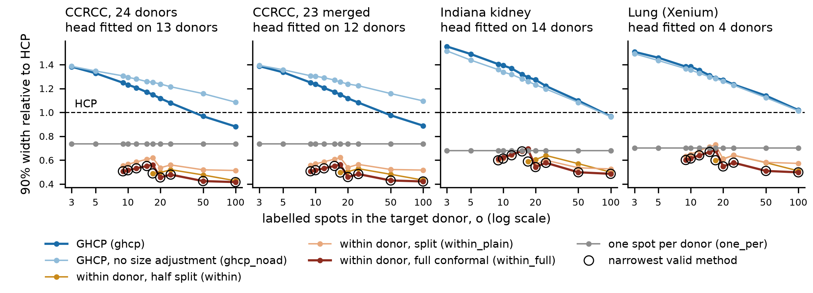
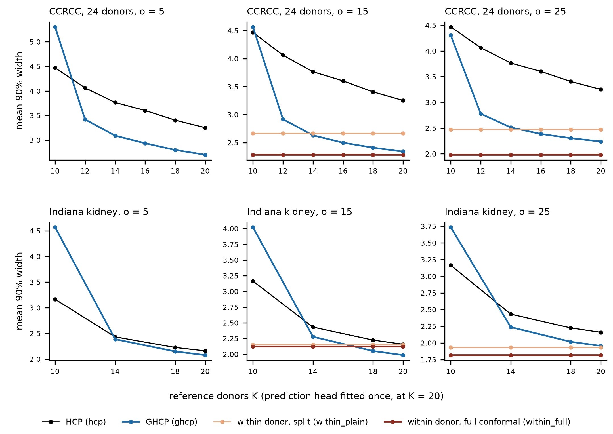
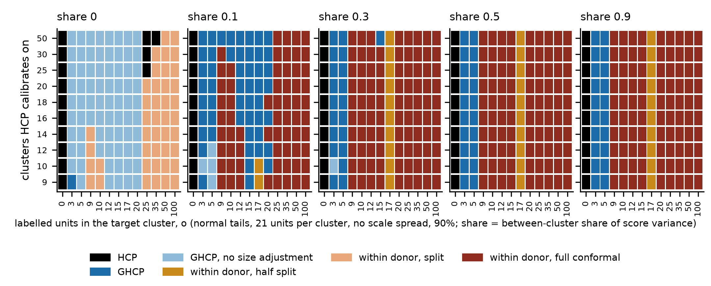
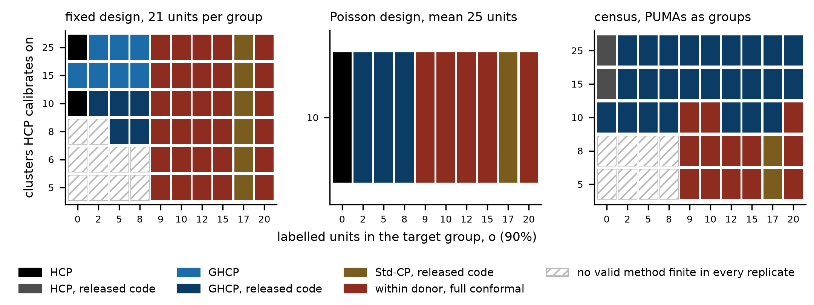
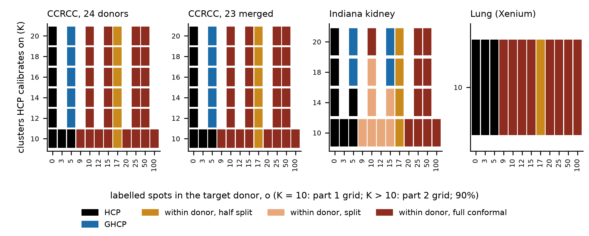

# Round 5, prediction-set track: closing report at W5 (W3, W4 and W5, with W1 and W2 carried from the W2 gate)

Written by the lead at the end of interval 2, under `docs/decisions/round5_conformal_track.md` sections 6 to 8 and the W2 decisions memo (`docs/decisions/round5_conformal_W2_decisions.md`, transcribed as plan section 6). W1 and W2 were reported at the W2 gate (`docs/round5_conf_W2_report.md`, tag `round5-conf-W2`, pull request #16, merged). Their results are not repeated here beyond the predictions table and the closing page.

## 1. Stage and status

W5, the end of the track, is reached. W3 ran in full on Longleaf. W4 part B step 5 was attempted within its cap and dominance is unresolved. The W5 map, the provenance index and this report are committed on `round5-conformal`. The branch is pushed once with the tag `round5-conf-final`, one pull request is opened, and the session stops.

## 2. What was run

**Code reaching Longleaf.** Every Longleaf job ran from a read-only snapshot of a delivered commit (`results/round5/conformal/code_deliveries.csv`, rows 1 to 4). The W3 production ran from snapshot `2aae741` (delivery 3). The W3 merge ran from snapshot `c474859` (delivery 4, Slurm 4349475), which changed only how the merge reads the round-4 reference files (escalation 4).

| Script | md5 | Where it ran |
|---|---|---|
| `code/scripts/round5_conf_w3.py` | 737a452b090da9609c798cc482f6896d | Longleaf, all W3 production |
| `code/scripts/round4_conf_c3.py` (imported, unchanged) | 2d8418677cf8290eec89a14c315b92cd | Longleaf, all W3 production |
| `code/scripts/round5_conf_w3_merge.py` | 88d41fb29ff244ea69112d50dfb0c2c9 | Longleaf, Slurm 4351817 |
| `code/scripts/round5_conf_w3_p3p2_diag.py` | e56f4b7f80575c8e902b48bf4bc980cd | Longleaf, read-only diagnostic |
| `code/scripts/round5_conf_w3_report.py` | 60ab3948f2320f9734f761198980b5e8 | local (plan extension 3) |
| `code/scripts/round5_conf_w5_map.py` | d698a0c843249bdad3fb0b034ca9ea14 | local |
| `code/scripts/round5_conf_w5_numbers.py` | c195ec9e2342c938b3006d8fa7e930b3 | local |
| `code/scripts/round5_conf_provenance_index.py` | d132296a90c7ee0632e7a13152520af4 | local |
| `code/scripts/round5_conf_w4_hcp_pointwise.py` | c81a2c92a60470f7c8726548073e2f5a | local (W4 probe) |

**W3 jobs.** Every job, with account, partition, node, state, wall time, requested memory and peak memory from `sacct`, and the CPU model from the job's PROVENANCE.txt, is in `results/round5/conformal/W3_real/w3_jobs.csv`. In summary, eight sub-agent units ran 30 production jobs, each with 4 CPUs on account `rc_tengfei_pi`. All 30 completed. The jobs requested partition `general` and Slurm placed most of them on `spill` (escalation 6).

| Unit | Production jobs | Longest wall time | Peak batch memory (GB) |
|---|---|---|---|
| p1_ccrcc24 | 3 | 01:01:57 | 17.7 |
| p1_ccrcc23m | 3 | 00:57:56 | 17.4 |
| p1_indiana | 3 | 00:22:52 | 8.6 |
| p1_lung | 2 | 02:29:45 | 23.5 |
| p2_ccrcc24 | 3 | 05:04:06 | 32.1 |
| p2_ccrcc23m | 7 | 02:42:29 | 24.9 |
| p2_indiana | 2 | 01:52:02 | 13.9 |
| p3_fixedhead | 7 | 04:20:42 | 36.6 |

Three further attempts were superseded and their work rerun in full: 4325175 (out of memory), 4321638 and 4322340 (cancelled by the lead, escalation 3). The final merge, Slurm 4351817, ran on node t0604 (Intel Xeon E7-8867 v3) in 00:08:43 with 9.6 GB peak memory (`W3_real/merged/MERGE_SOURCE.txt`, `w3_jobs.csv`).

**Commits of interval 2**, in order: `e352d69`, `2c820e0`, `2aae741`, `8de3088`, `e1bf886` (the W3 scoring rules, committed before any production row was merged), `c474859`, `27c7ac3`, `f0c3f73`, `9f56b00`, `fde56c2`, `1a995bc`, `e714cec`, and the commit carrying this report.

## 3. Acceptance checks

### W3 (`results/round5/conformal/W3_real/merged/w3_acceptance.csv`)

The merge read 117 row files with 10,218,582 rows, every one recording snapshot `2aae741` (`merged/w3_merge_inputs.json`). It found no duplicated keys. Part 1 has 2,071,818 rows, part 2 has 4,971,348 and part 3 has 3,175,416. Each unit's own count matched these (all 2,646 rows per part-1 fit, 1,446 per part-2 fit and $K$, 8,676 per CCRCC part-3 fold and draw and 5,784 per Indiana one). Every unit directory's `_provenance.json` carries the frame id assigned to that unit.

1. **Reproduction of round 4 (coverage exact, width within 1.91e-8).** 1,693,662 W3 rows were matched to round-4 rows with none missing (`merged/w3_reproduction.csv`). Rows against `c3_K_sweep.csv` and the $o = 25$ GHCP fragment all pass, with largest width difference 4.52e-9 and no coverage difference. Against `c3_o_sweep.csv`, two rows fail, each appearing once in part 1 and once in part 2. So the check fails as written on 2 of 1,693,662 rows. Both are `within` at $\alpha = 0.2$, $o = 10$, $K = 10$ (`merged/w3_repro_mismatch_rows.csv`). The first is CCRCC, hoptimus0, fold INT9, draw 16, where coverage differs by 1.19e-5, about one test spot. The second is CCRCC_23merged, uni_v2, fold INT5, draw 34, where coverage agrees and the median width differs by 5.9e-8. Escalation 1 gives the CPU models of both runs.
2. **Within-donor coverage within 0.005 of $\lceil (o+1)(1-\alpha) \rceil/(o+1)$.** Passes for `within_plain` (362 cells, largest difference 0.0033), `within` (264 cells, 0.0035) and `within_full` (362 cells, 0.0025).
3. **Part 3 at $K = 20$ equals part 2 at $K = 20$.** 637,686 rows matched. Coverage is equal in every row. Width differs by up to 1.08e-8, so the check fails as written, since its tolerance is zero. The diagnostic `merged/w3_p3p2_by_cpu.csv` shows that the two are bit-identical whenever both runs used the same CPU model, and also between Gold 6140 and EPYC 9654 runs. The differences occur only where one run used an E5-2680 v4 or E5-2643 v3 node (escalation 2).
4. **Self-tests.** The c3 self-test passed in every part-1 shard. The part-3 nesting check passed in all 26 part-3 shards. The `within_full` exact-set coverage was computed for every gene. No gene's set was ever other than one interval (`wf_frac_not_interval_max` is 0 in all 362 cells of `merged/w3_within_coverage.csv`).

### W5

- **Provenance index** (`results/round5/conformal/provenance_index.csv`), over every PROVENANCE.txt of W0 to W4, 1,247 script records from 88 Slurm jobs, checked against commit `fde56c2`. Check 1, the recorded commit is an ancestor of the gate, holds in 1,247 of 1,247. Check 2, the recorded md5 equals the script's md5 at that commit, holds exactly in 1,156. The other 91 are traced to the first commit on the gate's history whose blob has that md5. Of these, 89 are staged copies (W1 and W2, escalation 4 of the W2 report), and 2 are local runs from an uncommitted working tree that was committed afterwards. None is untraced. The merge job and the local report runs write `MERGE_SOURCE.txt`, `REPORT_PROVENANCE.txt` and `W5_map/PROVENANCE.txt` in their own formats, which the index does not read. Their script md5s are listed in section 2.
- **Numeric-claim sweep**, section 10.

## 4. Methods, assumptions and guarantees, as written before they ran

The methods of W3 are those of round 4's C3 harness, unchanged (`code/scripts/round4_conf_c3.py`, docstring). `within_full` is added from W1 (`code/scripts/round5_conf_w1_sim.py`, `f_within_full`), gene-vectorised in `round5_conf_w3.py`. Its assumption is that the target donor's $o$ labelled spots and its evaluation spots are exchangeable. Its guarantee is coverage $\lceil (o+1)(1-\alpha) \rceil/(o+1)$, and it is finite if and only if $\lfloor \alpha (o+1) \rfloor \ge 1$. HCP assumes the $K$ calibration donors and the test donor are exchangeable. GHCP assumes its A1 to A3. `within` and `within_plain` assume exchangeability inside the target donor. `pooled` and `recentred` carry no finite-sample guarantee under hierarchical exchangeability and are never called valid.

The variables that differ between arms are these.

- Part 1 compares methods at fixed fold, calibration draw, label draw and encoder. Only the method and $o$ differ.
- Part 2 varies $K$, and with it the number of training donors the head is fitted on. For CCRCC that number falls from 13 at $K = 10$ to 3 at $K = 20$, and for Indiana from 14 to 4 (`w3_map_by_task.csv`, `n_T_donors`).
- Part 3 holds the head fixed at the $K = 20$ design's fit, so only the calibration donors differ across $K$.

The W5 map's per-method group counts and the code they are read from are in `results/round5/conformal/W5_map/w5_method_groups.csv`. In the GHCP designs, with $n$ reference groups, the released HCP calibrates on $\lceil n/2 \rceil$ groups and fits its forest on the other $n - \lceil n/2 \rceil$ (`methods/donor_hcp.py`, `get_hcp_train_cal_split`). The released GHCP calibrates on $\lceil n/2 \rceil$ (its pool of $\lceil n/2 \rceil + 1$ less the donor) and fits on $n - \lceil n/2 \rceil - 1$ (`get_donor_style_train_cal_split`). The released Std-CP uses no group and splits the target's $o$ units in half.

## 5. Predictions against outcomes

W1 and W2 are carried from the W2 report section 5, unchanged. W3 is scored by the rules committed in `e1bf886` before the merge (`code/scripts/round5_conf_w3_report.py`, docstring), at $\alpha = 0.1$. Per-clause values are in `results/round5/conformal/W3_real/w3_report_numbers.csv` and the scores in `w3_prediction_scores.csv`.

| Prediction | Outcome | Scored |
|---|---|---|
| W1.1 | GHCP narrowest in 1 cell at $K \le 10$ ($K = 10$, share 0.9, $o = 5$) | partly held |
| W1.2 | Narrowest in 24 of 24 cells, 3% to 13% below HCP | partly held |
| W1.3 | Held apart from one cell | held, apart from one cell |
| W1.4, first sentence | Held | held |
| W1.4, second sentence | `within_full` in 270 of 300 cells, the other 30 at $o = 17$ | refuted as written |
| W1.5 | 11% rather than 15%, and 37% rather than 40% | refuted on both magnitudes |
| W2.1, W2.2, W2.3 | As the W2 report | held |
| W2.4 | Second clause held, first not testable at $\alpha = 0.1$ | partly held |
| W2.5 | Refuted at $o = 9$ and 10, second clause not testable at $\alpha = 0.1$ | refuted |
| W3.1, original wording. At $K = 10$ on every task, GHCP is 1.2 to 1.5 times HCP at $o = 3$ and 5, and from $o = 9$ `within_full` is narrowest, at 0.45 to 0.65 of HCP for $o$ 9 to 15 | Ratio 1.3283 to 1.3824 on CCRCC and 1.3359 to 1.3872 on CCRCC_23merged. On Indiana it is 1.4887 to 1.5522 and on lung 1.4578 to 1.5072, above 1.5 at $o = 3$. `within_full` is not narrowest at $o = 17$ on any task (`within` is). On Indiana `within_plain` is narrowest at $o$ 9 to 15. `within_full`/HCP at $o$ 9 to 15 is 0.5063 to 0.5504 on CCRCC, 0.5067 to 0.5510 on CCRCC_23merged, 0.6098 to 0.6765 on Indiana and 0.6011 to 0.6682 on lung | partly held |
| W3.1, amended wording (except $o = 17$) | As above. The narrowest-method clause now holds on CCRCC, CCRCC_23merged and lung, and fails on Indiana | partly held (held in full on the two CCRCC label sets) |
| W3.2. `within_full` 5 to 15% narrower than `within_plain` from $o = 9$, and 5 to 12% narrower than `within` from $o = 20$ | First margin 0.0866 to 0.1898 on CCRCC, 0.0888 to 0.1843 on CCRCC_23merged, 0.0504 to 0.1306 on lung, and -0.0192 to 0.0777 on Indiana, where `within_plain` is the narrower at some $o$. Second margin 0.0257 to 0.1078, 0.0260 to 0.1074, 0.0279 to 0.1264 and 0.0235 to 0.1201 | partly held (first clause held on lung only; second clause on no task) |
| W3.3. On kidney cancer at $o = 5$, GHCP within 8% of HCP at every $K$ from 12 to 20, so GHCP has no cell below 9 where it is narrower by a margin that matters | GHCP/HCP minus one at $o = 5$ is -0.0365 to -0.1694 on CCRCC and -0.0419 to -0.2043 on CCRCC_23merged, so GHCP is narrower by more than 8% from $K = 16$ and $K = 14$. GHCP over the narrowest other valid method falls to 0.8306 and 0.7957 at $K = 20$ | refuted |
| W3.4. In part 3 the within-cluster methods do not change with $K$ and GHCP's width falls with $K$. At $o$ 9 to 25 GHCP is not narrowest by more than 5% at any $K$ | Within-cluster widths are identical across $K$ (relative range 0). GHCP's width falls at every step in $K$, by at least 2.77% on CCRCC and 3.07% on Indiana. At $o$ 10 to 25 GHCP is never narrowest by more than 5% on CCRCC. On Indiana it is, once, at $K = 20$ and $o = 15$ (ratio 0.9359) | partly held |
| W3.5. Indiana repeats kidney cancer's pattern in parts 2 and 3 | Of the five clauses of W3.3 and W3.4, Indiana agrees with CCRCC on two (W3.4 a and b). Unlike CCRCC, on Indiana GHCP stays within 8% of HCP at $o = 5$ (-0.0382 to 0.0053), and it is narrowest by more than 5% in one part-3 cell | partly held |
| W4.1. Proposition 2 is a direct corollary of a named result for ordinary data, and is not found stated for groups | Two corollaries of Tibshirani, Barber and Ramdas are written out (Theorem 3 for deterministic order-invariant methods, probability one; Theorem 7, infinite expected measure). Neither gives the bound $1 - \alpha(K+1)$ for randomised methods, and that bound was not found in print. Not found for groups (`docs/round5_conf_theory.md`, A.2) | partly held (as the W2 decisions memo directs) |
| W4.2. Proposition 1's floor is not found | Not found (A.3) | held |
| W4.3. Part B ends with step 4 written as a result and dominance unresolved | Step 4 is written as a result (B.4). Step 5 derives that HCP is not tight and is not pointwise dominated in the revealed-law model, and leaves dominance in expected width unresolved (B.5) | held |

## 6. Results

### W3, real data above 10 calibration donors

`results/round5/conformal/W3_real/fig_w3_map.png`. Part 1, $K = 10$, $\alpha = 0.1$, three encoders, three calibration draws and 20 label draws per fold. Widths are means over encoders of fold means, as round 4. The sd over folds of each coverage is in `merged/w3_map_by_task.csv` (`coverage_sd_folds`).

- At $K = 10$ the narrowest valid method is HCP at $o \le 5$ on every task, and `within_full` from $o = 9$, except at $o = 17$ (`within`, all tasks) and on Indiana at $o$ 9 to 15 (`within_plain`) (`w3_report_numbers.csv`, W3.1 b).
- `within_full` at $o = 9$ is 0.506 of HCP's width on CCRCC and 0.610 on Indiana, and at $o = 100$ it is 0.416 and 0.485 (`W5_map/w5_report_numbers.csv`).
- GHCP covers 0.994 to 0.998 at $K = 10$ on CCRCC over $o > 0$, and 0.992 to 0.999 on the other tasks (`w5_report_numbers.csv`).

`results/round5/conformal/W3_real/fig_w3_fixed_head.png`. Part 3, the head fitted once at the $K = 20$ design (3 training donors on CCRCC, 4 on Indiana).

- **Part 2, the $K$ sweep.** On both CCRCC label sets GHCP at $o = 5$ becomes narrower than HCP from $K = 12$. The ratio is 0.963 at $K = 12$ and 0.831 at $K = 20$ on CCRCC, and 0.958 and 0.796 on CCRCC_23merged. On Indiana it stays at 0.962 to 1.005 (`w5_report_numbers.csv`).
- **Part 3, the head held fixed.** The within-cluster methods do not change with $K$, as they must. HCP and GHCP both narrow as $K$ rises. GHCP falls fastest, from 5.304 at $K = 10$ to 2.702 at $K = 20$ on CCRCC at $o = 5$, against HCP's 4.469 to 3.252. At $o = 15$ and 25 GHCP approaches `within_full` from above on CCRCC, and on Indiana it is below it at $K = 18$ and 20 for $o = 15$ (`w5_report_numbers.csv`, part 3 rows).

### W4, the theory document

`docs/round5_conf_theory.md`, section B.5, added in interval 2 (commit `8de3088`), with the probe `results/round5/conformal/W4_theory/w4_hcp_pointwise.csv`.

1. In the revealed-law model with continuous laws and $K + 1 \ge 1/\alpha$, randomised HCP equals HCP (derived).
2. HCP is not tight (derived). Its coverage is $\lceil c \rceil/(K+1)$ at disjoint ordered configurations and $c/K$ at homogeneous ones, with $c = (K+1)(1-\alpha)$. The probe reproduces 0.909091 and 0.99 at $K = 10$, $\alpha = 0.1$.
3. A lemma, derived and checked by probe. A valid symmetric method lower than HCP at a configuration $D_0$ of continuous laws with every $F_j(q_0) < 1$ must be wider than HCP at some configuration $D_0 - j + \delta_x$. So HCP is not pointwise dominated.
4. Dominance in expected width is unresolved. The induction on the number of degenerate groups failed at its endpoint, which is stated and not written out. Part B's cap was respected.

### W5, the map on one axis

`results/round5/conformal/W5_map/w5_map.csv` has 19,940 rows: 19,240 from the simulation, 240 from the GHCP designs and 460 from real data. Each row is placed by `axis_n_cal_hcp`, the number of clusters HCP calibrates on, and gives, for HCP, the narrowest valid method and the runner-up, the clusters each calibrates on and fits its score on, and the target units used.

`fig_w5_map_simulation.png`, `fig_w5_map_ghcp_designs.png` and `fig_w5_map_real_data.png`, all at $\alpha = 0.1$. On this axis the GHCP paper's fixed design with 20 groups sits at 10 clusters, the same as the real-data map at $K = 10$ (`w5_map.csv`, settings `fixedN21_K20` and the part-1 rows).

## 7. Discrepancies, open questions and escalations

1. **Two round-4 rows are not reproduced exactly** (acceptance check 1). The CCRCC row was computed in round 4 on node c151605, which Slurm lists as `rhel9,amd,avx512` with 384 CPUs (the EPYC 9654 class, inferred from the thread count since round 4 did not record the model). In W3 it was computed on E5-2680 v3 and E5-2680 v4 nodes, with the same value on both. The CCRCC_23merged row was computed in round 4 on node c140708 (`rhel9,intel`, 24 CPUs, model not recorded) and in W3 on Gold 6140 nodes. Round 4's job ids are 3450164 and 3445594 (`results/round4/conformal/C3_real/c3_jobs_sacct.csv`). Both rows are `within` at $o = 10$, where the half split calibrates on 5 scores, so a last-bit difference in a forest prediction can move one spot across the threshold. I did not rerun them on round 4's node classes.
2. **Part 3 against part 2 at $K = 20$** (acceptance check 3). Coverage is exact and width agrees to 1.08e-8 or better. The differences follow the CPU pairing (`merged/w3_p3p2_by_cpu.csv`). The pattern is consistent with AVX2-only and AVX-512 floating-point paths, which is an inference, not a measurement.
3. **Cancellations by the lead.** On the units' requests, and after `squeue -u weiyang` and the job script confirmed the target directories, the lead cancelled 4321638 (p3_fixedhead, 40.1 GB of 48 GB with half its specs done, after its 32 GB sibling 4325175 had run out of memory) and 4322340 (p2_ccrcc23m, resnet50 shards g1 to g4, 1 h 16 min from its 5 h limit with output written only at the end). Both were rerun in full in new directories, as 4-fold shards at 64 GB and as two jobs split by $K$. The superseded directories are excluded from the merge (`merged/w3_merge_inputs.json`). The failed part-3 attempts left no row files.
4. **Delivery 4.** The first two preliminary merges failed. The first passed several `--exclude` values to one flag. The second could not find `c3_o_sweep.csv.gz`, because on Longleaf round 4's o sweep is the uncompressed `c3_o_sweep.csv`, byte-identical after decompression (md5 2c3ceaa42528a1e3ad2979dc1161e542), and the $o = 25$ GHCP rows are in six shard files rather than one merged file. Commit `c474859` reads both layouts, with the comparison rules unchanged, and was delivered as snapshot `c474859`.
5. **`w3_K_sweep.csv.gz` is 123,730,538 bytes**, over GitHub's limit even compressed. The whole file stays on Longleaf at the same path. It is committed split by task, with each piece's md5 and row count in `W3_real/merged/w3_K_sweep_SPLIT.txt`.
6. **Partitions.** Jobs requested `general`. Slurm ran 35 of the 38 jobs in `w3_jobs.csv` on `spill` and 2 on `general_big`.
7. **A stray file.** A part-3 verification job copied `ver_p3_fixedhead.json` into `W3_real/` on Longleaf, outside its unit directory. It is a small read-only summary, left in place, and carried into the repository copy.
8. **Unit-level stamps only.** The W3 script writes PROVENANCE.txt per shard but no `_provenance.json`. The units stamped their unit directories, and every stamp carries the assigned frame id. Part 2 and part 3 check files are empty by design, since the c3 self-test runs only in part 1.
9. **Scoring choices**, fixed in `e1bf886` before the merge. "Kidney cancer" in W3.3 is read as both CCRCC label sets. W3.5 compares Indiana with CCRCC:24. Both choices are in the rule text.

## 8. What was not checked

- The two unreproduced round-4 rows were not rerun on round 4's node classes (escalation 1).
- W3 is scored at $\alpha = 0.1$ only. The $\alpha = 0.2$ rows are in the merged tables and unscored.
- Real-data margins have no standard error. The map gives the sd over folds of coverage, not a paired error for width differences.
- Encoders are averaged. Per-encoder maps can be read from `w3_by_fold.csv` and were not examined.
- The W5 group counts for the Poisson design and for the simulation with unequal or data-derived sizes are the all-groups-eligible values, flagged `n_cal_exact = False`.
- That each cited file is the right file for its number. The sweep checks only that the number is in the cited file.

## 9. Proposed next step

None within this track. The track ends here. Two items are left for the oversight chat. One is whether the two unreproduced round-4 rows (escalation 1) need a rerun on round 4's node classes. The other is whether W4's open question, dominance of HCP in expected width, is pursued anywhere.

## 10. Numeric-claim sweep

`code/scripts/verify_numeric_claims.py` over `docs/round5_conf_plan.md`, `docs/round5_conf_theory.md` and this report, with exceptions in `.verify-exceptions-round5-conformal` and the README not swept (W2 decisions memo, section 4). Search directories were `results/round5/conformal` and `results/round4/conformal`. The tables passed with `--always` were `W3_real/w3_report_numbers.csv`, `W5_map/w5_report_numbers.csv`, `W3_real/merged/w3_acceptance.csv`, `W2_ghcp_settings/w2_report_numbers.csv`, `W1_sim/w1_report_numbers.csv` and `W1_sim/w1_whole_grid_counts.csv`. Results:

- This report: 173 of 173 claims verified.
- Plan: 100 of 100.
- Theory document: 23 of 23.

Values that are not data (peak memory converted from kilobytes, sums of row counts, source line numbers, an md5 fragment) are declared with reasons in `.verify-exceptions-round5-conformal`. The W2-era entries for the plan and the theory document are carried into it unchanged, and the value 115, which at W2 matched an unrelated entry of `.verify-exceptions`, is now declared as the source line reference it is. The output is `results/round5/conformal/W5_map/w5_numeric_claim_sweep.tsv`.

## 11. Statements of round 4 that this round changes

From the closing page of `docs/round4_conf_final_report.md` and from `docs/decisions/round4_conformal_C4_decisions.md`.

| Round-4 statement | Old value | New value (file) |
|---|---|---|
| Closing page and C4 section 2 item 1. At $K$ near 10, labelled spots buy nothing below about 25 (closing page) or ten (memo), and above that the within-donor split is the cheapest valid choice | `within_plain` cheapest from $o = 10$ or 25 | At $K = 10$ the full conformal set inside the donor, `within_full`, is narrowest from $o = 9$ on every task, except at $o = 17$ and on Indiana at $o$ 9 to 15. It is 0.506 to 0.550 of HCP's width on CCRCC at $o$ 9 to 15 (`W3_real/w3_report_numbers.csv`, W3.1) |
| C4 section 2 item 2. The plain split is the only finite within-donor choice below $o = 25$, and `within` is narrower from 25 | CCRCC $o = 10$: `within_plain` 2.32; $o = 25$: `within` 2.14 against 2.30; $o = 100$: 1.75 against 2.11 | `within_full` is finite from $o = 9$ and narrower than both. CCRCC $o = 10$: 2.116; $o = 25$: 1.967; $o = 100$: 1.709, at coverage 0.910, 0.923 and 0.901. Round 4's three values reproduce: 2.321, 2.137 and 2.300, 1.754 and 2.109 (`W5_map/w5_report_numbers.csv`) |
| C4 section 2 item 1. At $K = 10$ GHCP is 1.23 to 1.49 times HCP's width at $o \le 10$ | 1.23 to 1.49, on $o \in \{5, 10\}$ | 1.231 to 1.552 over $o \in \{3, 5, 9, 10\}$, the top of the range at $o = 3$ on Indiana. At $K \ge 12$ on CCRCC, GHCP at $o = 5$ is 0.796 to 0.963 of HCP (`w5_report_numbers.csv`) |
| C4 section 2 item 1. GHCP covers 0.98 to 1.00 at every $o$ at $K = 10$ | 0.98 to 1.00 | 0.992 to 0.999 over $o > 0$ on the four tasks (`w5_report_numbers.csv`) |
| Closing page. For $K + 1 \ge 1/\alpha$ the question is open | open | HCP is not tight and is not pointwise dominated in the revealed-law model. Dominance in expected width is still open (`docs/round5_conf_theory.md`, B.5) |
| Closing page. The forced infinite probability $1 - \alpha(K+1)$ and the floor $1 - \beta^\star$ go in as one remark with proofs in an appendix | proved in round 4 | Neither is in print in the ten papers read. The infinite-probability statement for deterministic order-invariant methods and infinite expected measure for all valid methods are direct corollaries of Tibshirani, Barber and Ramdas, Theorems 3 and 7. The bound for randomised methods and the floor rest on the round-4 proofs (`docs/round5_conf_theory.md`, A.2, A.3) |

## What the round-5 prediction-set track established

In simulation, at 90%, normal tails and a between-cluster share of 0.3 or more, the narrowest method with a finite-sample guarantee is HCP with no labelled target units, GHCP at 3 to 5 labelled units once there are about 14 calibration clusters, and the full conformal set inside the target cluster from 9 labelled units, except at $o = 17$, where a half split's rank is lower by discreteness (`results/round5/conformal/W1_sim/merged/w1_narrowest_valid.csv`, `W5_map/fig_w5_map_simulation.png`). On HEST at $K = 10$ the same holds on every task with HCP in GHCP's place at 3 and 5 labelled spots. GHCP is 1.3283 to 1.5522 times HCP's width there, and `within_full` is 0.416 to 0.677 of HCP's width from 9 labelled spots (`W3_real/w3_report_numbers.csv`, `W5_map/w5_report_numbers.csv`). As the number of calibration donors rises on CCRCC, GHCP at 5 labelled spots becomes the narrowest method from $K = 12$, at 0.796 to 0.963 of HCP's width, while on Indiana it stays within 4% of HCP (`w5_report_numbers.csv`, `W5_map/fig_w5_map_real_data.png`). With the head held fixed, GHCP's width falls at every step in $K$ and the within-donor widths do not move (`W3_real/w3_report_numbers.csv`, W3.4). The W3 rows reproduce round 4's to the agreed tolerances in all but 2 of 1,693,662 rows (`W3_real/merged/w3_reproduction.csv`). For $K + 1 \ge 1/\alpha$, HCP is not pointwise dominated in the revealed-law model, and whether it is dominated in expected width is open (`docs/round5_conf_theory.md`, B.5).

**What the paper's prediction-set section should say about GHCP, in numbers.** In GHCP's own designs, from 9 labelled units the full conformal set inside the target group is narrower than GHCP at every number of groups tried. At 20 groups and $o = 10$, 15 and 20 its width is 0.269, 0.348 and 0.378 of the released GHCP's (`results/round5/conformal/W2_ghcp_settings/w2_sim_designs.csv`). Below 9 labelled units GHCP is the narrowest method finite in every replicate from 20 groups, at 0.825 of HCP's width at $o = 5$ with 20 groups (`w2_sim_designs.csv`). On the census task GHCP is narrowest at every $o \ge 2$ with 30 or 50 PUMAs, and with 20 PUMAs the full conformal set is narrower at $o = 9$ and 10, 210,334 and 221,958 dollars wide against GHCP's 253,653 and 247,714 (`W2_ghcp_settings/w2_census.csv`). GHCP's coverage held in every setting, at 0.900 to 0.977 in the simulation designs and 0.904 to 0.983 on the census (`docs/round5_conf_W2_report.md`, section 6). The released code calibrates HCP on half of the reference groups and fits its forest on the other half. So the design of 20 groups calibrates HCP on 10 groups, and the released GHCP calibrates on 10 and fits on 9 (`W5_map/w5_method_groups.csv`, `W5_map/w5_map.csv`). That is the calibration count of the real-data map at $K = 10$, where GHCP is 1.3283 to 1.5522 times HCP's width at 3 and 5 labelled spots (`W3_real/w3_report_numbers.csv`).
