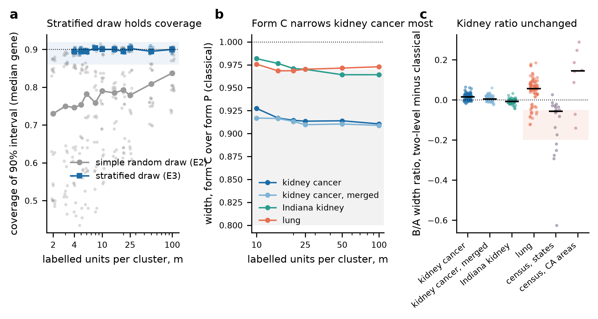
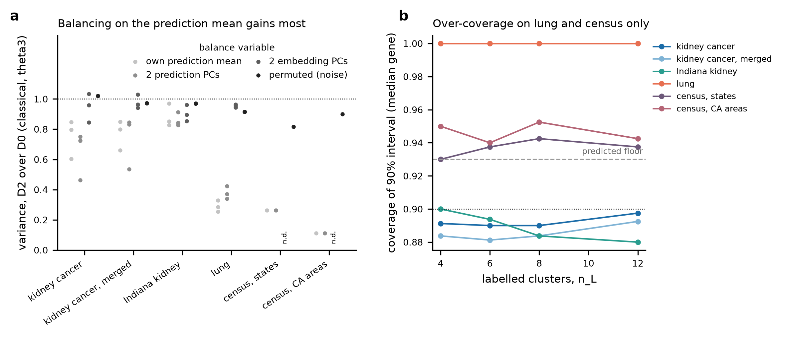

# Round 5 PPI track, the E4 gate report (stages E3a, E3 and E4)

9 October 2026. Written by the execution session for the oversight chat, under `docs/decisions/round5_ppi_track.md` and the E2 decision memo `docs/decisions/round5_ppi_E2_decisions.md`, as transcribed in `docs/round5_ppi_plan.md` section 7. Every number below is read from the file named beside it. Paths are relative to the repository root unless they start with `/work`. Shorthand used throughout is `E3a/` for `results/round5/ppi/E3a_crossfit/`, `E3/` for `results/round5/ppi/E3_twolevel/` and `E4/` for `results/round5/ppi/E4_selection/`.

## 1. Stage and status

Interval 2 is complete. E3a's derivation closed (theory section 2.0) and its acceptance passed, so the corrected interval `textbook_t|fpc|lin|xf` is the primary design-target interval of E3 and E4, with `textbook_t|fpc|lin` beside it. E3's derivations closed (theory sections 2.1 to 2.6) and its four acceptance checks pass on all six tasks, with one coverage difference of 0.015 on lung at a degenerate cell (section 3). E4's acceptance check 1a passes everywhere, check 1b passes except for $\theta_2$ at $n_L = 4$ and 6 on Indiana and lung, and check 2 (balance on a permuted variable leaves the variance unchanged) fails. Check 2's failure is escalation 1, with the mechanism in section 6.4. No check that the brief or memo names as stop-and-report failed, so work ran to the gate without an interim stop. The stratified draw for $\theta_2$ fixes E2's regime B failure, with coverage 0.885 to 0.913 at $m \ge 6$ in 192 of 192 cells (`E3/e3_prediction_scores.csv`). Nothing after E4 has been set up. The tag `round5-ppi-E4` marks the commit that adds this report.

## 2. What was run

**Branch and commits.** All interval-2 work is on local branch `round5-ppi` above the E2 gate tag `round5-ppi-E2` (`b4e8ef5`). The first interval-2 commit `a2ee717` added the memo unchanged and plan section 7. Nothing has been pushed since pull request #15.

**Code delivery.** Code reached Longleaf only as git bundles, seven times, each a short Slurm job that verified the bundle, fast-forwarded `/work/users/w/e/weiyang/hest_code/round5-ppi` and wrote a read-only snapshot under `/work/users/w/e/weiyang/hest_code/round5-ppi_snapshots/<full hash>/`. Every fast-forward succeeded. The ledger is `results/round5/ppi/code_deliveries.csv`, with logs in `results/round5/ppi/deliveries/`.

| delivery | Slurm job | head after | carried |
|---|---|---|---|
| 1 | 4313167 | `a2ee717` | memo and plan section 7 |
| 2 | 4315518 | `f3fb876` | E3a interval, E3 two-level code and driver |
| 3 | 4321399 | `3894ad6` | E4 balance, selection and simulation code |
| 4 | 4325514 | `81ec444` | D1 degrees-of-freedom fix, E3 simulation 90% fix |
| 5 | 4338488 | `15f7535` | E4 threshold over finite distances, embedding loader |
| 6 | 4338533 | `3f037cc` | skip D1 when $n_L$ exceeds the valid clusters |
| 7 | 4339953 | `d7ab177` | E4 inclusion diagnostic, E3 merge script |

**Scripts.** All under `code/scripts/`. Each job's `PROVENANCE.txt` lists the md5 of every script it executed.

| script | role |
|---|---|
| `round5_ppi_estimator.py` | adds `textbook_t|fpc|lin|xf` |
| `round5_ppi_e3a_masking.py`, `round5_ppi_e3a_tests.py` | E3a masking rerun and tests |
| `round5_ppi_twolevel.py`, `round5_ppi_e3_tests.py`, `round5_ppi_e3_twolevel.py` | forms P and C, stratified $\theta_2$, unit-weighted GREG, E3 task driver |
| `round5_ppi_e3_sim.py` | E3 simulation |
| `round5_ppi_balance.py`, `round5_ppi_e4_selection.py`, `round5_ppi_e4_sim.py` | designs D0, D1, D2 and the E4 drivers |
| `round5_ppi_e4_inclusion.py` | inclusion-probability diagnostic for escalation 1 |
| `round5_ppi_e3_merge.py`, `round5_ppi_e3_superseded.py`, `round5_ppi_e3_figures.py` | E3 merge, scoring, superseded numbers, figure |
| `round5_ppi_e4_merge.py`, `round5_ppi_e4_figures.py`, `round5_ppi_e4_stamp_check.py` | E4 merge, scoring, figure, stamp check |
| `round5_ppi_run.py` | runner that writes `PROVENANCE.txt` and `_run_row.csv` for every job and local run |

**Jobs.** Every Longleaf job ran on partition `spill` under account `rc_tengfei_pi`. Unit ledgers sit in each unit directory (for example `E3/LUNG_XENIUM/job_ledger__LUNG_XENIUM.csv`). They hold 20 E3a jobs, 187 E3 jobs and 21 E4 jobs. All completed except one E3 job that hit its 2 h limit (4322336, the first submission of CCRCC_merged `constant__masking`, rerun, in `E3/CCRCC_merged/e3_job_ledger__CCRCC_merged.csv`). The largest peak memory was 1.31 GB in E3a (4316728, `E3a/masking/job_ledger_e3a_masking.csv`), 1.61 GB in E3 (4316571) and 5.21 GB in E4 (4338769, lung). The lead's own jobs, the seven deliveries and the six inclusion jobs, are in `results/round5/ppi/r5ppi_slurm_jobs.csv`. The six inclusion jobs (4340375, 4340376, 4340378, 4340420, 4340421, 4340422) show state FAILED because their last line copied the output directory into itself. Each had finished its computation and written its outputs, which were read back by ssh and are in `E4/<task>/_inclusion/`.

**Local runs.** The simulations ran on this Mac under plan section 7.4, from `git archive` snapshots of committed commits, each with its own `PROVENANCE.txt`. There are 43 local runs in `results/round5/ppi/r5ppi_local_runs.csv`. Of these 23 are superseded runs kept as the record (the E3 simulation at 95% and its mixed-provenance duplicate, and the E4 simulation before the D1 fix), and the record runs are 6 for E3a, 8 for E3 (`E3/sim/r5e3sim_final/`, from `126c9d4`) and 6 for E4. Local and Longleaf rows are never mixed in one table. The merges ran locally on committed result files.

**Fan-out.** E3a ran as two sub-agents (simulation, masking), E3 as seven (six tasks on Longleaf and the local simulation), E4 as seven (six tasks and the local simulation). The provenance index was built by one further sub-agent. The lead wrote the theory, the E4 inclusion diagnostic, the merges and this report.

**Provenance index.** `results/round5/ppi/provenance_index.csv`, built by `code/scripts/round5_ppi_provenance_index.py`, has one row per job and executed script over E0 to E4, 3,007 rows over 394 jobs (351 on Longleaf and 43 local). The Longleaf records were read by ssh from 357 `PROVENANCE.txt` files holding 360 records, and are kept verbatim under `results/round5/ppi/provenance_raw/` (counts in `results/round5/ppi/provenance_index_summary.csv`). Check 1 (the recorded commit is an ancestor of the branch head `4f5f65a`, which the gate tag descends from) passes in every row. Check 2 (the md5 equals the script's md5 at the recorded commit) fails in 5 rows, listed in `results/round5/ppi/provenance_index_failures.csv`. Four are ad hoc E2 scripts that were never committed (jobs 4199452, 4200937, 4201176, 4202190), and one is the E0 copy of `round4_ppi_estimator.py` at `de3d1f2` uploaded as `ref_estimator_de3d1f2.py` (job 4198575), whose md5 matches that file. Nine jobs in the ledgers have no provenance record, the cancelled job 4203301 that never ran, the seven delivery jobs, whose logs are in `results/round5/ppi/deliveries/`, and job 4338818 (escalation 5, `E4/ACS_CA_PUMA/job_ledger__ACS_CA_PUMA.csv`).

## 3. Acceptance checks

**E3a** (`E3a/e3a_sim_acceptance.csv`, `E3a/e3a_masking_acceptance.csv`).

1. The local rerun of E1's normal and skewed grids reproduces the Longleaf E1 rows in 5,760 of 5,760 rows within the E0 tolerances. The largest absolute difference is 5.7e-14 and every coverage column is exact. 1,230 of the rows are bit-identical.
2. Under rule `none` and under the oracle the two intervals are identical, 1,920 of 1,920 rows, and under `c_crossfit` at $n_L = 4$, where both halves get the same coefficient, 180 of 180.
3. The masking rows of `textbook_t|fpc|lin` reproduce `q4a_table61.csv` in 304 of 304 rows, with largest difference 0 on every column, and under rule `none` the corrected interval equals the uncorrected one in 152 of 152 rows.

**E3** (`E3/e3_acceptance.csv` and each `E3/<task>/e3_unit_acceptance__<task>.csv`).

1. The round-4 engine inside the new code reproduces round 4's code on every task. The largest differences are 3.6e-14 on $\hat\theta$ and 8.1e-11 relative on variance (lung, regime A).
2. Against `q4_main_table.csv` every task passes at the E0 tolerances, with one exception. On lung, $\theta_2$, $n_L = 12$, $m =$ all, the median coverage differs by 0.015 for the permuted arm and 0.005 for `hoptimus0`, while the variances agree to 1e-13. Lung $\theta_2$ has 9 valid donors, so at $n_L = 12$ every valid donor is labelled in full in some draws. The design variance is then zero and coverage turns on rounding of $\hat\theta$ against the truth. This reading was not verified by a separate run.
3. Under form C a predictor constant within a cluster leaves the estimate unchanged, for $\theta_3$ and the stratified $\theta_2$, on every task. The largest differences are 2.1e-13 on $\hat\theta$ and 3.2e-13 on variance (lung).
4. The constant arm's regime B width ratio of form P to the form P classical estimator is 1.000 at $m \ge 20$ on every task. This check is weaker than it looks, because the GREG coefficient of a constant predictor is set to 0 by collinearity, so form P with the constant arm is the classical estimator by construction (escalation 6).

**E4** (`E4/e4_acceptance.csv`, and the uniform recomputation `E4/e4_perm_balance_diagnostic.csv`).

1. 1a. Design D2 with $p_a = 1$ reproduces D0 on every task and file.
2. 1b. D0 reproduces `q4a_table61.csv` on every task except $\theta_2$ at $n_L = 4$ and 6 on Indiana and lung. E4's D0 drops draws with fewer than two valid labelled donors for $\theta_2$, and round 4 kept them (escalation 2).
3. 2. Balance on a permuted variable should leave the classical variance within 0.93 to 1.07 of D0. Recomputed the same way on every task, the ratio of median variances is in band in 37 of 96 cells. By task it is 11 of 16 on CCRCC, 6 on CCRCC_merged, 11 on Indiana, 0 on lung, 5 on census by state and 4 on census by area (`E4/e4_report_numbers.csv`, names `A2diag|...`). This is escalation 1.

## 4. What differs between the arms of each comparison

1. **E3a, `|lin` against `|lin|xf`.** Only the variance estimate, which adds $(n_L/G)\,\overline{(\lambda_g - c')^2}\,s_f^2/n_L$ under cross-fitting. Draws, seeds, estimates and degrees of freedom are shared.
2. **E3, form C against form P.** Form C centres the labelled units' predictions on their cluster's all-unit mean and fits within-cluster coefficients. Form P is the pooled GREG of round 4 with the two-stage variance. Draws, seeds, units, target and interval family are shared.
3. **E3, `_ppi` against `_classical`.** The predictor term only. The classical estimator is the same form with the predictor set to zero.
4. **E3, regime B against regime A.** The allocation of a cost-matched budget (a few units in every cluster against whole clusters), and with it the interval (`regB_t` against the design-target interval). In E3.7 both sides use the same estimator.
5. **E3, the stratified $\theta_2$ draw against E2's simple random draw.** The within-cluster draw and the variance formula. E2's rows used the r4 estimator, E3's use form C.
6. **E4, D2 against D0.** The labelled-cluster sample only, rejected when a balance distance exceeds the $p_a$ quantile. The estimator, rule and interval are shared, and the interval still uses the simple-random-sampling formula.
7. **E4, the balance variables.** `own` is the estimand's own $\bar f_g$, `pcF1` to `pcF3` the leading principal components of all genes' $\bar f_g$, `pcE1` to `pcE3` those of the mean embeddings, and `perm` a permuted $\bar f_g$ that carries no information about the outcome.
8. **E4, D1 against D0.** Stratified selection on $\bar f_g$ with `strat_t`, against simple random selection.

## 5. Predictions against outcomes

| prediction | outcome | evidence |
|---|---|---|
| E3a.1 | held | xf est/emp 0.974 to 1.013 in 15 of 15 cells (uncorrected 0.691 to 0.909), coverage at least 0.888 (`E3a/e3a_sim_prediction_cells.csv`) |
| E3a.2 | held | largest coverage difference 0.0060 at $G = 51$ over 180 cells, and 0.00245 at $\lambda^\star = 1.2$ (`E3a/e3a_sim_prediction_cells_E3a2.csv`) |
| E3a.3 | held for $\theta_3$ | lung $n_L = 12$, xf 0.885 against classical 0.885. For $\theta_2$ 0.890 against 0.915, which is 9 valid donors at $n_L = 12$ (`E3a/e3a_masking_E3a3_table_nL8_12_16.csv`) |
| E3.1 | held | permuted $C_{ppi}/C_{cl}$ width at $m \ge 10$ 1.000 to 1.017 in 72 of 72 cells. Unit-weighted variance ratio 0.992 to 1.027 in 34 of 34 (`E3/e3_prediction_scores.csv`) |
| E3.2 | partly held | within 0.05 of E2 in 242 of 274 cells. $\theta_3$ 153 of 154, $\theta_2$ 89 of 120, where E2 used the simple random draw (same file) |
| E3.3 | partly held | $C_{cl}/P_{cl}$ width at $m \ge 10$ in 0.80 to 0.97 in 144 of 288 cells (0.818 to 1.003). Form C coverage at $m \ge 5$ in 0.87 to 0.92 in 864 of 864 (0.875 to 0.917) |
| E3.4 | held | regime B narrower in 210 of 232 ($C_{ppi}$) and 211 of 232 ($P_{ppi}$) |
| E3.5 | refuted | $m^\star$ falls on 6 of 8 task-form pairs, but rises on census by state. $m^\star_{PP}/m^\star$ within 15% of theory in 10 of 28 |
| E3.6 | held | stratified $\theta_2$ coverage 0.885 to 0.913 at $m \ge 6$ (192 of 192), 0.890 to 0.905 at $m = 4$ (24 of 24) |
| E3.7 | partly held | kidney within 0.10 in 216 of 216. Lung and census lower by 0.05 to 0.20 in 20 of 112, and lung's median difference is +0.056 |
| E4.1 | partly held | within 0.05 of $1 - R^2$ in 189 of 240 cells. 48 of 80 at $G = 15$, 63 of 80 at 24, 78 of 80 at 51 (`E4/e4_prediction_scores.csv`) |
| E4.2 | partly held | lung 0.255, 0.330, 0.285 in band. CCRCC `uni_v2` 0.604 in band. Census by state 0.264, below 0.28 |
| E4.3 | partly held | lung recovers 0.89, 0.81, 0.94 of the gain. Kidney cancer 1.22, 1.36, 1.81, more than all of it |
| E4.4 | refuted in its main part | own balance, D2 classical coverage at least 0.93 in 95 of 320 real cells (median 0.905). D2 final within 0.02 of D0 in 172 of 320. D1 in 0.88 to 0.92 in 665 of 1,184 |
| E4.5 | partly held | kidney embedding balance at least 0.9 in 466 of 576 cells (0.468 to 1.504) |

## 6. Results

### 6.1 E3a, the cross-fitting term

Theory section 2.0 writes the cross-fitted estimator as exactly $\hat\theta = T_1 - \kappa\,\delta\,\Delta$, with $\kappa = n_A n_B/n^2$, $\delta$ the difference of the halves' coefficients and $\Delta$ the difference of the halves' prediction means. The second term has no finite-population factor, because the halves are a random split of the labelled sample whatever $n_L/G$ is. The current estimate catches about $\delta^2 s_f^2$ of it plus a residual inflated by overfitting. The derivation gives the expected shortfall, about 0.65 of the true variance at $G = 15$ and $n_L = 12$ against the memo's worst cell of 0.69, and 0.985 after the correction. The corrected estimate is

$$
\widehat{\text{Var}}_{\text{xf}} = \Big(1 - \frac{n_L}{G}\Big)\frac{s_e^2}{n_L} + \frac{n_L}{G}\cdot\frac{\overline{(\lambda_g - c')^2}\,s_f^2}{n_L}
$$

which is the memo's candidate with $d^2$ replaced by the mean squared deviation of each cluster's coefficient from the other half's, and which holds for odd $n_L$.

In simulation at $G = 15$, $n_L = 12$ and $\lambda^\star = 0.6$ under the normal law, the ratio of estimated to empirical variance is 0.974 to 1.013 with the correction and 0.691 to 0.909 without, and coverage is 0.888 to 0.903 with it and 0.840 to 0.886 without (`E3a/e3a_sim_prediction_cells.csv`, 15 cells). On the masking grid the correction changes little except where cross-fitting bites. On lung $\theta_2$ at $n_L = 12$ the uncorrected cross-fitted interval covers 0.825 and the corrected one 0.890 (`E3a/e3a_masking_E3a3_table_nL8_12_16.csv`).

### 6.2 E3, the two-level estimator

The simulation record is `E3/sim/r5e3sim_final/`, merged in `E3/e3_sim_summary.csv`. In regime B the design-target coverage of forms C and P ranges 0.8735 to 0.9215 over every $m$, estimator and estimand. In regime A the cross-fitting correction raises form C's minimum design-target coverage for the mean from 0.8545 to 0.8795. Under form C the constant predictor gives width ratio exactly 1.000 against the form C classical estimator, and the identity check holds in 420 of 420 cells with difference 0. For $\theta_3$ with a cluster level shift of 10 standard deviations, form C's regime B width is 0.597 of the round-4 estimator's, and the round-4 estimator's ratio to its own classical estimator is 0.129 because its classical estimator carries the level variance.

On the real tasks the permuted predictor behaves as a null predictor under form C (E3.1), which it did not in round 4 on the unit-weighted rows (0.09 to 0.48 in `results/round4/ppi/Q5a/q5a_spot_weighted_permuted.csv`, against 0.992 to 1.027 now). Form C's classical estimator is narrower than form P's by about 9% on the two kidney cancer tasks and by 2 to 4% on Indiana and lung (`E3/fig_e3_summary.png` panel b, cells in `E3/e3_prediction_cells.csv`). That is why E3.3's band of 3 to 20% holds in only half the cells. Regime B stays narrower than regime A under the two-level estimator (E3.4).

E3.5's two parts both miss. The classical $m^\star$ at $c_d/c_s = 100$ falls from round 4's 121 on kidney cancer to 99 (form P) and 78 (form C), from 236 on Indiana to 164 and 158, and from 172 on lung to 89 and 77. On census by state it rises from 379 to 436 under form P, and the merge returns no form C value (section 8 item 7) (`E3/e3_superseded_round4_numbers.csv`, part `mstar`). The ratio $m^\star_{PP}/m^\star$ is near 1 on the kidney tasks (0.97 to 1.03 under form C) where the formula gives 1.01 to 1.29. The formula's within- and cluster-level $R^2$ do not describe how the predictor changes the two variance components once form C has removed the level.

E3.7 holds on the kidney tasks, where the regime B over regime A width ratio is the same with or without the predictor (within 0.10 in 216 of 216 comparisons). On lung the two-level ratio is higher than the classical one, with median difference 0.056, and on census by area higher by a median 0.146. Only census by state goes the predicted way, with median difference -0.056 (`E3/e3_regime_ratio_two_level_vs_classical.csv`, panel c of the figure). So what regime B buys is mostly the design, and the predictor adds to regime A at least as much as to regime B.

### 6.3 E3, the stratified draw for $\theta_2$

Under the stratified draw the regime B coverage of $\theta_2$ (form C, median over genes, design target) is 0.885 to 0.913 at $m \ge 6$ in 192 of 192 cells and 0.890 to 0.905 at $m = 4$ in 24 of 24, on every tissue task and arm (`E3/e3_prediction_scores.csv`). Under E2's simple random draw the median over cells was 0.73 at $m = 2$ rising to 0.84 at $m = 100$ (`E3/fig_e3_summary.png` panel a, from `results/round5/ppi/E2_regimeB/e2_regimeB_grid.csv`). The table `E3/e3_superseded_round4_numbers.csv` sets every round-4 regime A and regime B $\theta_2$ row with $m <$ all (round 4, design target, `c_crossfit`) beside the E3 value under `C_ppi`, `C_classical` and `P_ppi`, 7,200 rows with none unmatched. In regime B the round-4 median coverage over those rows was 0.875 with minimum 0.545, and E3's is 0.900 with minimum 0.500. The E3 minimum is census by area at one budget and was not investigated.

### 6.4 E4, which clusters to label

**Simulation** (`E4/e4_sim_prediction_cells.csv`, `E4/sim/_merge/e4_sim_merge_summary.json`). The classical variance under D2 with $p_a = 0.01$ on $\bar f_g$ is within 0.05 of $(1 - R^2)$ times its D0 variance in 189 of 240 cells. Of the 51 misses, 32 are at $G = 15$ and 17 at $G = 24$, with differences down to -0.350. Under D1 the stratified interval covers 0.881 to 0.915 under the normal law in 120 of 120 cells and 0.767 to 0.871 under the skewed law in 0 of 120. Under D2 the classical interval reaches 0.93 in 275 of 480 cells (median 0.941). Summed over the 480 cells of `E4/sim/_merge/d2_misses.csv`, 576 pairs of draw and simulated population found no accepted candidate, all at $p_a = 0.01$, and the simulation used the last candidate for them.

**Real tasks** (`E4/e4_variance_ratios.csv`, `E4/fig_e4_variance_by_design.png`). With balance on the estimand's own $\bar f_g$, D2 at $p_a = 0.01$ and $n_L = 8$ takes the classical $\theta_3$ variance to 0.255 to 0.330 of D0 on lung, 0.604 for `uni_v2` on kidney cancer and 0.264 on census by state, each below what the tuned estimator reaches under D0 (0.428 to 0.540, 0.844 and 0.434). Balance on two principal components of the predictions recovers 0.81 to 0.94 of the own-balance gain on lung and more than the whole of it on kidney cancer (fractions 1.22 to 1.81), so the brief's contrast between the two tissues does not appear. Balance on the mean embeddings reaches ratio 0.9 or above in 466 of 576 kidney cells.

**Coverage.** The classical interval from the simple-random-sampling formula does not over-cover under D2 on the tissue tasks other than lung. With own balance it reaches 0.93 in 95 of 320 cells, with median 0.905 at both $p_a$ (`E4/e4_prediction_scores.csv`). It does over-cover on census, at 0.930 to 0.9525, and on lung it covers 1.000 at every $n_L$ (panel b). D1's stratified interval covers 0.88 to 0.92 in 665 of 1,184 cells with median 0.885.

**Escalation 1, the permuted-balance check.** Balance on a variable unrelated to the outcome should not change the variance. It does, in two different ways.

On the kidney and census tasks the ratio stays within 0.82 to 1.30 and has no consistent direction. The D0 baseline in the denominator is the empirical variance over 200 draws that every gene of a task shares, so its draw noise does not average out over genes. Its own ratio of estimated to empirical variance, which should be 1, ranges 0.825 to 1.263 across these tasks (`E4/e4_perm_balance_diagnostic.csv`, columns `est_var_over_emp_var_median_D0`), and the median absolute deviation of the permuted ratio from 1 (0.046 to 0.109) is of the same order as the deviation of D0's own ratio (0.026 to 0.077). The band of 0.93 to 1.07 was set as if genes gave independent replicates, and on these tasks the failure is the baseline's Monte Carlo error rather than a property of D2.

On lung the ratio falls to 0.49 to 0.88 for $\theta_3$ and to 0.000 to 0.70 for $\theta_2$, while D2's estimated over empirical variance rises to as much as 6.45. The cause is the size of the sample space. Lung has $G = 15$ clusters for $\theta_3$ and 9 valid clusters for $\theta_2$, so there are 6,435 possible samples at $n_L = 8$ for $\theta_3$ and 126 at $n_L = 4$ for $\theta_2$. D2 keeps the samples below the $p_a$ quantile of the distance over the pooled candidates (`round5_ppi_balance.py`), which at $p_a = 0.01$ is about 64 and about 1 distinct samples. The design is then close to deterministic whatever the balance variable is, and the variance across draws collapses. The inclusion diagnostic supports this reading. Per-donor inclusion frequencies under D2 are as uniform as under D0 (standard deviation over donors 0.015 to 0.058 against 0.034 to 0.036 under D0 for lung), while the share of genes with standardised bias above 3 rises to 0.187 for $\theta_3$ and 0.557 for $\theta_2$ at $p_a = 0.01$ (`E4/e4_inclusion_bias.csv`). Rejective sampling at this $G$ does not tilt inclusion toward particular donors; it picks a handful of samples, which gives low variance with a fixed conditional bias.

The consequence for E4.2 is that lung's own-balance ratio of 0.255 to 0.330 includes this collapse. The permuted variable alone gives 0.81 at $n_L = 8$ and $p_a = 0.01$ for $\theta_3$, so on lung the balance gain is not separable from the shrinking support at this $p_a$. On the other tasks the own-balance gains (0.604 on kidney cancer, 0.264 on census by state) are far outside the permuted ratio's spread and stand.

## 7. Discrepancies, open questions and escalations

### Escalations

1. **E4 acceptance check 2 fails.** Section 6.4. On kidney and census the failure is the D0 baseline's shared draw noise. On lung it is a real property of rejective sampling with a small sample space, and lung's D2 variance ratios and its coverage of 1.000 should be read with that in mind. A fix for the check would be a D0 baseline with independent draws per gene, or many more D0 draws. A fix for lung would be a $p_a$ chosen so that the accepted set holds a fixed number of distinct samples. Neither was run.
2. **E4 acceptance check 1b, $\theta_2$ at small $n_L$.** E4's D0 drops draws with fewer than two valid labelled donors and round 4 kept them, so the $n_L = 4$ and 6 rows on Indiana and lung differ from `q4a_table61.csv`. The other rows match.
3. **E4 code defects found during the runs.** Three, each fixed in a delivered commit and rerun, with the superseded outputs kept under `E4/<task>/_superseded_81ec444/` and `E4/sim/_superseded_df/`. D1's degrees of freedom (`81ec444`). The D2 threshold computed over infinite distances and the mean-embedding loader (`15f7535`). D1 run when $n_L$ exceeded the valid clusters (`3f037cc`).
4. **The E3 simulation.** The first E3 simulation run computed 95% intervals because of a constant in `round5_ppi_e3_sim.py`, fixed in `126c9d4` and kept as `E3/sim/_superseded_95pct/`. Separately, the lead dispatched the first E4 simulation sub-agent with the E3 brief by mistake, so it ran the E3 grid at the same time as the E3 sub-agent and the run `r5e3sim_main90` has mixed provenance. The lead reran the eight E3 units locally from `126c9d4` into `E3/sim/r5e3sim_final/`, which is identical to `r5e3sim_main90` (largest difference 0.0) and is the record. `r5e3sim_main90` is not committed.
5. **Process.** The census-by-area E4 sub-agent submitted one job (4338818, `E4/ACS_CA_PUMA/job_ledger__ACS_CA_PUMA.csv`) that ran inline Python rather than a script from the snapshot, against plan section 7.3 item 3. It was a permuted-inclusion diagnostic, submitted before that item was dropped from its brief, and its output was neither copied back nor used. The lead's inclusion diagnostic replaced it. Most interval-2 sub-agents wrote the lead's frame id into their ownership stamps rather than their own, in 173 of 175 unit records (`E4/e4_stamp_check.csv`). The interval-2 briefs did not pass each sub-agent its own frame id, which the E2 gate's practice did. The unit directory, the job ledger and `PROVENANCE.txt` still identify each record.
6. **E3 acceptance check 4 is trivial for the constant arm.** Form P sets the coefficient of a constant predictor to 0 by collinearity, so the check compares the classical estimator with itself. The non-trivial version is form C's identity in check 3, which passes.
7. **The three records naming `8b879bb`.** The memo (section 2) and plan section 7.3 item 6 ask for three records that name `8b879bb` for `round5_ppi_e2_levelcheck.py` and `round5_ppi_e2_report_extra.py` to be listed as failing check 2. The records do not say that. `results/round5/ppi/E2_regimeB/diag/PROVENANCE__report_extra.txt` and its Longleaf original hold three records, one per job. Job 4203320 ran `round5_ppi_e2_diag.py` and names `8b879bb`, job 4203540 ran `round5_ppi_e2_levelcheck.py` and names `4f52b0c`, and job 4203742 ran `round5_ppi_e2_report_extra.py` and names `f75950f`. Each md5 equals the script's md5 at the commit its own record names, so all three pass both checks, and `8b879bb` occurs in one of the 360 Longleaf records (`results/round5/ppi/provenance_index_summary.csv`). The file appends each job's record to the same `PROVENANCE.txt`, so reading the first record's commit as the file's commit would give the memo's reading. The index lists the three rows as passing, with this note, rather than forcing them to fail.

### Discrepancies and records

1. Lung's E3 acceptance check 2 difference of 0.015 is at a cell with zero design variance in some draws (section 3).
2. The superpopulation-target interval for the mean in regime A covers as little as 0.708 under every form with the predictor, the round-4 estimator included (`E3/e3_sim_summary.csv`, section `A_coverage`). E3 did not make predictions about it and it is not new to E3.
3. `E3/e3_gene_ratios.csv.gz` (132 MB) is regenerated by `round5_ppi_e3_merge.py` and is not committed.
4. The provenance index failures are the five rows of section 2.

## 8. What was not checked

1. The reading of lung's E3 check 2 difference as zero-variance draws, by a run that counts them.
2. A D0 baseline with independent draws per gene for E4's check 2.
3. The census-by-area $\theta_2$ cell with regime B coverage 0.500.
4. E4.4 under balance variables other than `own`.
5. Any change to $p_a$ that fixes the size of the accepted set.
6. The README, which the oversight chat sweeps.
7. Why the census-by-state form C $m^\star$ is missing from `E3/e3_prediction_cells.csv`.

## 9. Proposed next step

E5 as the brief describes, once the oversight chat has reviewed this report. Before E5, a decision on escalation 1 (whether E4's lung rows and check 2 need the reruns of section 8 items 2 and 5) and on whether E3.5's $m^\star_{PP}$ formula should be restated for form C.
